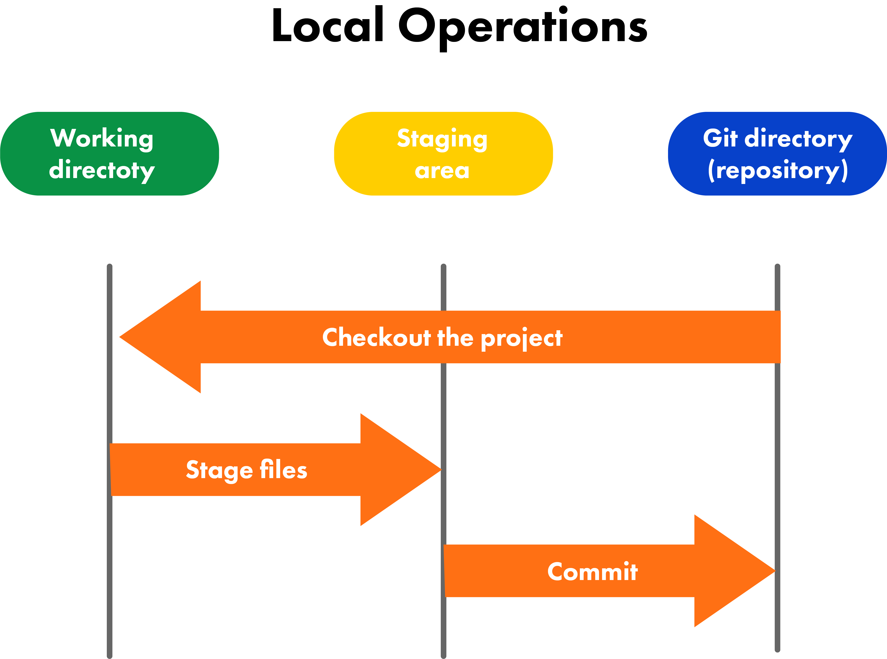
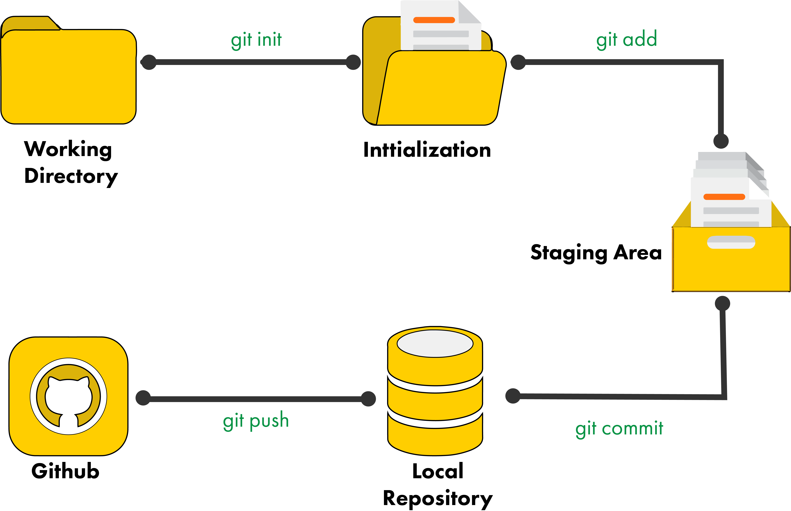

# OOP, Maven and Developer Practices - Day 3

## Linux File Commands Using GitBash

Below are some useful UNIX/Linux commands for handling files using GitBash. Always remember that UNIX/Linux commands are case-sensitive.

`ls`

- Lists all files and directories in the current directory.
- Some versions may support color coding to differentiate file types.
- `ls -l | more`: Lists files in long format, pausing after each screenful of information.
- `ls -l`: Lists files in long format, showing detailed information like permissions, owner, size, and modification date.

---

`cd`

- Changes the current directory.
- `cd ..`: Moves up one directory level.
- `cd /path/to/directory`: Navigates to a specific directory.

---

`pwd`

- Prints the current working directory.

---

`mkdir`

- Creates a new directory.
- `mkdir new_directory`: Creates a directory named "new_directory".

---

`cat`

- Concatenates and displays file content.
- `cat file.txt`: Displays the content of "file.txt".
- `cat file1.txt file2.txt > combined.txt`: Combines "file1.txt" and "file2.txt" into "combined.txt".
- `cat > file.txt`: Creates a new file "file.txt" and allows you to input text until you press `CTRL+D` to save and exit.

When you type in the the command above, the command prompt will disappear. This is because of the `>` (greater than) symbol, which is known as "output redirection".
At this point the keyboard is being re-directed into the new file. You can type in whatever you want, and when you are done, press `CTRL+D` to save the file and return to the command prompt.

Another way to create a file using `cat`:

`cat sourcefilename > destinationfilename`: Copies the content of "sourcefilename" into "destinationfilename".

---

`touch`

- Creates a new empty file.
- `touch newfile.txt`: Creates an empty file named "newfile.txt".
- From here you can use a terminal based text editor like `nano` or `vim` to edit the file.

---

`echo`

- Displays a line of text or a variable value.
- `echo "Hello, World!"`: Prints "Hello, World!" to the terminal.
- `echo $VARIABLE_NAME`: Prints the value of the environment variable "VARIABLE_NAME".
- Strings that are passed to `echo` can also be redirected into a file using the `>` operator: `echo "This is a test" > testfile.txt`

---

`grep`

- Searches for a specific pattern in files.
- `grep "search_term" file.txt`: Searches for "search_term" in "file.txt".
- `grep -r "search_term" /path/to/directory`: Recursively searches for "search_term" in all files within the specified directory.

---

`diff`

- Compares the contents of two files line by line.
- `diff file1.txt file2.txt`: Displays the differences between "file1.txt" and "file2.txt".
- The output will be formatted to show lines that are different, with `<` indicating lines from the first file and `>` indicating lines from the second file.

### Real World Application

**Why Use the Command Line?**

It is important to know why using the command line is crucial:

- When Unix was developed, there was no graphical user interface (GUI), so all interactions were done through the command line.
  - Command-line interfaces (CLI) were natural for this type of terminal. The use of text terminals was also a major reason why Unix developers preferred short command names, as they were faster to type.
- Programming tools use the command line to perform tasks.
  - Programmers have been the staunchest advocates of Linux because it has so many tools for them to get their work done: interpreters, compilers, debuggers, and more. And these tools are often used through the command line.
  - While you can use all of these tools from a graphical IDE, it is just a front-end to the command line.
- The command line is faster than a GUI.
  - For many tasks, using the command line is much faster than using a graphical interface. This is especially true for repetitive tasks, where you can write scripts to automate processes.
  - Command-line programs start faster than graphical ones because there's less overhead.
- The command line works everywhere, including on servers.
  - One of the main reasons why Linux is so popular for servers is that it can be managed entirely through the command line.
  - One big reason why the command line has survived on Linux systems is that it works just about everywhere.
- The command line is scriptable.
  - You can write scripts to automate tasks using shell scripting languages like Bash. This allows for complex workflows to be executed with a single command.
  - For example, if you wanted to copy all your text files to a directory, you'd use this line: `cp *.txt /path/to/directory`
  - A script could be written if you wanted to do this repeatedly, which would save time and reduce errors.

## Moving and Deleting Files Using GitBash

Below are some useful UNIX/Linux commands for moving and deleting files using GitBash. Always remember that UNIX/Linux commands are case-sensitive.

`mv`

The `mv` command moves a file or renames it. It can also be used to move files between directories.

`mv file1 directory1`: Moves "file1" into "directory1".
`mv file1 file2 file3 directory1`: Moves "file1", "file2", and "file3" into "directory1".
`mv -i file1 directory1`: Moves "file1" into "directory1", prompting for confirmation if the destination file already exists.
`mv -n file1 directory1`: Moves "file1" into "directory1", but does not overwrite an existing file in the destination.
`mv -u file1 directory1`: Moves "file1" into "directory1" only if "file1" is newer than the existing file in the destination.
`mv -b file1 directory1`: Moves "file1" into "directory1", creating a backup of the destination file if it exists.

---

`cp`

The `cp` command copies files and directories.

`cp second.txt third.txt`: Copies "second.txt" to "third.txt".
`cp -i second.txt third.txt`: Copies "second.txt" to "third.txt", prompting for confirmation if "third.txt" already exists.
`cp -b second.txt third.txt`: Copies "second.txt" to "third.txt", creating a backup of "third.txt" if it exists.
`cp -f second.txt third.txt`: Copies "second.txt" to "third.txt", forcing the copy even if "third.txt" is write-protected.
`cp -r directory1 directory2`: Recursively copies "directory1" and its contents to "directory2".
`cp -p second.txt third.txt`: Copies "second.txt" to "third.txt", preserving the original file's attributes (permissions, timestamps, etc.).

---

`rm`

The `rm` command removes files or directories.

`rm file1`: Deletes "file1".
`rm -i file1`: Prompts for confirmation before deleting "file1".
`rm -r directory1`: Recursively deletes "directory1" and its contents.
`rm -f file1`: Forces the deletion of "file1" without prompting for confirmation.

### Real World Application

**Advantages of Using Command Line Interface (CLI)**

When using a command-line interface, you can use detailed commands more efficiently and faster than you can with a graphical user interface (GUI). It demonstrates the advantages of using a command-line interface in this case, as it can handle extremely repetitive tasks across a wide range of systems.

With the assistance of a program like the computer CLI or code, it is easier for the user to control everything. The user's interface is slow when they navigate through different icons. This enables CLI to operate more quickly as commands are directly delivered to the computer. CLI is preferred by many professionals due to its speed and performance.

All options and operations are invoked in consistent form, while with GUIs similar operations often appear on different menus with different interfaces and different applications have different approaches.

CLIs double as scripting languages (see shell scripting), meaning that is it no more difficult to perform a rare operation than a common one. In fact, it is often easier to perform rare operations in a CLI than in a GUI, as the user can write scripts to automate those tasks. Once an operation is analyzed, it can be saved in a script and consistently performed without further effort. With GUIs, users must start over at the beginning every time, as GUI scripting is more limited (and often nonexistent). Simple commands do not even need a script, as the completed command can usually be assigned a name and executed by simply typing that name.

## Root Directories

`/bin`: Contains essential binary executables (programs) needed for system operation, such as basic commands like `ls`, `cp`, and `mv`.

`/boot`: Contains files necessary for the booting process, including the Linux kernel and initial RAM disk image.

`/dev`: Contains device files that represent hardware devices, such as hard drives, USB devices, and terminals.

`/etc`: Contains system-wide configuration files and scripts that control the behavior of various programs and services.

`/home`: Contains user home directories, where personal files and settings are stored for each user. Sometimes these are in `/usr` instead.

`/lib`: Contains shared libraries and kernel modules required by programs and the system.

`/media`: A mount point for removable media such as USB drives, CDs, and DVDs.

`/mnt`: A temporary mount point for filesystems that are mounted manually by the system administrator.

`/opt`: Contains optional software packages and third-party applications that are not part of the core system.

`/proc`: A virtual filesystem that provides information about running processes and system information. It is dynamically generated by the kernel.

`/root`: The home directory for the root user (the superuser with administrative privileges).

`/run`: A temporary filesystem that stores runtime data for processes and services. It is typically cleared on reboot.

`/sbin`: Contains essential system binaries (programs) used for system administration tasks, such as `fsck`, `reboot`, and `ifconfig`.

`/srv`: Contains data for services provided by the system, such as web server files or FTP server files.

`/sys`: A virtual filesystem that provides information about devices, drivers, and kernel subsystems. It is dynamically generated by the kernel.

`/tmp`: A temporary directory used for storing temporary files created by programs. It is typically cleared on reboot.

`/usr`: Contains user-related programs and data. It is further divided into subdirectories like `/usr/bin` (user binaries), `/usr/lib` (user libraries), and `/usr/share` (shared data).

`/var`: Contains variable data files, such as log files, mail spools, and temporary files created by programs.

## Source Control Management (git, vcs, cvcs, dvcs)

Source control management (SCM) systems are essential tools for developers, allowing them to track changes to code, collaborate with others, and manage different versions of their projects.

- **Version Control Systems (VCS)**: These systems track changes to files over time, allowing developers to revert to previous versions, compare changes, and collaborate with others. Examples include Git, Subversion (SVN), and Mercurial.

Version control is a process to manage a collection of source code and changes that provide you with many capabilities:

- Maintain multiple versions of the code.
- Ability to revert to previous versions.
- Developers can work concurrently on the same codebase.
- Audit traceability of changes with clear history on whom, which, when, where, and what was changed.
- Copy/Merge/Undo changes.
- Find out the difference between two versions of the code.
- Provides full backup without occupying additional space.
- Review history of changes.
- Capable for both small and large scale projects.

In simpler words, a Version Control System (VCS) is a system that allows developers to track changes in their code over time. It helps them collaborate, manage different versions of their projects, and revert to previous states if needed.

#### Importance of Version Control Systems

Let's take an example of an organization with a project team of five developers.

Two of the developers are in one location and the other three are in a different location. They received a project and started developing the code, and then come across the following situations:

- Each developer is working on one module at a time whereas others were waiting for developers to complete their tasks so that they can start working on their modules.
- Whenever they completed their work and decided to deploy the code, they were each taking a full backup of the project and one day they could not do it because the disk space was full.
- One day one of them deleted on module which they could not bring back and had to recreate it from scratch.
- They were unable to find out who has done what changes in the code.
- They could not do any experiments for the new feature without interfering with other developers' work.
- They need to send the code via email as they were seated in different locations, which led to confusion and version mismatches.

These situations highlight the need for a Version Control System (VCS). A VCS would allow developers to:

- A version control system ensures that all the previous versions of the code can be retrieved later on and all changes are tracked, providing a clear history of who made changes, when, and why.
- It also explains what a file looked like on a specific date or at a specific point in time.
- A version control system provides a central repository where all developers can access the latest code, reducing the need for email exchanges and preventing version mismatches and the ability to work concurrently on the same codebase.

#### Types of Version Control Systems

There are two types of Version Control Systems:

- **Centralized Version Control Systems (CVCS)**: In a CVCS, there is a single central repository that stores all versions of the code. Developers check out files from this central repository, make changes, and then check them back in. This model can lead to bottlenecks and conflicts if multiple developers are working on the same files simultaneously.

- **Distributed Version Control Systems (DVCS)**: In a DVCS, each developer has a complete copy of the repository, including its entire history. This allows for more flexible workflows, as developers can work offline, create branches, and merge changes more easily. Git is a popular example of a DVCS.

### Real World Application

#### Benefits of Version Control Systems

A version control system works as a database for your code and makes revisions instead of duplicating the entire codebase which helps to save space.

- It keeps all the history of all the files, which gives you full traceability and auditability of what changes were made, when, and by whom.
- It provides the ability to revert back to a previous version of the code if something goes wrong.
- It prevents the risk of losing work due to accidental deletions or overwrites.
- It helps to identify the differences between two versions of a file, making it easier to understand what has changed.
- It provides you with the ability to have entirely independent code versions through branching and merging.
- It provides the ability to work as a distributed team, allowing developers to work on the same codebase without interfering with each other's work.

## Git Fundamentals

#### What is Version Control?

Version control, also known as source control, is a system that records changes to a file or set of files over time so that you can recall specific versions later. It allows multiple people to work on the same project simultaneously without overwriting each other's changes.

As development environments become more complex, version control systems (VCS) have become essential tools for managing code changes, tracking history, and collaborating with team members.

Version control systems keep track of every modification to the code in a special kind of database. If a mistake is made, developers can easily revert back to a previous version of the code, minimizing the impact of errors and ensuring a smoother development process.

One of the most popular version control systems is Git, which is widely used in the software development industry. Git allows developers to create branches, merge changes, and collaborate on code in a distributed manner.

#### Nearly Every Operation is Local

Because Git is a distributed version control system, most operations are performed locally on the developer's machine. This means that developers can work offline, make commits, and create branches without needing to communicate with a central server. Once they are ready to share their changes, they can push their commits to a remote repository.

This means that there is very little you cannot do if you are offline or off VPN. FFor example, if you get on an airplane or train and want to work on your project, you can do so without any issues. You can make commits, create branches, and even view the history of your changes. Once you are back online, you can push your changes to the remote repository.

#### The Three States

Git has three main states that your files can reside in:

- **Modified**: This is when you have made changes to a file but have not yet staged it for commit. The file is still in your working directory and is not yet part of the version control system.
- **Staged**: This is when you have marked a modified file to be included in the next commit. The file is still in your working directory, but it is now part of the version control system.
- **Committed**: This is when you have saved your changes to the local repository. The file is now part of the version control system and is tracked by Git.

### Main Sections of a Git Project

Git has three main sections that you need to understand:

- **Working Directory/Tree**: This is where you make changes to your files. It is the directory on your local machine where you work on your project.
  - The working tree (or working directory) is a single checkout of one version of the project. These files are pulled out of the compressed database in the Git directory and placed on disk for you to use or modify.
- **Staging Area**: This is where you prepare your changes to be committed. You can think of it as a buffer between the working directory and the local repository.
  - The staging area (or index) is a file, also called the index, that lives in your Git directory. It stores information about what will go into your next commit.
- **Local Repository/Git Directory**: This is where your committed changes are stored. It is a hidden directory called `.git` that contains all the information about your project’s history.
  - The Git directory (or repository) is where Git stores the metadata and object database for your project. This is the most important part of Git, and it is what makes Git so fast and efficient.



#### Git Workflow

The basic workflow in Git involves the following steps:

1. **Make Changes**: Edit files in your working directory.
2. **Stage Changes**: Use `git add` to add changes to the staging area.
3. **Commit Changes**: Use `git commit` to commit the staged changes to the local repository.
4. **Push Changes**: Use `git push` to push the committed changes to a remote repository.

This workflow allows you to keep your changes organized and makes it easy to collaborate with others.



If a particular version of a file is in the Git directory, it is considered committed. If it has been modified and was added to the staging area, it is considered staged. If it has been modified but not yet staged, it is considered modified.

## Initializing a Git Repository

#### What is a Git Repository?

A Git repository is a virtual storage of your project. It allows you to save versions of your code, which you can access when needed. You can think of it as a folder that contains all the files and history of your project.

It saves the data about your project, including all the changes made to the files, the history of those changes, and information about branches and tags in a hidden directory called `.git`.

### Real World Application

Here are some reasons for using a Git repository:

- **Cloud Repository**
  - A Git repository can be hosted on a cloud service like GitHub, GitLab, or Bitbucket. This allows you to access your code from anywhere and collaborate with others.
  - It is generally more secure to store your code in a cloud repository than on your local machine, as it provides backup and version control.
  - It is easier to work collaboratively with a cloud repository, as multiple people can access and contribute to the codebase.
  - It is cheaper to use a cloud repository than to maintain your own server.
- **Distributed File System**
  - Git is distributed, meaning that every developer has a complete copy of the repository on their local machine. This allows for faster access to the project history and makes it easier to work offline.
  - It provides redundancy, as multiple copies of the repository exist on different machines.
  - In a centralized version control system, the global server contains all changes in the project, and the local copies are just light versions of the project. In contrast, Git allows every developer to have the full history of the project on their local machine.
- **Good Documentation**
  - A Git repository provides a clear history of changes made to the codebase, making it easier to understand the evolution of the project.
  - It allows for better collaboration, as developers can see who made changes and why.
  - It helps with debugging, as you can easily identify when a bug was introduced and by whom.
- **Branching and Merging**
  - Git allows for easy branching and merging, making it simple to work on new features or bug fixes without affecting the main codebase.
  - It provides a way to experiment with new ideas without the risk of breaking the existing code.
  - It allows for better collaboration, as multiple developers can work on different branches simultaneously and merge their changes when ready.
- **Encourages Code Reviews**
  - Using a Git repository encourages code reviews, as changes can be easily reviewed and discussed before being merged into the main codebase.
  - It helps maintain code quality, as multiple eyes can catch potential issues before they become problems.
  - It fosters a culture of collaboration and learning, as developers can learn from each other's code and provide feedback.
- **Simpler to Roll Back Changes**
  - Git makes it easy to roll back changes to a previous state, allowing developers to quickly fix mistakes or revert to a stable version.
  - It provides a safety net, as changes can be easily undone without affecting the entire codebase.
  - It encourages experimentation, as developers can try out new ideas without the fear of breaking the existing code.
- ** It's the Current Standard**
  - Git has become the de facto standard for version control in the software industry.
  - It is widely used by developers and organizations of all sizes, making it an essential skill for any programmer.
  - Many popular platforms and tools integrate with Git, further solidifying its position as the current standard.

## Implementation

#### Steps for Initializing a Git Repository

**How to Get a Git Repository**

There are two ways to obtain a Git repository:

1. **Clone an Existing Repository**: If you want to work on an existing project, you can clone a repository from a remote source like GitHub, GitLab, or Bitbucket. Use the command `git clone <repository_url>` to create a local copy of the repository on your machine.
2. **Create a New Repository**: If you want to start a new project, you can create a new Git repository from scratch. Use the command `git init` to create a new repository in the current directory.

#### Initialize a Repository

To initialize a new Git repository, follow these steps:

1. Open a terminal and navigate to the directory where you want to create the repository.
2. Run the command `git init` to create a new Git repository.
3. (Optional) Create a new file or add existing files to the repository.
4. Use the command `git add <file>` to stage changes for commit.
5. Run `git commit -m "Initial commit"` to commit the changes.

#### Clone a Repository

To clone an existing Git repository, follow these steps:

1. Open a terminal and navigate to the directory where you want to clone the repository.
2. Run the command `git clone <repository_url>` to create a local copy of the repository.
3. (Optional) Navigate into the cloned repository directory using `cd <repository_name>`.

## Pushing to a Remote Repository

#### What is a Remote Repository?

A remote repository is a version of your project that is hosted on the internet or another network. It allows you to share your code with others and collaborate on projects.

The `git push` command is used to upload local repository content to a remote repository. Pushing is how you transfer commits from your local repository to a remote repo. It's like uploading your changes to a shared space where others can access them.

The `fetch` and `push` commands are complementary operations. `fetch` imports commits from a remote repository into your local repository, while `push` exports commits from your local repository to a remote one.

#### `git push` Usage

`git push [remote-name] [branch-name]`

- `remote-name`: The name of the remote repository you want to push to (e.g., `origin`).
- `branch-name`: The name of the branch you want to push (e.g., `main`).

`git push [remote-name] --all`

- Pushes all branches to the specified remote repository.

`git push` is one component of many used in the overall Git "syncing" process, which also includes `fetch`, `pull`, and `merge`. The syncing process ensures that changes are consistently reflected across both local and remote repositories.

## Git Commit, Branch, Merge, Push, Pull

#### Git Merge

Merging is the process of combining the changes from one branch into another. It is a common operation in Git and is used to integrate changes from different branches. It is Git's way of putting a forked history back together again.

The `git merge` command lets you take the independent lines of development created by `git branch` and integrate them into a single branch. This is typically done in a feature branch workflow, where you develop a feature in isolation and then merge it back into the main branch when it's complete.

The current branch will be the one you are on when you run the `git merge` command.
Meaning, the changes from the branch you are merging in will be applied to your current branch. This means that `git merge` is often used in conjunction with `git checkout` to switch to the branch you want to merge into before running the merge command and `git branch -d` to delete the branch after merging if it is no longer needed.

#### How it Works

`git merge` will combine multiple sequences of commits into one unified history. The command takes the contents of a source branch and integrates it with the target branch. In the simplest case, the target branch is updated to point to the same commit as the source branch, effectively making them identical.

`git merge` takes two commit pointers, usually the branch heads, and finds a common base commit between the two. It then creates a new "merge commit" that combines the changes from both branches since that common base.

#### New Merge Commit Node

Merge commits are unique compared to other commits in that they have two parent commits instead of one. This is because a merge commit represents the point where two branches have been combined. The first parent is the tip of the branch you were on when you ran `git merge`, and the second parent is the tip of the branch you merged in.

When you perform a merge, Git will automatically create a new merge commit that has two parents. This merge commit will contain all the changes from both branches, and it will be added to the history of the target branch.

If Git encounters a conflict during the merge (i.e., changes in both branches that cannot be automatically reconciled), it will pause the merge process and prompt you to resolve the conflicts manually. Once the conflicts are resolved, you can complete the merge by committing the changes.

#### Preparing to Merge

Before performing a merge, there are a couple of steps you should take to ensure a smooth process:

- Confirm you are on the branch you want to merge into by using `git checkout <branch-name>`.
  - Execute `git status` to ensure you are on the correct branch and that there are no uncommitted changes in your working directory.
  - If needed, execute `git checkout <branch-name>` to switch to the desired branch.
- Fetch the latest remote commits:
  - Run `git fetch` to update your local copy of the remote repository. This ensures that you have the most recent changes from the remote branches before merging.
  - Once the fetch is completed, ensure the main branch is up to date by executing `git pull origin <main-branch>`. This step integrates any new commits from the remote main branch into your local main branch, reducing the likelihood of conflicts during the merge.

#### Merge

Once the preparatory steps are complete, you can proceed with the merge by executing the command:

`git merge <source-branch>`

### Real World Application

#### Merge Conflicts

It's always nice when merges happen seamlessly, but on occasion, you could run into merge conflicts.

Merge conflicts happen when both branches you are trying to merge have made changes to the same lines in a file, or when one branch deletes a file that another branch has modified. When this happens, Git cannot automatically determine which changes to keep and which to discard, so it marks the file as conflicted and pauses the merge process.

When a merge conflict occurs, Git will modify the affected files to include conflict markers that indicate the conflicting sections. The markers look like this:

```
<<<<<<< HEAD
// Changes from the current branch
=======
 // Changes from the branch being merged in
>>>>>>> <source-branch>
```

#### Solving Merge Conflicts

To solve a merge conflict you first need to understand what caused the merge conflict. Did someone delete a file you made changes to? Or maybe you added a file with the same name as an existing file?

Regardless, Git will inform you that you have "unmerged paths" and that you need to resolve the conflicts before you can complete the merge.

Fortunately, Git uses the visual markers shown above to indicate the areas of conflict within the affected files. You can open these files in your favorite text editor or IDE to review and resolve the conflicts.

The equal signs separate the changes from the two branches. You can choose to keep one side, the other side, or a combination of both by editing the file to remove the conflict markers and make the code look the way you want.

After fixing the sections, you need to stage the resolved files using `git add <file>` and then complete the merge by committing the changes with `git commit`. Git will automatically create a merge commit that includes a message indicating that a merge was performed.

## Gitignore

Gitignore is a special file that tells Git which files or directories to ignore in a project. This is useful for excluding files that are not necessary to track, such as build artifacts, temporary files, or sensitive information like passwords.

`.gitignore` is a plain text file where each line contains a pattern that matches files or directories to be ignored by Git. The patterns can include wildcards and can be specific to certain directories.

Files already tracked by Git are not affected by the `.gitignore` file. If you want to stop tracking a file that is already being tracked, you need to unstage it using `git rm --cached <file>` before adding it to the `.gitignore` file.

When deciding whether to ignore a path, Git normally checks gitignore patterns from multiple sources, with the following order of precedence, from highest to lowest:

1. The `.gitignore` file in the same directory as the file being checked
2. The `.gitignore` file in any parent directory
3. The global gitignore file (usually located at `~/.gitignore` or specified by the `core.excludesFile` configuration)
4. The system-wide gitignore file (usually located at `/etc/gitignore`)

You can place any files and directories you want to ignore in the `.gitignore` file, using the following patterns:

- `*`: Matches any number of characters in a file or directory name. It is used as a wildcard.
- `/`: Indicates that the pattern should match only in the root directory of the repository.
- `#`: Indicates that the rest of the line is a comment and should be ignored by Git.
- `**/`: Matches directories at any level.
- `!`: Negates a pattern, meaning that files matching this pattern should not be ignored.

Example:

```bash
# Ignore all .log files
*.log
!important.log
```

## Real World Application

The `.gitignore` file is essential for managing a Git repository effectively. Here are some reasons why:

- **Preventing Unnecessary Files from Being Tracked**: By ignoring files that are not necessary to track, you can keep your repository clean and focused on the important files. This helps to reduce clutter and makes it easier to navigate the repository.
- **Reducing Repository Size**: Ignoring large files or directories that are not needed for version control can help keep the repository size manageable. This can improve performance when cloning or fetching changes.
- **Avoiding Sensitive Information**: By ignoring files that contain sensitive information, such as passwords or API keys, you can help protect your project from security vulnerabilities.

In summary, the `.gitignore` file is a crucial tool for maintaining a clean and efficient Git repository.
