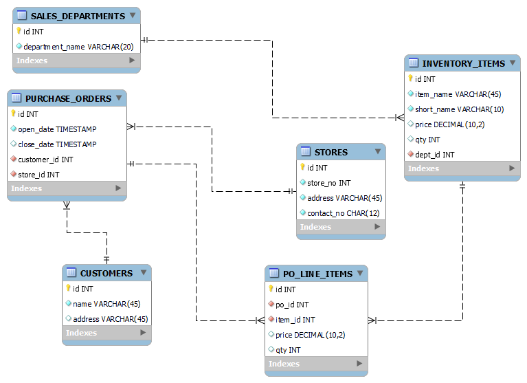

# OOP, Maven, and Developer Practices - Day 4

## What is a Database?

#### What is Data?

Data is information that is stored and used by applications. It can be anything from user information, product details, transaction records, to multimedia files. Data is essential for applications to function effectively and provide value to users.

In enterprise applications, data provides aggregated state information for the application. Businesses will use this data for various reasons including marketing, usage statistics, error reporting, and more. Data is specifically designed to provide insights and persistence information for the applications which they support.

#### What is a Database?

A database is an organized collection of data that is stored and managed in a way that allows for easy access, retrieval, and manipulation. Databases are used to store large amounts of information efficiently and securely.

It is a system of software and capabilities that make validating, storing, searching, filtering, aggregating, grouping, and administering data easier and more efficient. In enterprise applications, databases fall into two main categories: Relational Databases and NoSQL Databases.

#### SQL Databases

SQL (Structured Query Language) databases are a type of relational database that use a structured schema to define the organization of data. They are based on the relational model, which organizes data into tables (or relations) that can be linked—or related—based on data common to each. SQL databases are known for their ACID (Atomicity, Consistency, Isolation, Durability) properties, which ensure reliable transactions and data integrity.

#### NoSQL Databases

NoSQL (Not Only SQL) databases are a type of database that do not use a fixed schema and are designed to handle unstructured or semi-structured data. They are often used for big data applications and real-time web applications. NoSQL databases can be categorized into several types, including document stores, key-value stores, column-family stores, and graph databases. They are known for their scalability and flexibility.

### Real World Application

From the start of digital revolution, we have witnessed the utmost requirement for storing data effectively and efficiently. Data is the lifeblood of business solutions and having an accurate DBMS (Database Management System) is crucial for the success of any application.

Each DBMS has its own strengths and weaknesses, and the choice of which one to use depends on the specific needs of the application. Factors to consider include the type of data being stored, the volume of data, the required performance, and the complexity of the data relationships. By understanding the different types of databases and their use cases, developers can make informed decisions about how to best store and manage their application's data.

### Implementation

The general syntax for creating a `DATABASE` in **MySQL** is:

```sql
CREATE DATABASE database_name;
```

```sql
CREATE DATABASE employees_db;
```

The general syntax to use a newly created schema:

```sql
USE database_name;
```

```sql
USE employees_db;
```

## What is SQL?

SQL (Structured Query Language) is a standard programming language specifically designed for managing and manipulating relational databases. It provides a way to interact with the data stored in a database, allowing users to perform various operations such as querying, inserting, updating, and deleting data.

SQL is used to:

- Define database structure
- Manipulate stored data
- Define relationships between data
- Define data access controls
- Control concurrent access to data
- Query data

To accommodate these operations, SQL is broken into five main categories:

1. Data Query Language (DQL): Used for querying data from the database.

- Search, filter, group, aggregate data, etc.

2. Data Definition Language (DDL): Used for defining and managing database structures.

- Define tables, schemas, indexes, etc.

3. Data Manipulation Language (DML): Used for manipulating and managing data within the database.

- Insert, update, delete data, etc.

4. Data Control Language (DCL): Used for defining access controls and permissions.

- Grant, revoke permissions, etc.

5. Transaction Control Language (TCL): Used for managing transactions within the database.

- Commit, rollback transactions, etc.

Each category serves a specific purpose and provides a set of commands and functionalities tailored to that purpose.

SQL itself is generally case-insensitive, meaning that commands can be written in uppercase or lowercase without affecting their execution. However, it is common practice to write SQL keywords, table names, and column names in uppercase for better readability and to distinguish them from other elements in the query.

### Real World Application

SQL is used to administer SQL based RDBMS. Below is a short list of some databases and their enterprise users:

- Oracle
  - Wells Fargo
  - Verizon
  - Citi
  - ADP
  - FEMA
- MySQL
  - Wordpress
  - NASA
  - Netflix
  - YouTube
  - Bank of America
- PostgreSQL
  - Twitch
  - Apple
  - Spotify
  - Reddit
  - IMDb
- Microsoft SQL Server
  - Fisher Investments
  - Penske
  - Alarm.com
  - Citi
  - Humana
- MariaDB
  - Moodle
  - Samsung
  - Nokia
  - Red Hat
  - Select Quote
  - Walgreens
- MongoDB
  - Adobe
  - eBay
  - Expedia
  - Lyft
  - Square

### Implementation

SQL is developed based on the ANSI SQL Standard. However, there a lot of different vendor specific implementations available.

## Consistency

#### Database Consistency

Database consistency is the property that ensures that a database remains in a valid state before and after a transaction. It guarantees that any changes made to the database will not violate any predefined rules or constraints, such as data types, relationships, and integrity constraints.

In the context of ACID (Atomicity, Consistency, Isolation, Durability) properties, consistency ensures that:

- All data must be valid according to the defined rules and constraints.
- Any transaction that violates these rules will be rolled back, leaving the database in its previous valid state.
- The database will always transition from one valid state to another valid state.

Maintaining consistency is crucial for ensuring the reliability and integrity of the data stored in a database, especially in multi-user environments where concurrent transactions may occur.

While database consistency helps ensure the appropriate format for data written to the database, it does not account for what the data actually represents or its meaning within the application context. This means that information entered may match the expected data type and format, but it may not be accurate or relevant to the application's needs.

These rules applied to our data is what keeps databases working smoothly by ensuring that all data adheres to the defined structure and constraints.

#### Database Inconsistency

Database inconsistency occurs when the data in a database does not adhere to the defined rules, constraints, or integrity conditions.

Database consistency also applies to any changes of the data within the system. If one particular object in the database is updated, but also is present in another table in the database, it can lead to inconsistencies if the changes are not propagated correctly. This can result in conflicting or outdated information being displayed to users or applications, undermining the reliability of the database.

Database inconsistency can arise from various factors, including:

- **Concurrent Updates**: When multiple transactions attempt to update the same data simultaneously without proper locking mechanisms, it can lead to conflicting changes.
- **Application Bugs**: Errors in application logic can result in invalid data being written to the database, violating integrity constraints.
- **Data Migration Issues**: During data migration or integration processes, inconsistencies can occur if the data is not transformed or mapped correctly.

This mostly happens when any portion of the information in the table is updated, but the corresponding information in related tables is not updated accordingly.

### Real World Application

#### Database Consistency

Image working at the New York DMV and you have been asked to work on the database for the new Driver's License. Due to growing population sizes, they have required a new Driver's License number to help identify individuals. Your team has determined that every individuals driver's license number must include the following:

- 1 Alpha Character
- 6 Numeric Characters
- 1 Alpha Character

All driver license numbers are now required to follow this rule, such that "P123456A" is a valid driver's license number, while "1234567A" is not. Any entry that does not fit those requirements would result in error for inconsistent data.

#### Database Inconsistency

Keeping the driver's license example, imagine a driver's home address changes. This update must be represented across all tables where that prior address existed. If any table is not updated, then the database is now inconsistent. This could lead to issues such as:

- The individual not receiving important mail at their new address.
- Legal documents being sent to the wrong address.
- Inability to verify the individual's identity due to mismatched information.

### Implementation

Database consistency implementation, which involves specific constraints, triggers, variables, cascades, etc., will be covered in detail in the database section of this course. These elements are established based on the rules set by you as a developer. Always keep in mind, "how is this affecting my data's consistency?" when designing your database.

## Introduction to RDBMS

Relational Database Management System (RDBMS) is a type of database management system that organizes data into tables (or relations) with rows and columns. Each table represents a specific entity or concept, and the relationships between tables are established through keys.

An RDBMS is based on the relational model, which was introduced by Edgar F. Codd in 1970. The relational model provides a mathematical foundation for organizing and manipulating data in a structured way.

The use of RDBMS is essential in large scale application development. The use is so widespread that it would be nearly impossible to find a modern application that does not utilize some form of relational database.

Below is a list of some reasons for using a RDBMS:

- **Data Integrity**: RDBMSs enforce data integrity through constraints, ensuring that the data remains accurate and consistent.
- **ACID Compliance**: RDBMSs support ACID (Atomicity, Consistency, Isolation, Durability) properties, which guarantee reliable transactions.
- **Complex Queries**: RDBMSs provide powerful query languages (e.g., SQL) that allow for complex data retrieval and manipulation.
- **Data Relationships**: RDBMSs are designed to handle relationships between data entities, making it easier to model real-world scenarios.
- **Scalability**: RDBMSs can handle large volumes of data and concurrent users, making them suitable for enterprise applications.
- **Structured Data Model**: RDBMSs use a structured data model, which makes it easier to organize and manage data.
- **Large Scale Concurrent Access**: RDBMSs are designed to handle multiple users accessing and modifying the database simultaneously, ensuring data consistency and integrity.
- **Fault Tolerance**: RDBMSs often include features for backup, recovery, and replication, which help protect data against loss or corruption.
- **Distributed Data Storage**: RDBMSs can be configured to distribute data across multiple locations, improving access speed and reliability.

### Real World Application

Databases provide the backbone of data persistence in enterprise applications. Large business applications are designed around the idea of scalability which emphasizes stateless execution and the ability to handle large volumes of data. This means that a single application in the system won't store its own data locally, but use some other type of data storage solution, typically a centralized RDBMS, to manage and persist its data.

#### Choosing Persistence

System architects and project teams work to identify what type of persistence solution is best for the application. This includes evaluating the type of data being stored, the volume of data, the required performance, and the complexity of the data relationships.

RDBMS is just one solution among many. Other solutions include NoSQL databases, in-memory databases, and file-based storage systems. Each solution has its own strengths and weaknesses, and the choice of which one to use depends on the specific needs of the application.

So how does one choose a RDBMS persistence provider? The following list is just a few features to consider:

- Distribution type (cloud, on-premise, hybrid)
- Cost (licensing, support, maintenance)
- Scalability (horizontal vs vertical scaling)
- License type (open source, commercial)
- Security features (encryption, access controls)
- Support and community (documentation, forums, user groups)

#### Distribution Type

Installing the database is half of the battle and of course there a number of different ways to distribute a database.

| Distribution Type | Description                                                                        |
| ----------------- | ---------------------------------------------------------------------------------- |
| Standalone        | A single instance of the database running on a dedicated server or machine.        |
| Managed           | A cloud-based database service where the provider handles maintenance and scaling. |
| Containerized     | A database instance running within a container for easy deployment and management. |

Each distribution type has its own advantages and trade-offs, and the choice of which one to use depends on the specific needs of the application.

#### Scalability

Scalability is a critical factor to consider when choosing a database solution. It refers to the database's ability to handle increased loads, whether by adding more resources to a single instance (vertical scaling) or by distributing the load across multiple instances (horizontal scaling).

| Scalability Type | Description                                                                                 |
| ---------------- | ------------------------------------------------------------------------------------------- |
| Vertical         | Adding more resources (CPU, RAM) to a single database instance to improve performance.      |
| Horizontal       | Distributing the database load across multiple instances or servers to handle more traffic. |

Much like the applications that use the database for persistence, the databases themselves should be scalable. The problem is, databases cannot be stateless like applications. This means that the database must maintain state information about the data it manages. This makes scaling databases more complex than scaling stateless applications.

The scalability of a database is centered around clustering and replication. Clustering involves grouping multiple database instances together to work as a single unit, while replication involves copying data from one database instance to another to ensure data availability and redundancy.

Clustering is a scheme where multiple nodes are orchestrated to work together as a single unit. In RDBMS clustering however, there is a slight difference, A RDBMS cluster is constructed with a single master and multiple other replicas. This means all reads and writes happen primarily on the master with data being propagated to the replicas over time. This is known as asynchronous replication.

Most vendors implement some kind of clustering capability into their RDBMS offerings, but the specifics can vary widely. Some may offer built-in clustering features, while others may require third-party tools or additional configuration. The biggest decision is how much work do you want to do. The distribution type will play a big part in this with `Standalone` distributions requiring the most effort, `Managed` distributions requiring the least, and `Containerized` distributions falling somewhere in between.

Each scalability type has its own advantages and trade-offs, and the choice of which one to use depends on the specific needs of the application.

#### License Type

The license type of a database can have a significant impact on its cost, support, and flexibility. There are two main types of licenses to consider:

| License Type | Description                                                               |
| ------------ | ------------------------------------------------------------------------- |
| Open Source  | The database software is freely available and can be modified by anyone.  |
| Commercial   | The database software is proprietary and requires a paid license for use. |

Open source databases are often more flexible and cost-effective, but they may require more technical expertise to set up and maintain. Commercial databases typically offer more robust support and features, but at a higher cost.

When choosing a database, it's important to carefully evaluate the license type and its implications for your project.

#### Security Features

Security is a critical aspect of any database system. It involves protecting the database from unauthorized access, ensuring data integrity, and maintaining data confidentiality. Here are some key security features to consider when evaluating a database:

| Security Feature    | Description                                                                     |
| ------------------- | ------------------------------------------------------------------------------- |
| Authentication      | Verifying the identity of users and applications accessing the database.        |
| Authorization       | Controlling user access to specific data and operations within the database.    |
| Encryption          | Protecting data at rest and in transit through encryption techniques.           |
| Auditing            | Tracking and logging database activities for compliance and security purposes.  |
| Backup and Recovery | Implementing robust backup and recovery solutions to protect against data loss. |

When choosing a database, it's essential to assess its security features and ensure they align with your organization's security policies and compliance requirements.

#### Support and Community

Active support and community can be invaluable when working with a database. They provide resources, assistance, and a platform for sharing knowledge and experiences. Here are some aspects to consider:

| Aspect                 | Description                                                                                                          |
| ---------------------- | -------------------------------------------------------------------------------------------------------------------- |
| Documentation          | Comprehensive and up-to-date documentation can help users understand and utilize the database effectively.           |
| Community Forums       | Active forums and discussion groups can provide quick answers to questions and foster collaboration.                 |
| Training and Tutorials | Availability of training resources and tutorials can help users get up to speed with the database quickly.           |
| Vendor Support         | For commercial databases, vendor support can be a critical factor in resolving issues and ensuring smooth operation. |

When choosing a database, it's essential to evaluate the level of support and community engagement available to ensure you have the resources you need to succeed.

### Implementation

The implementation of an RDBMS is strictly dependent on the RDBMS vendor. Typically, the implementation of an RDBMS is based on the SQL standard and there are many different RDBMS vendors. Below is a non-exhaustive list of some popular RDBMS vendors:

- Oracle
- Microsoft SQL Server
- PostgreSQL
- MySQL
- MariaDB
- SQLite

Since the implementation of the system is dependent on the RDBMS vendor, its architecture can vary drastically. However, most RDBMS systems share some common components:

- **Client**: Provides users the ability to interact with the database through a user interface or command line.
- **Connection Handler**: Manages connections between clients and the database server. Receives incoming client connections and creates new thread execution contexts for isolating client connections from each other.
- **Parser**: Interprets and validates SQL commands issued by clients. Converts SQL commands into a format that can be executed by the database engine.
- **Optimizer**: Analyzes SQL commands and determines the most efficient way to execute them.
- **Query Cache**: Stores the results of frequently executed queries to improve performance by reducing the need to re-execute the same queries.
- **Storage Engine**: Manages the physical storage of data on disk. Responsible for reading and writing data to and from the database files.

It is important to note that not all RDBMS systems will have all of these components, and some may have additional components not listed here. The specific architecture of an RDBMS will depend on the vendor and the design choices made during its development.

#### Data Structure

RDBMSs use a structured data model, which makes it easier to organize and manage data. The data is organized into tables, which consist of rows and columns. Each table represents a specific entity or concept, and the relationships between tables are established through keys.

The discussion of vendor choice and vendor implementation aside an RDBMS is a DBMS based on relationships. All RDBMS implementations are based on some relational concepts.

#### What is a Table?

One of the core components of an RDBMS is an object called a **table**. A table is a collection of related data organized into rows and columns. Each row represents a single record or instance of the entity being modeled, while each column represents a specific attribute or property of that entity.

Let's look at an example table called `Employees`:

| id  | firstName | lastName | department | reports To |
| --- | --------- | -------- | ---------- | ---------- |
| 1   | John      | Doe      | HR         | 3          |
| 2   | Jane      | Smith    | IT         | 4          |
| 3   | Emily     | Johnson  | HR         | NULL       |

#### What is a Row?

A **row** is a single record in a table, representing a specific instance of the entity being modeled. Each row contains values for each column in the table, corresponding to the attributes of the entity. In the `Employees` table example, each row represents a different employee, with their specific details filled in for each column.

| 1   | John | Doe | HR  | 3   |
| --- | ---- | --- | --- | --- |

#### What is a Column?

A **column** is a specific attribute or property of the entity being modeled in a table. Each column has a name and a data type, which defines the kind of data that can be stored in that column. In the `Employees` table example, the columns are `id`, `firstName`, `lastName`, `department`, and `reports To`. Each column holds a specific type of information about the employees.

#### What is a Constraint?

A **constraint** is a rule that restricts the values that can be stored in a column or the relationships between tables. Constraints help maintain the integrity and consistency of the data in the database. Common types of constraints include:

- **Primary Key**: Uniquely identifies each row in a table.
- **Foreign Key**: Establishes a relationship between two tables by referencing the primary key of another table.
- **Unique**: Ensures that all values in a column are distinct.
- **Not Null**: Prevents null values from being stored in a column.

## Schema

The term `schema` comes from the Greek word "σχῆμα" which means "shape" or "form". In the context of databases, a `schema` defines the structure of the database, including the tables, columns, data types, and relationships between tables. It serves as a blueprint for how data is organized and accessed within the database.

In layman's terms, a schema is like a map or outline of how the data is organized in a database. It helps database designers and developers understand the relationships between different data entities and how they can be accessed and manipulated.

Database schema is declared using a formal language supported by the database management system (DBMS). The most common language for defining database schema is SQL (Structured Query Language). In enterprise application development, the definition of a schema is centered on modeling the data for a particular set of problems. The solutions will be implemented in software, but the data is stored in a database schema separate from the application of software logic.

### Real World Application

The real world application of `schema` comes in two steps: modeling and then implementation. Modeling can be done using tools to create an Entity Relation Diagram (ERD), which visually represents the entities, attributes, and relationships in the database. Once the model is finalized, it can be implemented in the database using SQL to create the actual tables, columns, and constraints.

Let's look at a schema for an inventory management system.



This schema defines the structure of the inventory management system, including the integrity constraints and relationships between tables. It serves as a blueprint for how data is organized and accessed within the database.

Integrity constraints include:

- Column names
- Data types
- Data constraints
- Relationships between tables

With the design done, let's view the script to create this schema in SQL:

```sql
SET @OLD_UNIQUE_CHECKS=@@UNIQUE_CHECKS, UNIQUE_CHECKS=0;
SET @OLD_FOREIGN_KEY_CHECKS=@@FOREIGN_KEY_CHECKS, FOREIGN_KEY_CHECKS=0;
SET @OLD_SQL_MODE=@@SQL_MODE, SQL_MODE='ONLY_FULL_GROUP_BY,STRICT_TRANS_TABLES,NO_ZERO_IN_DATE,NO_ZERO_DATE,ERROR_FOR_DIVISION_BY_ZERO,NO_ENGINE_SUBSTITUTION';

CREATE SCHEMA IF NOT EXISTS `inventory` DEFAULT CHARACTER SET utf8mb4 COLLATE utf8mb4_0900_ai_ci;

-- -----------------------------------------------------
-- Table `inventory`.`SALES_DEPARTMENTS`
-- -----------------------------------------------------
CREATE TABLE IF NOT EXISTS `inventory`.`SALES_DEPARTMENTS` (
  `id` INT NOT NULL AUTO_INCREMENT,
  `department_name` VARCHAR(20) NOT NULL,
  PRIMARY KEY (`id`),
  UNIQUE INDEX `department_name_UNIQUE` (`department_name` ASC) VISIBLE)
ENGINE = InnoDB;


-- -----------------------------------------------------
-- Table `inventory`.`INVENTORY_ITEMS`
-- -----------------------------------------------------
CREATE TABLE IF NOT EXISTS `inventory`.`INVENTORY_ITEMS` (
  `id` INT NOT NULL AUTO_INCREMENT,
  `item_name` VARCHAR(45) NOT NULL,
  `short_name` VARCHAR(10) NOT NULL,
  `price` DECIMAL(10,2) UNSIGNED NULL DEFAULT 0.99,
  `qty` INT NULL DEFAULT 0,
  `dept_id` INT NOT NULL,
  PRIMARY KEY (`id`),
  UNIQUE INDEX `short_name_UNIQUE` (`short_name` ASC) VISIBLE,
  INDEX `fk_item_dept_idx` (`dept_id` ASC) VISIBLE,
  CONSTRAINT `fk_item_dept`
    FOREIGN KEY (`dept_id`)
    REFERENCES `inventory`.`SALES_DEPARTMENTS` (`id`)
    ON DELETE NO ACTION
    ON UPDATE NO ACTION)
ENGINE = InnoDB;


-- -----------------------------------------------------
-- Table `inventory`.`STORES`
-- -----------------------------------------------------
CREATE TABLE IF NOT EXISTS `inventory`.`STORES` (
  `id` INT NOT NULL AUTO_INCREMENT,
  `store_no` INT UNSIGNED NOT NULL,
  `address` VARCHAR(45) NOT NULL,
  `contact_no` CHAR(12) NOT NULL,
  PRIMARY KEY (`id`),
  UNIQUE INDEX `address_UNIQUE` (`address` ASC) VISIBLE)
ENGINE = InnoDB;


-- -----------------------------------------------------
-- Table `inventory`.`CUSTOMERS`
-- -----------------------------------------------------
CREATE TABLE IF NOT EXISTS `inventory`.`CUSTOMERS` (
  `id` INT NOT NULL AUTO_INCREMENT,
  `name` VARCHAR(45) NOT NULL,
  `address` VARCHAR(45) NULL,
  PRIMARY KEY (`id`))
ENGINE = InnoDB;


-- -----------------------------------------------------
-- Table `inventory`.`PURCHASE_ORDERS`
-- -----------------------------------------------------
CREATE TABLE IF NOT EXISTS `inventory`.`PURCHASE_ORDERS` (
  `id` INT NOT NULL AUTO_INCREMENT,
  `open_date` TIMESTAMP NOT NULL,
  `close_date` TIMESTAMP NULL,
  `customer_id` INT NOT NULL,
  `store_id` INT NOT NULL,
  PRIMARY KEY (`id`),
  INDEX `fk_po_store_idx` (`store_id` ASC) VISIBLE,
  INDEX `fk_po_customer_idx` (`customer_id` ASC) VISIBLE,
  CONSTRAINT `fk_po_store`
    FOREIGN KEY (`store_id`)
    REFERENCES `inventory`.`STORES` (`id`)
    ON DELETE NO ACTION
    ON UPDATE NO ACTION,
  CONSTRAINT `fk_po_customer`
    FOREIGN KEY (`customer_id`)
    REFERENCES `inventory`.`CUSTOMERS` (`id`)
    ON DELETE NO ACTION
    ON UPDATE NO ACTION)
ENGINE = InnoDB;


-- -----------------------------------------------------
-- Table `inventory`.`PO_LINE_ITEMS`
-- -----------------------------------------------------
CREATE TABLE IF NOT EXISTS `inventory`.`PO_LINE_ITEMS` (
  `id` INT NOT NULL AUTO_INCREMENT,
  `po_id` INT NOT NULL,
  `item_id` INT NOT NULL,
  `price` DECIMAL(10,2) NULL DEFAULT 0.99,
  `qty` INT NULL DEFAULT 1,
  PRIMARY KEY (`id`),
  INDEX `fk_po_item_idx` (`po_id` ASC) VISIBLE,
  INDEX `fk_item_line_itm_idx` (`item_id` ASC) VISIBLE,
  CONSTRAINT `fk_po_line_itm`
    FOREIGN KEY (`po_id`)
    REFERENCES `inventory`.`PURCHASE_ORDERS` (`id`)
    ON DELETE NO ACTION
    ON UPDATE NO ACTION,
  CONSTRAINT `fk_item_line_itm`
    FOREIGN KEY (`item_id`)
    REFERENCES `inventory`.`INVENTORY_ITEMS` (`id`)
    ON DELETE NO ACTION
    ON UPDATE NO ACTION)
ENGINE = InnoDB;


SET SQL_MODE=@OLD_SQL_MODE;
SET FOREIGN_KEY_CHECKS=@OLD_FOREIGN_KEY_CHECKS;
SET UNIQUE_CHECKS=@OLD_UNIQUE_CHECKS;
```

This script creates the `inventory` schema and its associated tables, along with their columns, data types, and constraints. It serves as the implementation of the schema design for the inventory management system.

### Implementation

The focus of this section is `schema`, however it is impossible to implement schema in an RDBMS without the use of SQL. The way to implement a schema is to first create it, this step is dependent on the database vendor. Generally the syntax is:

```sql
CREATE SCHEMA <schema_name>;
```

After the schema has been created the data is divided in tables, which are created using the `CREATE TABLE` statement. Each table is defined with its columns, data types, and constraints. The SQL syntax for creating a table is as follows:

```sql
CREATE TABLE <table_name> (
  <column_name> <data_type> [constraints],
  ...
);
```

In the context of the inventory management system, the tables are created within the `inventory` schema and include the necessary columns and constraints to enforce data integrity and relationships between the tables.

## Table Structure

In **MySQL**, a table stores and organizes data in columns and rows as defined by the schema.

- The `CREATE TABLE` command is used to create a new table in the database.
- The `DROP TABLE` command is used to delete an existing table from the database.
- The `TRUNCATE TABLE` command is used to remove all rows from a table without deleting the table itself.
- The `ALTER TABLE` command is used to modify the structure of an existing table, such as adding or dropping columns, changing data types, or adding constraints.

The major differences between a database and a table are as follows:

- Tables are a way to organize data within a database.
- A database can contain multiple tables, each with its own structure and data.
- Tables are defined by their columns and data types, while a database is defined by its overall structure and relationships between tables.

A `TUPLE` refers to an ordered set of values. The number of values, or elements, in a tuple is fixed and is known as the arity (or degree) of the tuple. In the context of databases, a tuple represents a single row in a table, where each value corresponds to a specific column in that table.

In the context of databases, a tuple represents a single row in a table, where each value corresponds to a specific column in that table.

For example, consider a table representing employees:

| EmployeeID | FirstName | LastName | Age | Salary |
| ---------- | --------- | -------- | --- | ------ |
| 1          | John      | Doe      | 30  | 50000  |
| 2          | Jane      | Smith    | 25  | 60000  |
| 3          | Bob       | Johnson  | 40  | 70000  |

In this table, each row represents a unique employee, and the values within each row correspond to the employee's attributes, such as their ID, name, age, and salary. Each row is a tuple, and the entire table is a collection of these tuples.

### Real World Application

In the real world, tables are used to store and organize data in a structured way. For example, a company may use a table to store information about its employees, including their names, job titles, salaries, and contact information. This table can then be used to generate reports, track employee performance, and manage payroll.

### Implementation

The general syntax for creating a table in MySQL is:

```sql
CREATE TABLE [IF NOT EXISTS] table_name (
  column1 datatype [constraints],
  column2 datatype [constraints],
  ...
);
```

Explanation:

- `CREATE TABLE [IF NOT EXISTS] table_name`: This statement creates a new table with the specified name. The `IF NOT EXISTS` clause is optional and prevents an error from occurring if the table already exists.
- `column1 datatype [constraints]`: This defines the first column of the table, including its name, data type, and any constraints (e.g., `NOT NULL`, `UNIQUE`) that should be applied to it.
- `column2 datatype [constraints]`: This defines the second column of the table, following the same format as the first column.
- `...`: This indicates that additional columns can be defined in the same manner.

Example:

```sql
CREATE TABLE movies (m_name VARCHAR(100) NOT NULL, m_genre VARCHAR(50) NOT NULL, m_director VARCHAR(100) NOT NULL, m_release_year INT NOT NULL, PRIMARY KEY (m_name));
```

The example above creates a table named `movies` with four columns: `m_name`, `m_genre`, `m_director`, and `m_release_year`. The `m_name` column is designated as the primary key, ensuring that each movie name is unique within the table.

To add values to the newly created table:

```sql
INSERT INTO movies VALUES ('Inception', 'Sci-Fi', 'Christopher Nolan', 2010);
```

#### `DROP` vs `TRUNCATE`

- `DROP TABLE`: This command is used to delete an entire table from the database, including all of its data and structure. Once a table is dropped, it cannot be recovered.
- `TRUNCATE TABLE`: This command is used to remove all rows from a table while keeping the table structure intact. Truncating a table is generally faster than deleting rows one by one, as it does not generate individual row delete logs.

The general syntax for dropping a table in MySQL is:

```sql
DROP TABLE table_name;
```

We use the `DROP` command to completely remove the table.

```sql
DROP TABLE movies;
```

The general syntax for truncating a table in MySQL is:

```sql
TRUNCATE TABLE table_name;
```

We use the `TRUNCATE` command to remove all rows from the table while keeping its structure intact.

```sql
TRUNCATE TABLE movies;
```

#### Modifying Structure

To `ADD` a column to a table:

```sql
ALTER TABLE table_name ADD column_name datatype [constraints];
```

We can also use the `ALTER TABLE` statement to modify existing columns, such as changing their data type or adding constraints.

```sql
ALTER TABLE table_name MODIFY column_name new_datatype [constraints];
```

For example:

```sql
ALTER TABLE movies ADD m_rating FLOAT CHECK (m_rating >= 0 AND m_rating <= 10);
```

To `DROP` a column:

```sql
ALTER TABLE movies DROP m_rating;
```
