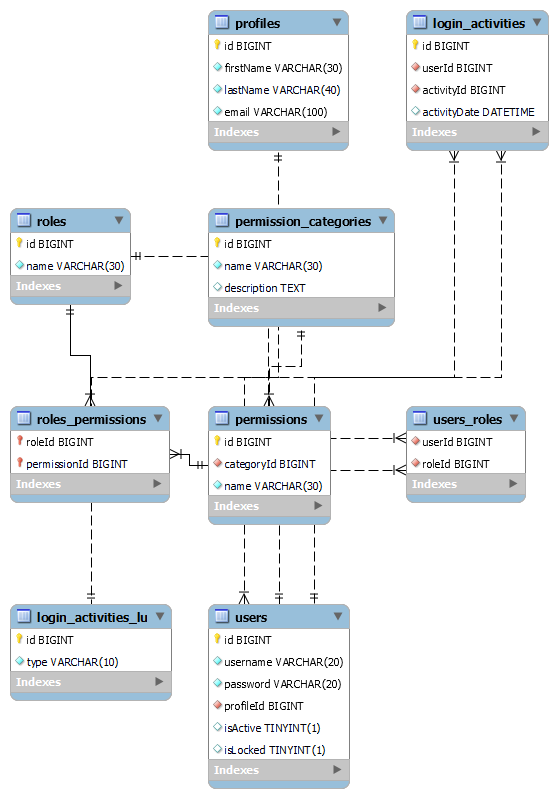

# SQL Basic and JDBC - Day 1

## Overview of Sublanguages

Structured Query Language or SQL, is the standard language for working with RDBMS. SQL is used to administer and manipulate SQL servers. SQL is a scripting language that is interpreted by the database engine. SQL is used to:

- Define database structure
- Manipulate stored data
- Define data access permissions
- Control concurrent data access
- Query the database

To accommodate the operations above, SQL is divided into several sublanguages, each serving a specific purpose. The main sublanguages of SQL are:

| Sublanguage                        | Purpose                        |
| ---------------------------------- | ------------------------------ |
| DDL (Data Definition Language)     | Define database structure      |
| DML (Data Manipulation Language)   | Manipulate stored data         |
| DCL (Data Control Language)        | Define data access permissions |
| TCL (Transaction Control Language) | Control concurrent data access |
| DQL (Data Query Language)          | Query the database             |

Each sublanguage is responsible for a specific aspect of database management, allowing users to effectively interact with and manage relational databases.

### Real World Application

Consider a scenario where we have to use all five SQL sublanguage commands, so we have to be familiar with all the commands in each of DDL, DML, DCL, and DQL.

Their respective commands are as follows:

- **DDL**: CREATE, ALTER, DROP, TRUNCATE, RENAME
- **DML**: SELECT, INSERT, UPDATE, DELETE
- **DCL**: GRANT, REVOKE
- **TCL**: COMMIT, ROLLBACK, SAVEPOINT
- **DQL**: SELECT

### Implementation

#### DDL

DDL sublanguage is utilized to define and manage the structure of database objects. Here are some common DDL commands: `CREATE`, `ALTER`, `DROP`, `TRUNCATE`, and `RENAME`. Using DDL, the overall structure is modeled by creating objects like tables where specific columns are defined with their respective data types.

#### DML

DML sublanguage is utilized to manipulate the data stored in the database. Here are some common DML commands: `SELECT`, `INSERT`, `UPDATE`, and `DELETE`. Using DML, users can retrieve, add, modify, and remove data from database tables.

#### DQL

DQL sublanguage is utilized to query the database and retrieve data. The primary DQL command is `SELECT`, which allows users to specify the data they want to retrieve from one or more tables. DQL is essential for data retrieval and reporting in database applications.

DQL is the backbone for querying databases, enabling users to extract meaningful information from large datasets. The command set consists pf the single `SELECT` command but the sublanguage is built on a grammar structure that is used to:

- Search data
- Project record views
- Filter records
- Group values
- Offset result sets

The `SELECT` statement is the crux of DQL and is composed of clauses that define the query's structure and behavior. The primary clauses of the `SELECT` statement include:

| Phrase  | Clause 1             | Clause 2             |
| ------- | -------------------- | -------------------- |
| Search  | `FROM <table_name>`  |                      |
| Project | `SELECT <columns>`   | `ORDER BY <columns>` |
| Filter  | `WHERE <condition>`  |                      |
| Group   | `GROUP BY <columns>` | `HAVING <condition>` |
| Offset  | `LIMIT <number>`     | `OFFSET <number>`    |

#### DCL

DCL sublanguage is utilized to define data access permissions and control user access to the database. Here are some common DCL commands: `GRANT` and `REVOKE`. Using DCL, database administrators can manage user privileges and ensure data security.

## DDL

Data Definition Language (DDL) is one of the five sublanguages of SQL. It is used to define and manage the structure of database objects, such as tables, indexes, and schemas. DDL commands are responsible for creating, altering, and deleting database objects. Some common DDL commands include:

- `CREATE`: Used to create new database objects.
  - Can be used to create databases, users, tables, indexes, triggers, functions, stored procedures, and views.
- `ALTER`: Used to modify existing database objects.
  - This command can ultimately be used to add, drop, or modify options of existing database objects.
- `DROP`: Used to delete database objects.
  - Any object created using the `CREATE` command can be deleted using the `DROP` command.
- `TRUNCATE`: Used to remove all records from a table without deleting the table itself.
  - This command is faster than the `DELETE` command when removing all records from a table, as it does not log individual row deletions.
- `RENAME`: Used to rename database objects.
  - The availability of this command may vary depending on the database system being used.
- `COMMENT`: Used to add comments to database objects.
  - This command is often used to provide descriptions or explanations for tables, columns, and other database objects.
  - You can also write comments in SQL scripts using `--` for single-line comments or `/* ... */` for multi-line comments.

### Real World Application

Database administrators use the DDL sublanguage to define complex tables and the relationships between them, the constraints on the data in the tables, search indexes, large table partitions, and other structural elements of a database.

Let's envision a complex system for user-identity management.



The script required to create this ERD is a combination of the `CREATE` and `ALTER` commands, which define the tables, columns, and relationships between the entities in the system.

```sql
CREATE DATABASE IF NOT EXISTS IAM; -- Create the IAM database if it doesn't exist

USE IAM; -- Switch to the IAM database

CREATE TABLE IF NOT EXISTS permission_categories (
  id BIGINT PRIMARY KEY,
  name VARCHAR(30) NOT NULL UNIQUE,
  description TEXT
);

CREATE TABLE IF NOT EXISTS permissions (
  id BIGINT PRIMARY KEY,
  categoryId BIGINT NOT NULL,
  name VARCHAR(30) NOT NULL UNIQUE,
  INDEX(categoryId, name) -- Index to optimize queries on categoryId and name
);

CREATE TABLE IF NOT EXISTS roles (
  id BIGINT PRIMARY KEY,
  name VARCHAR(30) NOT NULL UNIQUE
);

CREATE TABLE IF NOT EXISTS role_permissions (
  roleId BIGINT,
  permissionId BIGINT,
  PRIMARY KEY (roleId, permissionId) -- Composite primary key to prevent duplicate entries
);

CREATE TABLE IF NOT EXISTS login_activities_lu (
  id BIGINT PRIMARY KEY,
  type VARCHAR(10) NOT NULL
);

CREATE TABLE IF NOT EXISTS profiles (
  id BIGINT PRIMARY KEY,
  firstName VARCHAR(30) NOT NULL,
  lastName VARCHAR(40) NOT NULL,
  email VARCHAR(100) NOT NULL UNIQUE,
);

CREATE TABLE IF NOT EXISTS users (
  id BIGINT PRIMARY KEY,
  username VARCHAR(20) NOT NULL UNIQUE,
  password VARCHAR(20) NOT NULL,
  profileId BIGINT NOT NULL,
  isActive BOOLEAN NOT NULL DEFAULT TRUE,
  isLocked BOOLEAN NOT NULL DEFAULT FALSE,
);

CREATE TABLE IF NOT EXISTS login_activities (
  id BIGINT PRIMARY KEY,
  userId BIGINT NOT NULL,
  activityId BIGINT NOT NULL,
  activityTimestamp TIMESTAMP NOT NULL DEFAULT CURRENT_TIMESTAMP
);

CREATE TABLE IF NOT  EXISTS users_roles (
  userId BIGINT NOT NULL,
  roleId BIGINT NOT NULL
);

ALTER TABLE permissions ADD CONSTRAINT fk_permissions_category_id FOREIGN KEY (categoryId) REFERENCES permission_categories(id);
ALTER TABLE roles_permissions ADD CONSTRAINT fk_permissions_role_id FOREIGN KEY (roleId) REFERENCES roles(id);
ALTER TABLE roles_permissions ADD CONSTRAINT fk_roles_permission_id FOREIGN KEY (permissionId) REFERENCES permissions(id);
ALTER TABLE users ADD CONSTRAINT fk_users_profile_id FOREIGN KEY (profileId) REFERENCES profiles(id);
ALTER TABLE login_activities ADD CONSTRAINT fk_login_user_id FOREIGN KEY (userId) REFERENCES users(id);
ALTER TABLE login_activities ADD CONSTRAINT fk_login_activity_id FOREIGN KEY (activityId) REFERENCES login_activities_lu(id);
ALTER TABLE users_roles ADD CONSTRAINT fk_ur_user_id FOREIGN KEY (userId) REFERENCES users(id);
ALTER TABLE users_roles ADD CONSTRAINT fk_ur_role_id FOREIGN KEY (roleId) REFERENCES roles(id);
```

This script creates tables for permission categories, permissions, roles, role-permission relationships, login activities, profiles, users, user-role relationships, and sets up the necessary foreign key constraints to maintain referential integrity between the tables.

Once the schema is created using DDL, the responsibility for maintaining the schema falls upon the database administrators and developers to continuously manage the structure in response to changing business requirements and to ensure optimal performance of the database. The need to add new tables, remove tables, add constraints, or columns could present themselves daily as teams coordinate their needs for a persistent data structure.

### Implementation

#### Create

Let's start by creating a new database. The syntax for creating a database is:

```sql
CREATE {DATABASE | SCHEMA} [IF NOT EXISTS] database_name; -- Create a new database or schema
```

Let's create a database named `my_database`:

```sql
CREATE DATABASE IF NOT EXISTS my_database;
```

The same `CREATE` command can be used to create a table in the newly created database, with a slight change to the syntax:

```sql
CREATE [TEMPORARY] TABLE [IF NOT EXISTS] table_name (
  column1 datatype [constraints],
  column2 datatype [constraints],
  ...
) [table_options] [partition_options]; -- Create a new table with specified columns and constraints; [TEMPORARY] creates a temporary table that is dropped at the end of the session; [IF NOT EXISTS] prevents error if table already exists;
```

Focus on the `column1 datatype [constraints]` part of the syntax. This is where you define the columns of the table, their data types, and any constraints (like `NOT NULL`, `UNIQUE`, `PRIMARY KEY`, etc.) that should be applied to those columns.

Let's now create a table called `my_table:

```sql
USE my_database; -- Switch to the newly created database

CREATE TABLE my_table (
  id INT PRIMARY KEY,
  my VARCHAR(10) NOT NULL,
  my_other_value FLOAT DEFAULT 10.0
)
```

Note: In **MySQL**, it is necessary to select a database to which the table will belong using the `USE` command.

Now that the database has some structure, let's use the `ALTER` command to change the structure of the table. The syntax is as following:

```sql
ALTER TABLE table_name [alter_option, [alter_option], ...] [partition_options];
```

Note: The `ALTER` command has many different options depending on what and how you want to change the table.

Let's alter the table by adding a column using the syntax:

```sql
ALTER TABLE table_name
ADD COLUMN col_name datatype [constraints] [FIRST | AFTER col_name];
```

```sql
ALTER TABLE my_table
ADD COLUMN my_last_value BOOLEAN DEFAULT true;
```

At this point, the database has working structure. The following is the syntax of the reaming commands, which are trivial in comparison:

```sql
DROP [TABLE] [IF EXISTS] table_name [, table_name, ...] [RESTRICT | CASCADE];
```

```sql
RENAME TABLE old_table_name TO new_table_name;
```

```sql
TRUNCATE [TABLE] table_name;
```

## Defining Schema

A database schema is the collection of database objects, including tables, views, indexes, and stored procedures, that define the structure and organization of the data within a database. It serves as a blueprint for how data is stored, accessed, and manipulated, and is typically defined using Data Definition Language (DDL) statements.

Note: Regarding MySQL, the `schema` and `database` terms are used interchangeably. For other RDBMS, multiple schemas are allowed in a database, and each schema allow the ability to grant specific access and permissions to users.

#### Advantages

- Allow several users per schema
- Multiple schemas
- Move database objects between schemas
- Manage database object in a logical group

### Real World Application

When a business is working with a relational database, it leverages schemas to manage all of its information, especially related to the sales of products. The business has tables of relational data stored inside the schema for all its products and relates sales. Along with this, it has stored procedures, views, and functions associate with this sales information for repeated queries to generate analysis such as quarterly sales reports to deliver to the company, sales reports for specific products, profit margins, etc.

### Implementation

When working with SQL, you use the keyword `CREATE` to generate a schema, along with all the other components utilized by the schema.

**Generate a new schema in SQL**

```sql
CREATE SCHEMA IF NOT EXISTS my_schema;
GO -- Note: The `GO` command is used in some SQL environments (like SQL Server) to signal the end of a batch of SQL statements. It is not part of the SQL standard and may not be recognized in all database systems.
```

**Generate a table inside a specific schema**

```sql
CREATE TABLE employment.employees (
  employee_id INT PRIMARY KEY,
  first_name VARCHAR(50) NOT NULL,
  last_name VARCHAR(50) NOT NULL,
  department VARCHAR(50) NOT NULL
);
```

**Generate a view inside a specific schema**

```sql
CREATE VIEW employment.hr_employees AS
SELECT first_name, last_name
FROM employment.employees
WHERE department = 'HR';
```

A view is a virtual table based on the result set of an SQL statement. It contains rows and columns, just like a real table. The fields in a view are fields from one or more real tables in the database. You can use views to:

- Simplify complex queries
- Provide a layer of security by restricting access to specific data
- Present data in a specific format without altering the underlying tables

## `CREATE`, `DROP`, `TRUNCATE`

`CREATE`

- It is part of the DDL (Data Definition Language) sublanguage of SQL.
- It is used to create new database objects such as databases, tables, indexes, views, stored procedures, and functions.
- Tables are used to store the data in the database with a unique name and schema.
  - Tables also require at least one column to be valid.
  - Each column required an associated data type.
- Certain RDBMS (Relational Database Management Systems) have transactional DDL support, meaning that `CREATE` statements can be rolled back if they are part of a transaction that is not committed.
  - **PostgreSQL**, **SQL Server**, and **SQLite**, among with others, support this feature.
  - **MySQL** and **Oracle** do not support transactional DDL, meaning that once a `CREATE` statement is executed, it cannot be rolled back.
- It is also used to define schemas.

---

`DROP`

- It is part of the DDL (Data Definition Language) sublanguage of SQL.
- It is used to delete existing database objects such as databases, tables, indexes, views,
- It removes all the indexes, privileges, and rows, and frees memory space for other objects.
- **You cannot drop a database that is currently in use or is referenced by a foreign key constraint.**
- The objects related to the table, like views and procedures, need to be explicitly dropped before the table can be dropped.
- No DML triggers will be fired when a table is dropped.
- We cannot roll back a `DROP` statement, as it is a DDL command and takes effect immediately.

* A **trigger** is a set of instructions that are automatically executed (or "triggered") in response to certain events on a particular table or view in a database. Triggers are used to enforce business rules, maintain data integrity, and automate system tasks.

---

`TRUNCATE`

- It is part of the DDL (Data Definition Language) sublanguage of SQL.
- It is used to delete all rows from a table without logging individual row deletions.
- It also deallocates the memory space used by the table/object, and other objects will use the freed memory space.
- The `TRUNCATE` command cannot be rolled back, as it is a DDL command and takes effect immediately.
- We cannot use conditions in a `TRUNCATE` statement.

### Real World Application

`CREATE`

Consider a scenario where we want to create a fresh new table of course information. When we create, we must specify all the information and the appropriate data type for each column related to the course information. You can also use the `CREATE` for schemas, procedures, views, indexes, and even databases.

---

`TRUNCATE`

Consider a scenario where we want to delete or remove all records from a table named `students`. If we truncate the table, the table structure remains, and all the records are removed, and the memory space is freed for other objects to use.

---

`DROP`

Consider a scenario where we want to remove a table named `courses` from the database. When we drop the table, all the data, indexes, and privileges associated with the table are removed permanently. This action cannot be rolled back, so it is essential to ensure that the table is no longer needed before dropping it.

### Implementation

#### `DROP`

Syntax to `DROP` a table from the database:

```sql
DROP TABLE table_name;
```

Example:

```sql
DROP TABLE courses;
```

#### CREATE

Syntax to `CREATE` a table in the database:

```sql
CREATE TABLE table_name (
  table_id INT PRIMARY KEY IDENTITY(1,1), -- IDENTITY(1,1) auto-increments the value starting from 1 and increments by 1 for each new record
  table_value VARCHAR(50) NOT NULL, -- NOT NULL ensures that this column cannot have NULL values
  another_table_value INT,
  foreign_key INT,
  FOREIGN KEY (foreign_key) REFERENCES another_table(another_table_id)
);
```

Example:

```sql
CREATE TABLE courses (
  course_id INT PRIMARY KEY IDENTITY(1,1),
  course_name VARCHAR(100) NOT NULL,
  course_description TEXT,
  credits INT CHECK (credits > 0)
);
```

#### TRUNCATE

Syntax to `TRUNCATE` a table from the database:

```sql
TRUNCATE TABLE table_name;
```

Example:

```sql
TRUNCATE TABLE students;
```

## DML (Data Manipulation Language)

Data Modification Language (DML) is one of the five sublanguages of SQL. It is used to manipulate the data stored in the database. DML commands are responsible for retrieving, adding, modifying, and removing data from database tables. Some common DML commands include:

- `SELECT`: Retrieves data from one or more tables.
- `INSERT`: Adds new rows of data to a table.
- `UPDATE`: Modifies existing data in a table.
- `DELETE`: Removes rows of data from a table.

In order to utilize the commands of the DML sublanguage, a database user must have the appropriate permissions on the server and on the particular parent object.

### Real World Application

DML is used to manipulate the data stored in a database. For example, when a user wants to update their profile information in a web application, the application will use DML commands to modify the relevant records in the database.

Often, DML is used in enterprise application solutions that utilize bridging libraries like JDBC in Java or EF in .NET, but of course, it is possible to use DML directly in a SQL IDE or console.

In the real world, a DBA (Database Administrator) could be responsible for adding data to bootstrap the database into a working state for the applications that will rely on the data.

Let's bootstrap the permission and roles tables in the following IAM schema:

```sql
CREATE DATABASE IF NOT EXISTS IAM;

USE IAM;

CREATE TABLE IF NOT EXISTS permission_categories (
        id bigint primary key,
    name varchar(30) not null unique,
    description text(255)
);

CREATE TABLE IF NOT EXISTS permissions (
        id bigint primary key,
    categoryId bigint not null,
    name varchar(30) not null unique,
    index(categoryId, name)
);

CREATE TABLE IF NOT EXISTS roles (
        id bigint primary key,
    name varchar(30) not null unique
);

CREATE TABLE IF NOT EXISTS roles_permissions(
        roleId bigint,
    permissionId bigint,
    primary key(roleId, permissionId)
);

CREATE TABLE IF NOT EXISTS login_activities_lu (
        id bigint primary key,
    type varchar(10) not null unique
);

CREATE TABLE IF NOT EXISTS profiles (
        id bigint primary key,
    firstName varchar(30) not null,
    lastName varchar(40) not null,
    email varchar(100) not null unique
);

CREATE TABLE IF NOT EXISTS users (
        id bigint primary key,
    username varchar(20) not null unique,
    password varchar(20) not null,
    profileId bigint not null,
    isActive boolean default true,
    isLocked boolean default false
);

CREATE TABLE IF NOT EXISTS login_activities (
        id bigint primary key,
    userId bigint not null,
    activityId bigint not null,
    activityDate datetime default NOW()
);

CREATE TABLE IF NOT EXISTS users_roles (
        userId bigint not null,
    roleId bigint not null
);

ALTER TABLE permissions ADD CONSTRAINT fk_permissions_category_id FOREIGN KEY(categoryId) REFERENCES permission_categories(id);
ALTER TABLE roles_permissions ADD CONSTRAINT fk_permissions_role_id FOREIGN KEY(roleId) REFERENCES roles(id);
ALTER TABLE roles_permissions ADD CONSTRAINT fk_roles_permission_id FOREIGN KEY(permissionId) REFERENCES permissions(id);
ALTER TABLE users ADD CONSTRAINT fk_users_profile_id FOREIGN KEY(profileId) REFERENCES profiles(id);
ALTER TABLE login_activities ADD CONSTRAINT fk_login_user_id FOREIGN KEY(userId) REFERENCES users(id);
ALTER TABLE login_activities ADD CONSTRAINT fk_login_activity_id FOREIGN KEY(activityId) REFERENCES login_activities_lu(id);
ALTER TABLE users_roles ADD CONSTRAINT fk_ur_user_id FOREIGN KEY(userId) REFERENCES users(id);
ALTER TABLE users_roles ADD CONSTRAINT fk_ur_role_id FOREIGN KEY(roleId) REFERENCES roles(id);
```

We'll use DML commands to add the following information or data into our tables:

```sql
INSERT INTO roles (id, name) VALUES (1, 'ADMIN'), (2, 'OWNER'), (3, 'EDITOR'), (4, 'VIEWER');
INSERT INTO permission_categories (id, name, description) VALUES (1, 'HR', 'Permissions assigned to members of the HR team'),
        (2, 'Accounting', 'Permissions assigned to members of the accounting team'), (3, 'Technology', 'Permissions assigned to members of the technology team');
INSERT INTO permissions (id, categoryId, name) VALUES (1, 1, 'TIMESHEETS'), (2, 2, 'PAYROLL'), (3, 3, 'EVALUATION');
```

The actual amount of bootstrapping that could be done is dependent on the problem at hand, and of course, IAM is a complex domain with many considerations. The above demonstrates the use of insert statements of DML. Pay attention to the order of some of the statements. For instance, the `permissions` table has a relationship with `permission_categories`, so in order to insert the `categoryId` into the `permissions` table, the corresponding `id` must already exist in the `permission_categories` table.

Should the need arise to modify a record in the database, like re-assigning the `PAYROLL` permission from `Accounting` to `HR`, you would need to ensure that the new `categoryId` exists in the `permission_categories` table before making the change in the `permissions` table.

```sql
UPDATE permissions SET categoryId = 1 WHERE name = 'PAYROLL';
```

Or should the need arise to remove the `VIEWER` role:

```sql
DELETE FROM roles WHERE name = 'VIEWER';
```

### Implementation

#### `INSERT`

The `INSERT` command is used to store new records in a database table. The syntax is as follows:

```sql
INSERT INTO <table_name> (column1, column2, column3, ...)
VALUES (value1, value2, value3, ...);
```

The `INSERT` command can also be used to insert multiple records at once:

```sql
INSERT INTO <table_name> (column1, column2, column3, ...)
VALUES (value1, value2, value3, ...),
       (value4, value5, value6, ...),
       (value7, value8, value9, ...);
```

#### `UPDATE`

The `UPDATE` command can modify 0 or more records, and the results of the command are the number of rows affected

```sql
UPDATE <table_name>
SET column1 = value1, column2 = value2, ...
```

To limit the number of rows affected by the `UPDATE` command, you can use the `WHERE` clause:

```sql
UPDATE <table_name>
SET column1 = value1, column2 = value2, ...
WHERE condition;
```

#### `DELETE`

The `DELETE` command is used to remove existing records from a database table. The syntax is as follows:

```sql
DELETE FROM <table_name>
WHERE condition;
```

## `INSERT`

`INSERT` is an SQL command used to add new records to a database table. It is part of the DML (Data Manipulation Language) sublanguage of SQL.

`INSERT` statements only accept the data that follows the rules defined during the creation of your table structure. The inserted data must satisfy all constraints and match the appropriate data types; otherwise you will encounter an error. `INSERT` is always followed by the `VALUES` clause, which specifies the actual data to be inserted into the table.

### Real World Application

Every company requires the persistence of information. Whenever new products are added to an e-commerce website, the business will need the ability to add all of the details for each product into their database. They must maintain data consistency when applying their products to their database to capture the appropriate metrics for a successful business. These `INSERT` commands into the database are crucial for ensuring that all relevant information is stored and can be accessed when needed.

### Implementation

Basic `INSERT` command syntax is as follows:

```sql
INSERT INTO <table_name> (column1, column2, column3, ...)
VALUES (value1, value2, value3, ...);
```

Example:

```sql
INSERT INTO products (product_name, price, quantity)
VALUES ('Product A', 10.99, 100),
       ('Product B', 15.99, 200),
       ('Product C', 7.99, 300);
```

## `UPDATE`

`UPDATE` is an SQL command used to modify existing records in a database table. It is part of the DML (Data Manipulation Language) sublanguage of SQL.

The `UPDATE` statement uses locks on each record while modifying it. If a record is locked by one user, other users must wait until the lock is released before they can modify the same record. This ensures data integrity and prevents conflicts when multiple users are trying to update the same record simultaneously.

Note: Be mindful and careful when using the `UPDATE` statement, as it can affect multiple rows if not properly constrained with a `WHERE` clause.

### Real World Application

`UPDATE` commands are constantly used in applications to modify existing data. For example, if a product's price changes, an `UPDATE` command would be used to change the price in the database. Similarly, if a user's information needs to be updated, such as their email address or phone number, an `UPDATE` command would be employed.

### Implementation

The basic syntax for implementing `UPDATE`:

```sql
UPDATE table_name
SET column_1 = value_1, column_2 = value_2, ...
WHERE condition;
```

Example for a single record with an id = 12:

```sql
UPDATE employees
SET address_street = '123 New St', address_city = 'New City'
WHERE id = 12;
```

Example for multiple records with a department = 'Sales':

```sql
UPDATE employees
SET address_street = '456 Another St', address_city = 'Another City'
WHERE department = 'Sales';
```

## `DELETE`

`DELETE` is an SQL command used to remove existing records from a database table. It is part of the DML (Data Manipulation Language) sublanguage of SQL.

The `DELETE` command generally includes a `WHERE` clause to specify the records for deletion. However, much like the `UPDATE` command, there is a risk that if the `WHERE` clause is not specified, it will remove all records from the table.

The `DELETE` command removes one record at a time and logs each deleted row, which is why it is not considered good practice to delete all records using `DELETE` when you want to maintain the table structure. This is where `TRUNCATE` offers a better solution as it is both faster and removes the data by deallocating the data pages used to store the records. `DELETE` commands can also activate a trigger and work with indexed views.

### Real World Application

Deleting records from a database is common when we need to remove unwanted data, such as looking student records maintained at a college. When a student drops out of a course before the deadline, all grades and assessments related to that student may need to be deleted from the database. Therefore, they would need to use the `DELETE` command to remove those records.

### Implementation

The basic syntax for the `DELETE` command:

```sql
DELETE FROM table_name
WHERE condition;
```

Example for deleting a student with an id = 'student1@uni.edu' from an `enrollment` table for course_id = 101:

```sql
DELETE FROM enrollment
WHERE student_id = 'student1@uni.edu' AND course_id = 101;
```

Example for deleting all of the above student's grades from a `student_assessments` table:

```sql
DELETE FROM student_assessments
WHERE student_id = 'student1@uni.edu';
```

## DQL (Data Query Language)

Data Query Language (DQL) is one of the five sublanguages of SQL. It is used to query the database and retrieve data. The primary DQL command is `SELECT`, which allows users to specify the data they want to retrieve from one or more tables. DQL is essential for data retrieval and reporting in database applications.

It is the major sublanguage used by applications to search, project, filter, join, aggregate, and group data for displaying application state.

Unlike other sublanguages, DQL is only associated with a single command, `SELECT`. However, the `SELECT` command is built on a complex grammar structure that allows for powerful data retrieval capabilities.

### Real World Application

The DQL sublanguage is the most widely used sublanguage in enterprise applications. Application developers use DQL to `SELECT` statements in combination with platform-specific features to retrieve and manipulate data efficiently. This includes using `SELECT` statements with various clauses, such as `WHERE`, `JOIN`, and `GROUP BY`, to build complex queries that meet the specific needs of their applications.

Let's highlight a few enterprise application use cases of DQL:

E-Tail applications like Amazon, Walmart, and Best Buy may use DQL to:

- Query for the items in a user's shopping cart
- Query for the quantity of items in stock
- Query for a list of specials, sales, or targeted items based on user behavior
- Query for item information to craft UI elements

Content-driven applications like YouTube, Twitch, Twitter, and Facebook use DQL to:

- Query for user authentication information
- Query for content based on user feeds
- Query for trending topics and hashtags
- Query to deliver usage information for third-party applications

Search engines like Google, Bing, and Yahoo use DQL to:

- Query for URL data based on user queries
- Query for common questions to provide search suggestions
- Query for ads based on user behavior
- Query for user search history

The use cases go on and on. The main purpose of DQL is to enable efficient and flexible data retrieval from relational databases, allowing applications to meet their specific data access needs.

### Implementation

The DQL sublanguage has a simple one-dimensional purpose: to query data. However, the `SELECT` command is built on a complex grammar structure that allows for powerful data retrieval capabilities like:

- Filtering results with the `WHERE` clause
- Joining multiple tables with the `JOIN` clause
- Grouping results with the `GROUP BY` clause
- Aggregating data with functions like `COUNT`, `SUM`, and `AVG`

These capabilities make DQL an essential tool for developers working with relational databases.

#### Phrasing

A basic SQL query can be divided into clauses that describe different parts of the query.

```sql
SELECT <projection> FROM <table_name>
<filter>
<grouping>
<ordering>
<offset>
```

According to official documentation, this is how a query can be structured:

```sql
SELECT [ALL | DISTINCT]
        select_expr [, select_expr ...]
        [into_option]
        [FROM table_references]
        [WHERE where_condition]
        [GROUP BY {col_name | expr | position} [ASC | DESC], ... [HAVING having_condition]]
        [ORDER BY {col_name | expr | position} [ASC | DESC], ...]
        [LIMIT {number | ALL}]
```

That is a lot of information, but as an important note, most of these clauses are optional. Let's query the following simple table:

```sql
CREATE TABLE my_table (
  id INT PRIMARY KEY,
  my VARCHAR(10) NOT NULL,
  my_other_Value FLOAT DEFAULT 10.0
)
```

After creating the table, we can ruin the following query:

```sql
SELECT * FROM my_table;
```

| id  | my        | my_other_Value |
| --- | --------- | -------------- |
| 1   | where val | 1              |
| 2   | new value | 2              |

As you can see, the `SELECT` statement can be very simple.

Let's go over some more advanced usages of a `SELECT` statement.

#### Projection

The `projection` clause of a `SELECT` statement specifies the columns that should be returned in the query results. By default, a `SELECT *` statement will return all columns from the specified table(s). However, you can also specify a subset of columns to return by listing them explicitly in the `SELECT` clause.

For example, if you only want to retrieve the `id` and `my` columns from the `my_table`, you can use the following query:

```sql
SELECT id, my FROM my_table;
```

This will return a result set that includes only the `id` and `my` columns for all rows in the `my_table`.

Columns in the `projection` clause can also have an alias, which is a temporary name that can be used to refer to the column in the result set. To create an alias, you can use the `AS` keyword followed by the desired alias name.

```sql
SELECT id AS my_id, my AS my_value FROM my_table;
```

This will return a result set with the columns renamed to `my_id` and `my_value`.

#### Filtering

The `filtering` clause of a `SELECT` statement is a `WHERE` clause that specifies the conditions that must be met for a row to be included in the result set. The `WHERE` clause is used to filter the rows returned by the query based on specific criteria. The `WHERE` clause uses logical operators to select records that meet specific conditions.

| Operator | Meaning                  |
| -------- | ------------------------ |
| =        | Equal to                 |
| <>       | Not equal to             |
| >        | Greater than             |
| <        | Less than                |
| >=       | Greater than or equal to |
| <=       | Less than or equal to    |
| BETWEEN  | Between a range          |
| AND      | Logical AND              |
| IN       | Logical IN               |
| NOT      | Logical NOT              |
| OR       | Logical OR               |
| LIKE     | Pattern matching         |

To demonstrate some of the use of these `filter` operators, let's use the following code:

```sql
CREATE SCHEMA fruits_and_veggies;
USE fruits_and_veggies;
CREATE TABLE IF NOT EXISTS produce ( id INT AUTO_INCREMENT PRIMARY KEY, name VARCHAR(20) NOT NULL UNIQUE, price DECIMAL(3,2), type VARCHAR(10) NOT NULL);
INSERT INTO produce (name, price, type) VALUES ('navel orange', 1.99, 'citrus'),
('mandarin orange', 0.75, 'citrus'),
('tangerine', 0.50, 'citrus'),
('red delicious', 2.00, 'apple'),
 ('jona gold', 2.50, 'apple'),
 ('granny smith', 1.00, 'apple'),
 ('blueberry', 0.40, 'berry'),
 ('raspberry', 0.35, 'berry'),
 ('kiwi', 0.75, 'berry'),
 ('watermelon', 3.99, 'melon'),
 ('cantaloupe', 2.99, 'melon'),
 ('honeydew', 2.00, 'melon'),
 ('lettuce', 2.99, 'leafy'),
 ('spinach', 1.99, 'leafy'),
  ('pumpkin', 4.99, 'marrow'),
  ('cucumber', 0.99, 'marrow'),
  ('potato', 0.45, 'root'),
  ('yam', 0.25, 'root'),
   ('sweet potato', 0.50, 'root'),
   ('onion', 0.33, 'allium'),
    ('garlic', 0.25, 'allium'),
    ('shallot', 0.60, 'allium');
```

Before we start, let's look at all of the records in the `produce` table:

```sql
SELECT id, name, price, type FROM produce;
```

| id  | name            | price | type   |
| --- | --------------- | ----- | ------ |
| 1   | navel orange    | 1.99  | citrus |
| 2   | mandarin orange | 0.75  | citrus |
| 3   | tangerine       | 0.50  | citrus |
| 4   | red delicious   | 2.00  | apple  |
| 5   | jona gold       | 2.50  | apple  |
| 6   | granny smith    | 1.00  | apple  |
| 7   | blueberry       | 0.40  | berry  |
| 8   | raspberry       | 0.35  | berry  |
| 9   | kiwi            | 0.75  | berry  |
| 10  | watermelon      | 3.99  | melon  |
| 11  | cantaloupe      | 2.99  | melon  |
| 12  | honeydew        | 2.00  | melon  |
| 13  | lettuce         | 2.99  | leafy  |
| 14  | spinach         | 1.99  | leafy  |
| 15  | pumpkin         | 4.99  | marrow |
| 16  | cucumber        | 0.99  | marrow |
| 17  | potato          | 0.45  | root   |
| 18  | yam             | 0.25  | root   |
| 19  | sweet potato    | 0.50  | root   |
| 20  | onion           | 0.33  | allium |
| 21  | garlic          | 0.25  | allium |
| 22  | shallot         | 0.60  | allium |

#### AND

The `AND` operator compares two boolean expressions and returns true if both expressions are true. If either expression is false, the entire expression evaluates to false.

| Expression                           | Value |
| ------------------------------------ | ----- |
| TRUE AND TRUE                        | TRUE  |
| TRUE AND FALSE                       | FALSE |
| FALSE AND TRUE                       | FALSE |
| FALSE AND FALSE                      | FALSE |
| (TRUE AND TRUE) AND (TRUE AND TRUE)  | TRUE  |
| (TRUE AND TRUE) AND (TRUE AND FALSE) | FALSE |

Select all records that have a type of 'apple' AND a price greater than 1.00:

```sql
SELECT id, name, price, type FROM produce WHERE type = 'apple' AND price > 1.00;
```

| id  | name          | price | type  |
| --- | ------------- | ----- | ----- |
| 4   | red delicious | 2.00  | apple |
| 5   | jona gold     | 2.50  | apple |

#### IN

The `IN` operator compares an operand to a list and evaluates to true if the operand is equal to one of the values in the list.

| Expression     | Value |
| -------------- | ----- |
| 1 IN (1, 2, 3) | TRUE  |
| 4 IN (1, 2, 3) | FALSE |

Select all produce that have the type 'apple', 'root', 'berry', or 'allium':

```sql
SELECT name, price, type FROM produce
WHERE type IN ('apple', 'root', 'berry', 'allium');
```

| name          | price | type   |
| ------------- | ----- | ------ |
| red delicious | 2.00  | apple  |
| jona gold     | 2.50  | apple  |
| granny smith  | 1.00  | apple  |
| potato        | 0.45  | root   |
| yam           | 0.25  | root   |
| sweet potato  | 0.50  | root   |
| onion         | 0.33  | allium |
| garlic        | 0.25  | allium |
| shallot       | 0.60  | allium |

#### NOT

The `NOT` operator negates a boolean expression. If the expression is true, `NOT` makes it false, and if the expression is false, `NOT` makes it true.

| Expression           | Value |
| -------------------- | ----- |
| NOT TRUE             | FALSE |
| NOT FALSE            | TRUE  |
| NOT (1 IN (1, 2, 3)) | FALSE |
| NOT (4 IN (1, 2, 3)) | TRUE  |

Select all produce that are NOT an 'apple' and NOT an 'allium':

```sql
SELECT name, price, type FROM produce
WHERE NOT type = 'apple' AND NOT type = 'allium';
```

| name            | price | type   |
| --------------- | ----- | ------ |
| navel orange    | 1.99  | citrus |
| mandarin orange | 0.75  | citrus |
| tangerine       | 0.50  | citrus |
| blueberry       | 0.40  | berry  |
| raspberry       | 0.35  | berry  |
| kiwi            | 0.75  | berry  |
| watermelon      | 3.99  | melon  |
| cantaloupe      | 2.99  | melon  |
| honeydew        | 2.00  | melon  |
| lettuce         | 2.99  | leafy  |
| spinach         | 1.99  | leafy  |
| pumpkin         | 4.99  | marrow |
| cucumber        | 0.99  | marrow |
| potato          | 0.45  | root   |
| yam             | 0.25  | root   |
| sweet potato    | 0.50  | root   |

#### OR

The `OR` operator compares two boolean expressions and returns true if either expression is true. If both expressions are false, the entire expression evaluates to false.

| Expression                        | Value |
| --------------------------------- | ----- |
| TRUE OR TRUE                      | TRUE  |
| TRUE OR FALSE                     | TRUE  |
| FALSE OR TRUE                     | TRUE  |
| FALSE OR FALSE                    | FALSE |
| (TRUE OR TRUE) OR (TRUE OR TRUE)  | TRUE  |
| (TRUE OR TRUE) OR (TRUE OR FALSE) | TRUE  |

Select all records that have a type of 'citrus' OR a type of 'berry':

```sql
SELECT name, price, type FROM produce WHERE type = 'citrus' OR type = 'berry';
```

| id  | name            | price | type   |
| --- | --------------- | ----- | ------ |
| 7   | navel orange    | 1.99  | citrus |
| 8   | mandarin orange | 0.75  | citrus |
| 9   | tangerine       | 0.50  | citrus |
| 20  | blueberry       | 0.40  | berry  |
| 21  | raspberry       | 0.35  | berry  |
| 22  | kiwi            | 0.75  | berry  |

#### LIKE

The `LIKE` operator is used in a `WHERE` clause to search for a specified pattern in a column. It is often used with wildcard characters to match a range of values. `LIKE` can be used for fuzzy logic where a given value either fully or partially matches the pattern. Patterns in SQL can be zero or more character and include zero or more valid wildcard characters.

| Wildcard | Use                                                                                                            |
| -------- | -------------------------------------------------------------------------------------------------------------- |
| %        | Represents zero or more characters. For example, `LIKE 'blue%'` will match any string that starts with 'blue'. |
| \_       | Represents a single character. For example, `LIKE 'b_ue'` will match 'blue', 'b1ue', 'b2ue', etc.              |

Select all product with a type that starts with 'a':

```sql
SELECT name, price, type FROM produce where type LIKE 'a%';
```

| name          | price | type   |
| ------------- | ----- | ------ |
| red delicious | 2.00  | apple  |
| jona gold     | 2.50  | apple  |
| granny smith  | 1.00  | apple  |
| onion         | 0.33  | allium |
| garlic        | 0.25  | allium |
| shallot       | 0.60  | allium |

Select all produce that have a type that is exactly 5 characters long:

```sql
SELECT name, price, type FROM produce where type LIKE '_____';
```

| name          | price | type  |
| ------------- | ----- | ----- |
| red delicious | 2.00  | apple |
| jona gold     | 2.50  | apple |
| granny smith  | 1.00  | apple |
| blueberry     | 0.40  | berry |
| raspberry     | 0.35  | berry |
| kiwi          | 0.75  | berry |
| watermelon    | 3.99  | melon |
| cantaloupe    | 2.99  | melon |
| honeydew      | 2.00  | melon |
| lettuce       | 2.99  | leafy |
| spinach       | 1.99  | leafy |

#### BETWEEN

The `BETWEEN` operator is used in a `WHERE` clause to filter the result set within a certain range. The values can be numbers, text, or dates. The `BETWEEN` operator is inclusive, meaning that it includes the boundary values specified in the range.

Select all produce with a price between 0.50 and 1.00:

```sql
SELECT name, price, type FROM produce
WHERE price BETWEEN 0.50 AND 1.00;
```

| name            | price | type   |
| --------------- | ----- | ------ |
| mandarin orange | 0.75  | citrus |
| tangerine       | 0.50  | citrus |
| granny smith    | 1.00  | apple  |
| kiwi            | 0.75  | berry  |
| cucumber        | 0.99  | marrow |
| sweet potato    | 0.50  | root   |
| shallot         | 0.60  | allium |

SELECT all produce that have a name between 'o' and 'y':

```sql
SELECT name, price, type FROM produce
WHERE name BETWEEN 'o' AND 'y';
```

| name          | price | type   |
| ------------- | ----- | ------ |
| onion         | 0.33  | allium |
| potato        | 0.45  | root   |
| pumpkin       | 4.99  | marrow |
| raspberry     | 0.35  | berry  |
| red delicious | 2.00  | apple  |
| shallot       | 0.60  | allium |
| spinach       | 1.99  | leafy  |
| sweet potato  | 0.50  | root   |
| tangerine     | 0.50  | citrus |
| watermelon    | 3.99  | melon  |

#### GROUPING (part 1)

The `GROUP BY` clause of the `SELECT` statement groups rows that have the same values in specified columns into summary rows. `GROUP BY` is often used with aggregate functions like `COUNT`, `SUM`, `AVG`, `MAX`, and `MIN` to perform calculations on each group of rows.

Note: most databases require that the `GROUP BY` clause contain all projected columns. This may affect the results of the query.

Select the types and average price of each type of produce:

```sql
SELECT type, AVG(price) AS average_price FROM produce
GROUP BY type;
```

| type   | average_price |
| ------ | ------------- |
| allium | 0.40          |
| apple  | 1.83          |
| berry  | 0.50          |
| citrus | 1.08          |
| leafy  | 2.49          |
| melon  | 2.99          |
| marrow | 2.99          |
| root   | 0.40          |

#### GROUPING (part 2)

The `HAVING` clause is used in conjunction with the `GROUP BY` clause to filter groups based on a specified condition. It is similar to the `WHERE` clause, but it operates on groups rather than individual rows.

Select the types of produce that have an average cost higher than the average of all produce:

```sql
SELECT type, AVG(price) AS group_avg, (SELECT AVG(price) FROM produce) as gross_avg FROM produce
GROUP BY type
HAVING group_avg > gross_avg;
```

| type   | group_avg | gross_avg |
| ------ | --------- | --------- |
| apple  | 1.83      | 1.48      |
| melon  | 2.99      | 1.48      |
| leafy  | 2.49      | 1.48      |
| marrow | 2.99      | 1.48      |

#### ORDERING

The `ORDER BY` clause of the `SELECT` statement sorts the result set based on one or more columns. By default, the sorting is done in ascending order (from lowest to highest). However, you can also specify descending order (from highest to lowest) by using the `DESC` keyword.

Select all produce ordered alphabetically ascending by name:

```sql
SELECT name, price, type FROM produce
ORDER BY name ASC;
```

| name            | price | type   |
| --------------- | ----- | ------ |
| blueberry       | 0.40  | berry  |
| cantaloupe      | 2.99  | melon  |
| cucumber        | 0.99  | marrow |
| garlic          | 0.25  | allium |
| granny smith    | 1.00  | apple  |
| honeydew        | 2.00  | melon  |
| jona gold       | 2.50  | apple  |
| kiwi            | 0.75  | berry  |
| lettuce         | 2.99  | leafy  |
| mandarin orange | 0.75  | citrus |
| navel orange    | 1.99  | citrus |
| onion           | 0.33  | allium |
| potato          | 0.45  | root   |
| pumpkin         | 4.99  | marrow |
| raspberry       | 0.35  | berry  |
| red delicious   | 2.00  | apple  |
| shallot         | 0.60  | allium |
| spinach         | 1.99  | leafy  |
| sweet potato    | 0.50  | root   |
| tangerine       | 0.50  | citrus |
| watermelon      | 3.99  | melon  |
| yam             | 0.25  | root   |

Do the same but in reverse:

```sql
SELECT name, price, type FROM produce
ORDER BY name DESC;
```

| name            | price | type   |
| --------------- | ----- | ------ |
| yam             | 0.25  | root   |
| watermelon      | 3.99  | melon  |
| tangerine       | 0.50  | citrus |
| sweet potato    | 0.50  | root   |
| spinach         | 1.99  | leafy  |
| shallot         | 0.60  | allium |
| red delicious   | 2.00  | apple  |
| raspberry       | 0.35  | berry  |
| pumpkin         | 4.99  | marrow |
| potato          | 0.45  | root   |
| onion           | 0.33  | allium |
| navel orange    | 1.99  | citrus |
| mandarin orange | 0.75  | citrus |
| lettuce         | 2.99  | leafy  |
| kiwi            | 0.75  | berry  |
| jona gold       | 2.50  | apple  |
| honeydew        | 2.00  | melon  |
| granny smith    | 1.00  | apple  |
| garlic          | 0.25  | allium |
| cucumber        | 0.99  | marrow |
| cantaloupe      | 2.99  | melon  |
| blueberry       | 0.40  | berry  |

#### OFFSET (part 1)

The `LIMIT` clause is used in conjunction with the `SELECT` statement to limit the number of rows returned in the result set. It is often used for pagination, where a large result set is divided into smaller, more manageable chunks.

Select the first 5 produce records after ordering alphabetically:

```sql
SELECT name, price, type FROM produce
ORDER BY name
LIMIT 5;
```

| name         | price | type   |
| ------------ | ----- | ------ |
| blueberry    | 0.40  | berry  |
| cantaloupe   | 2.99  | melon  |
| cucumber     | 0.99  | marrow |
| garlic       | 0.25  | allium |
| granny smith | 1.00  | apple  |

#### OFFSET (part 2)

The `OFFSET` clause specifies the number of rows to skip before starting to return rows from the query. It is often used in conjunction with the `LIMIT` clause for pagination.

Note: Some databases use the `SKIP` keyword instead of `OFFSET`.

Given the array [1, 2, 3, 4, 5, 6, 7, 8, 9, 10 ], the following are facts in the context of `LIMIT` and `OFFSET`:

| Clause             | Fact                            |
| ------------------ | ------------------------------- |
|                    | [1, 2, 3, 4, 5, 6, 7, 8, 9, 10] |
| `OFFSET 0`         | [1, 2, 3, 4, 5, 6, 7, 8, 9, 10] |
| `LIMIT 5 OFFSET 0` | [1, 2, 3, 4, 5]                 |
| `OFFSET 2`         | [3, 4, 5, 6, 7, 8, 9, 10]       |
| `LIMIT 5 OFFSET 2` | [3, 4, 5, 6, 7]                 |

Select the second 5 produce records after ordering alphabetically:

```sql
SELECT name, price, type FROM produce
ORDER BY name
LIMIT 5 OFFSET 5;
```

| name            | price | type   |
| --------------- | ----- | ------ |
| honeydew        | 2.00  | melon  |
| jona gold       | 2.50  | apple  |
| kiwi            | 0.75  | berry  |
| lettuce         | 2.99  | leafy  |
| mandarin orange | 0.75  | citrus |

## Queries

Basic queries are important for working with many websites and applications and are at the core of how data is stored and transferred across the internet. In RDBMS, queries are used to interact with the database and perform various operations such as retrieving, inserting, updating, and deleting data.

Queries are almost always made using the `SELECT` statement.

IN this module, we will discuss basic syntax of SQL queries. We will also practice some important SQL queries using simple examples.

A list of the most widely used MySQL queries includes:

1. `SELECT`: Retrieve data from one or more tables.
2. `INSERT`: Add new rows of data to a table.
3. `UPDATE`: Modify existing data in a table.
4. `DELETE`: Remove rows of data from a table.
5. `CREATE TABLE`: Define a new table and its structure.
6. `ALTER TABLE`: Modify the structure of an existing table.
7. `DROP TABLE`: Delete a table and its data.

### Real World Application

The ability to write SQL queries is crucial for various reasons:

- **Data Retrieval**: SQL queries allow users to retrieve specific data from large datasets, making it easier to analyze and make informed decisions.
- **Data Manipulation**: SQL queries enable users to manipulate data, such as updating records or deleting unnecessary information. With SQL queries, users can insert, update, or delete data in a database table.
- **Data Analysis**: SQL queries are essential for analyzing data, allowing users to perform complex calculations, aggregations, and data transformations to gain insights and support decision-making. SQL queries enable you to perform calculations, aggregations, filtering, and sorting of data.
- **Database Administration**: SQL queries are used by database administrators to manage and maintain databases, including tasks such as creating tables, defining relationships, and optimizing performance.

In summary, the ability to write SQL queries is crucial for effectively managing and utilizing data in various applications, from business intelligence to web development.

### Implementation

Syntax to create a database:

```sql
CREATE DATABASE WORK;
```

---

Syntax to select/use a database:

```sql
USE WORK;
```

---

Syntax to create a table:

```sql
CREATE TABLE EMP (id INT, NAME VARCHAR(25), AGE INT, PRIMARY KEY(id));
```

---

Syntax to alter a table:

```sql
ALTER TABLE EMP
ADD SALARY DOUBLE;
```

---

Syntax to insert values:

```sql
INSERT INTO EMP VALUES(111, "Ryan", 24, 5000);
```

---

Syntax to update a record:

```sql
UPDATE EMP SET AGE = 23 WHERE id = 111;
```

---

Syntax to delete a record:

```sql
DELETE FROM EMP WHERE id = 111;
```

---

Syntax to select a record:

```sql
SELECT * FROM EMP;
```

---

Syntax to truncate a table:

```sql
TRUNCATE TABLE EMP;
```

---

Syntax to drop a table:

```sql
DROP TABLE EMP;
```

## Clauses

Clauses are used to filter and manipulate the results of SQL queries. Some common clauses include:

- `WHERE`: Filter records based on specific conditions.
- `ORDER BY`: Sort the result set by one or more columns.
  - `ASC`: Sort in ascending order (default).
  - `DESC`: Sort in descending order.
- `GROUP BY`: Group records with similar values in specified columns.
- `HAVING`: Filter groups based on aggregate functions.
- `JOIN`: Combine rows from two or more tables based on related columns.

The difference between `ORDER BY` and `GROUP BY` is that `ORDER BY` sorts the result set, while `GROUP BY` groups records based on specified columns.

| `ORDER BY`                                                  | `GROUP BY`                                                                     |
| ----------------------------------------------------------- | ------------------------------------------------------------------------------ |
| It ensures the presentation of columns                      | It ensures the aggregation of columns                                          |
| It is always used after the `GROUP BY` clause               | It is always used before the `ORDER BY` clause                                 |
| It is not mandatory to use aggregate functions              | It is mandatory to use aggregate functions                                     |
| The output is sorted based on the column's attribute values | The grouping of records is done based on the similarity among the rows' values |

### Real World Application

Consider a scenario where we want to know the employee's salaries in a particular department and organize the results in descending order based on the department column. In this case, we would need both the `GROUP BY` and `ORDER BY` clauses.

```sql
SELECT DEPARTMENT, AVG(SALARY) as AVG_SALARY
FROM EMP
GROUP BY DEPARTMENT
ORDER BY DEPARTMENT DESC;
```

### Implementation

The syntax to use the WHERE clause is:

```sql
SELECT column1, column2, ...
FROM table_name
WHERE condition;
```

Example:

```sql
SELECT title
FROM movies
WHERE ticket_price = 200;
```

---

The syntax to use the ORDER BY clause is:

```sql
SELECT expressions
FROM tables
[WHERE conditions]
ORDER BY expression [ASC | DESC];
```

Example:

```sql
SELECT title
FROM movies
WHERE ticket_price = 200;
```

```sql
SELECT expressions
FROM tables
[WHERE conditions]
ORDER BY expression [ASC | DESC];
```

Example:

```sql
SELECT marks
FROM STUDENTS
WHERE marks > 60
ORDER BY marks DESC;
```

---

The syntax to use the GROUP BY clause is:

```sql
SELECT column_name, function(column_name)
FROM table_name
WHERE condition
GROUP BY column_name;
```

Example 1:

```sql
SELECT Dept, Salary
FROM Employee
WHERE Salary > 15000
GROUP BY employee.salary, employee.dept
ORDER BY Dept DESC;
```

Example 2:

```sql
SELECT Dept, AVG(Salary) AS AvgSalary
FROM Employee
WHERE Salary > 15000
GROUP BY employee.dept
ORDER BY Dept DESC;
```

**Let's break down the differences**:

Column Selection:

Example 1: Selects individual Dept and Salary values.
Example 2: Selects Dept and the average Salary for each department.
GROUP BY clause:

Example 1: Groups by both salary and department, which doesn't change the result set.
Example 2: Groups only by department, allowing for aggregation of salaries within each department.
Aggregation:

Example 1: No aggregation is performed.
Example 2: Uses AVG() to calculate the average salary for each department.

---

**When to use each approach**:

Example 1:

Use when you want to see individual salary records for each employee in departments where at least one employee earns more than $15,000.
It's essentially equivalent to removing the GROUP BY clause entirely, as it doesn't change the result set.
This query might be useful for getting a detailed view of high-earning employees across departments.

Example 2:

Use when you want to analyze salary data at the department level.
It provides a summary view, showing the average salary for each department (considering only salaries above $15,000).
This is useful for comparing compensation across departments or identifying departments with higher average salaries.
The key difference is the level of detail and the type of analysis you're performing:
The Example 1 query gives you a granular view of individual salaries.
The Example 2 query provides an aggregated view, summarizing salary data by department.
