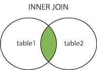
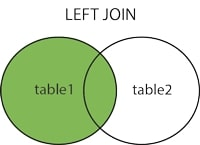
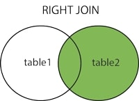
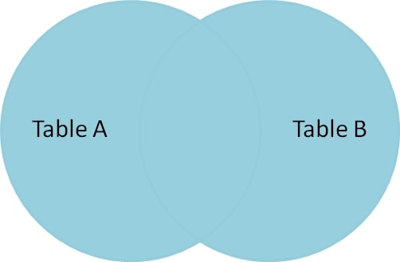
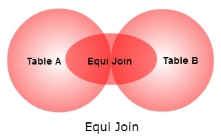

# SQL Basics and JDBC - Day 3

## What is a Subquery?

A subquery is a query nested inside another SQL query. It is used to retrieve data that will be used in the main query as a condition to further restrict the data to be retrieved.

A subquery can occur in various subsections of a query:

- `SELECT` clause (inner query)
- `WHERE` clause (nested query)
- `FROM` clause (inline view)

Subqueries can be nested in a `SELECT`, `INSERT`, `UPDATE`, `DELETE`, or even inside another subquery.

Logical operators can be used to compare the results of a subquery with other values in the main query.

- Nested queries can return a single or multiple values, depending on how they are used in the main query.

- Inline views create temporary result sets that can be treated as tables within the main query.

- Inner queries create temporary columns in the result set of the main query.

  - The column created by an inner query has a value equal to the result of the inner query for each row in the main query.

- The subquery can also be called an `inner query` or `inner select`, while the container query is called the `outer query` or `outer select`.

The `inner query` is executed first, and its result is used by the `outer query`.

Subqueries are convenient but can be less efficient than joins, especially for large datasets.

### Real World Application

Subqueries can be a convenient way of gathering information between related tables. However, in many cases, the same data can be queried using a `JOIN`, which may be more efficient. It is better practice to `JOIN` a table rather than using a subquery when possible.

It is rare to find a situation where a subquery is the only option for retrieving the desired data, especially since a `JOIN` could perform the same task more efficiently.

### Implementation

For the following demonstrations, use the table below:

```sql
CREATE TABLE IF NOT EXISTS students (
  id INT PRIMARY KEY,
  name VARCHAR(40) NOT NULL UNIQUE
)

CREATE TABLE IF NOT EXISTS evals (
  id INT PRIMARY KEY,
  studentId INT NOT NULL FOREIGN KEY REFERENCES students(id),
  evalName VARCHAR(10) NOT NULL,
  mark INT DEFAULT 0 CHECK(mark >= 0 AND mark <= 100)
)

INSERT INTO students (id, name) VALUES (1, 'Steve'), (2, 'Jane'), (3, 'Casey');
INSERT INTO evals (id, studentId, evalName, mark) VALUES (1, 1, 'quiz 1', 98),
 (2, 2, 'quiz 1', 80),
 (3, 3, 'quiz 1', 95),
 (4, 1, 'test 1', 72),
 (5, 2, 'test 1', 100),
 (6, 3, 'test 1', 68);
```

#### Nested Queries

A nested query is a subquery found in the `WHERE` clause of the main/outer query. It is used to filter the results of the outer query based on the results of the inner query.

```sql
SELECT col1, ... FROM table_name
WHERE (subquery);
```

Using the students schema, find all students who scored higher than Jane (2) on quiz 1. The problem is that we do not know Jane's score, so we will use a nested query to find it.

```sql
SELECT studentId, evalName, mark FROM evals
WHERE studentId = 2 AND evalName = 'quiz 1';
```

| studentId | evalName | mark |
| --------- | -------- | ---- |
| 2         | quiz 1   | 80   |

Knowing this information, we could write a simple query to obtain the other information.

```sql
SELECT studentId, evalName, mark FROM evals
WHERE evalName = 'quiz 1' AND mark > 80;
```

| studentId | evalName | mark |
| --------- | -------- | ---- |
| 1         | quiz 1   | 98   |
| 3         | quiz 1   | 95   |

There is a problem with this approach. If Jane's score changes, we would have to change our query. Instead, we can use a nested query to find Jane's score dynamically.

```sql
SELECT studentId, evalName, mark, FROM evals
WHERE evalName = 'quiz1'
AND mark > (
  SELECT mark FROM evals
  WHERE studentId = 2 AND evalName = 'quiz 1'
)
```

| studentId | evalName | mark |
| --------- | -------- | ---- |
| 1         | quiz 1   | 98   |
| 3         | quiz 1   | 95   |

The subquery `(SELECT mark FROM evals WHERE studentId = 2 AND evalName = 'quiz 1')` is executed first, returning Jane's score of 80. The outer query then uses this value to filter the results, returning all students who scored higher than Jane on quiz 1.

#### Inline View

Inline views are subqueries found in the `FROM` clause of the main/outer query. They create a temporary result set that can be treated as a table within the main query.

Let's write an inline view where any mark is greater than 90 on any evaluation.

```sql
SELECT student.name, evals.evalName, evals.mark FROM students,
(
  SELECT studentId, evalName, mark FROM evals
  WHERE mark > 90
)
evals
WHERE students.id = evals.studentId;
```

| name  | evalName | mark |
| ----- | -------- | ---- |
| Steve | quiz 1   | 98   |
| Casey | quiz 1   | 95   |
| Jane  | test 1   | 100  |

The subquery `(SELECT studentId, evalName, mark FROM evals WHERE mark > 90)` is executed first, returning a temporary result set of evaluations with marks greater than 90. The outer query then joins this result set with the `students` table to retrieve the names of the students who achieved these marks.

#### Inner Query

An inner query is a subquery found in the `SELECT` clause of the main/outer query. It creates a temporary column in the result set of the main query.

```sql
SELECT student.id, student.name,
(
  SELECT AVG(mark) FROM evals
  WHERE evals.studentId = students.id
  GROUP BY evals.studentId
) AS avg -- AS can be omitted but is recommended for clarity
FROM students;
```

| student.id | student.name | avg     |
| ---------- | ------------ | ------- |
| 1          | Steve        | 81.5000 |
| 2          | Jane         | 90.0000 |
| 3          | Casey        | 85.0000 |

---

Each of these types of queries serves a different purpose and can be used in various scenarios to retrieve and manipulate data effectively. Understanding when and how to use each type of subquery is essential for efficient SQL querying.

## What is a Join?

In relational databases, data stored in multiple tables is related to one another through foreign keys. A `JOIN` is a SQL operation that combines rows from two or more tables based on a related column between them.

The `JOIN` clause is a part of DQL (Data Query Language) and is used in queries to access multiple tables based on their relationships. Several different types of SQL `JOIN` clauses will be discussed in the following sections.

### Real World Application

In businesses, when they are looking to analyze data from multiple sources, `JOIN` operations become essential. For example, a company may want to combine customer information from a `customers` table with their order history from an `orders` table. By using `JOIN` clauses, they can create comprehensive reports that provide insights into customer behavior, sales trends, and more. There is nearly endless number of use cases for `JOIN` operations, including:

- Combining employee data from an `employees` table with their department information from a `departments` table.
- Merging product details from a `products` table with their sales data from an `order_items` table.
- Integrating user profiles from a `users` table with their activity logs from a `user_activity` table.

These examples illustrate the versatility and power of `JOIN` operations in SQL.

### Implementation

Basic SQL `JOIN` clause syntax using `INNER JOIN` (default `JOIN` type):

```sql
SELECT table_name_1.column_name, table_name_2.column_name
FROM table_name_1
JOIN table_name_2
ON table_name_1.common_column = table_name_2.common_column;
```

## Inner Join

An `INNER JOIN` selects records that have matching values in both tables. If there is no match, the row is not included in the result set.



Syntax:

```sql
SELECT column_name(s)
FROM table1
INNER JOIN table2
ON table1.common_column = table2.common_column;
```

### Real World Application

An `INNER JOIN` is commonly used in scenarios where you want to retrieve related data from two tables. For example, consider a database with two tables: `employees` and `departments`. The `employees` table contains information about employees, including a foreign key that references the `departments` table. If you want to get a list of employees along with their department names, you would use an `INNER JOIN` to combine the two tables based on the department ID.

### Implementation

Consider these two tables `users` and `account`:

```sql
CREATE TABLE IF NOT EXISTS users (
  userId INT PRIMARY KEY,
  username VARCHAR(30) NOT NULL UNIQUE,
  email VARCHAR(50) NOT NULL UNIQUE
);

CREATE TABLE IF NOT EXISTS account (
  accountId INT PRIMARY KEY,
  userId INT NOT NULL FOREIGN KEY REFERENCES users(userId),
  accountNumber VARCHAR(20) NOT NULL UNIQUE,
  balance DECIMAL(10, 2) DEFAULT 0.00
);
```

In this example, we have two tables `users` and `account`. The `users` table contains information about users, while the `account` table contains information about their accounts, linked by the `userId` foreign key establishing a relationship between the two tables. This allows us to retrieve user information along with their account details using `JOIN` operations.

Now, let's say you want to perform an `INNER JOIN` to get information about users and their corresponding accounts:

```sql
SELECT users.userId, users.username, users.email, account.accountNumber, account.balance
FROM users
INNER JOIN account ON users.userId = account.userId;
```

This query retrieves the `userId`, `username`, `email`, `accountNumber`, and `balance` for each user who has an associated account. If a user does not have an account, they will not be included in the result set. This is a typical use case for `INNER JOIN`, where you want to combine related data from multiple tables while excluding non-matching rows.

Output:

| userId | username | email            | accountNumber | balance |
| ------ | -------- | ---------------- | ------------- | ------- |
| 1      | john_doe | john@example.com | 1234567890    | 1000.00 |
| 2      | jane_doe | jane@example.com | 0987654321    | 2000.00 |

We could have achieved the same result without a `JOIN` by doing the following query:

```sql
SELECT users.userId, users.username, users.email, account.accountNumber, account.balance
FROM users, account
WHERE users.userId = account.userId;
```

This implicitly creates a Cartesian product of the two tables and then filters the results based on the `WHERE` clause. While this approach can work, it is generally less efficient and less readable than using explicit `JOIN` syntax. The `INNER JOIN` syntax clearly expresses the intention to combine related data from multiple tables, making the query easier to understand and maintain.

## Left and Right Joins

`LEFT JOIN`

A `LEFT JOIN` returns all records from the left table (table1), and the matched records from the right table (table2). If there is no match, the result is `NULL` on the side of the right table.



Syntax:

```sql
SELECT column_name(s)
FROM table1
LEFT JOIN table2
ON table1.common_column = table2.common_column;
```

---

`RIGHT JOIN`

A `RIGHT JOIN` returns all records from the right table (table2), and the matched records from the left table (table1). If there is no match, the result is `NULL` on the side of the left table.



Syntax:

```sql
SELECT column_name(s)
FROM table1
RIGHT JOIN table2
ON table1.common_column = table2.common_column;
```

---

Note: The terms `LEFT` and `RIGHT` do not refer to actual tables in a database but rather to the order in which the tables are listed in the SQL query. The first table mentioned is considered the "left" table, and the second table is considered the "right" table.

### Real World Application

`LEFT JOIN` and `RIGHT JOIN` are particularly useful in scenarios where you want to retrieve all records from one table, regardless of whether there is a matching record in the other table. For example, consider a database with two tables: `customers` and `orders`. If you want to get a list of all customers along with their orders, even if some customers have not placed any orders, you would use a `LEFT JOIN`. This way, you can see all customers and their associated orders, with `NULL` values for customers without orders.

### Implementation

Consider these two tables `Customers` and `Orders`:

```sql
CREATE TABLE IF NOT EXISTS Customers (
  customerId INT PRIMARY KEY,
  firstName VARCHAR(30) NOT NULL,
  lastName VARCHAR(30) NOT NULL,
  country CHAR(2) NOT NULL
);

CREATE TABLE IF NOT EXISTS Orders (
  orderId INT PRIMARY KEY,
  customerId INT NOT NULL FOREIGN KEY REFERENCES Customers(customerId),
  orderDate DATE NOT NULL DEFAULT CURRENT_DATE,
  totalAmount DECIMAL(10, 2) DEFAULT 0.00
);
```

In this example, we have two tables `Customers` and `Orders`. The `Customers` table contains information about customers, while the `Orders` table contains information about their orders, linked by the `customerId` foreign key establishing a relationship between the two tables. This allows us to retrieve customer information along with their order details using `JOIN` operations.

You want to see a list of all customers and their orders, even if some customers have not placed any orders.

```sql
SELECT Customers.customerId, Customers.firstName, Customers.lastName, Orders.orderId
FROM Customers
LEFT JOIN Orders ON Customers.customerId = Orders.customerId;
```

This SQL query performs a `LEFT JOIN` between the `Customers` and `Orders` tables based on the `customerId` column. It retrieves the `customerId`, `firstName`, `lastName`, and `orderId` for each customer. If a customer has not placed any orders, the `orderId` will be `NULL`.

Supposed you want to see all the orders and their corresponding customer information:

```sql
SELECT Customers.customerId, Customers.firstName, Customers.lastName, Customers.country, Orders.orderId, Orders.orderDate, Orders.totalAmount
FROM Customers
RIGHT JOIN Orders ON Customers.customerId = Orders.customerId;
```

Here, we are using a `RIGHT JOIN` to retrieve all orders along with their associated customer information. If an order does not have a corresponding customer (which is unlikely in this case due to the foreign key constraint), the customer fields will be `NULL`.

## Outer Join

An `OUTER JOIN` is a type of join that returns all records when there is a match in either left (table1) or right (table2) table records. depending on the type of `OUTER JOIN`, it can be classified into three types: `LEFT OUTER JOIN`, `RIGHT OUTER JOIN`, and `FULL OUTER JOIN`.

In simpler terms, an `OUTER JOIN` retrieves all records from both tables even if there is no match.


Note: MySQL does not support `OUTER JOIN`; you must use a `LEFT JOIN` or `RIGHT JOIN` to get the behavior of an `OUTER JOIN`.

In some other dialects of SQL, you can use a `FULL OUTER JOIN` or `FULL JOIN` to achieve the same result.

### Real World Implementation

In a real-world scenario, consider a database with two tables: `Employees` and `Departments`. You want to retrieve a list of all employees along with their department information, even if some employees are not assigned to any department.

Other use cases include:

- Used to fetch data from different tables
- Handling incomplete data scenarios
- Analyzing discrepancies between related datasets
- Combining data from multiple sources
- Aggregating data for reporting purposes

### Implementation

Consider the following tables `PartyGuests` and `PartyAttendees`:

```sql
CREATE TABLE IF NOT EXISTS PartyGuests (
  guestId SERIAL PRIMARY KEY,
  guestName VARCHAR(100) NOT NULL
);

CREATE TABLE IF NOT EXISTS PartyAttendees (
  attendeeId SERIAL PRIMARY KEY,
  attendeeName VARCHAR(100) NOT NULL
);

INSERT INTO PartyGuests (guestName) VALUES
  ('Alice'),
  ('Bob'),
  ('Charlie'),
  ('David');

INSERT INTO PartyAttendees (attendeeName) VALUES
  ('Alice'),
  ('Charlie'),
  ('Eve'),
```

Let;s consider a scenario where you have two tables: one containing a list of people invited to a part, `PartyGuests`, and another containing a list of people who actually attended the party, `PartyAttendees`. You want to find out who was invited but did not attend, as well as who attended without being invited. We will use a `FULL OUTER JOIN` to combine these tables and as the complete picture.

```sql
SELECT PartyGuests.guestId, PartyAttendees.attendeeId, PartyGuests.guestName, PartyAttendees.attendeeName
FROM PartyGuests
FULL OUTER JOIN PartyAttendees ON PartyGuests.guestName = PartyAttendees.attendeeName;
```

This could also be written by omitting the `OUTER` and yield the same result:

```sql
SELECT PartyGuests.guestId, PartyAttendees.attendeeId, PartyGuests.guestName, PartyAttendees.attendeeName
FROM PartyGuests
FULL JOIN PartyAttendees ON PartyGuests.guestName = PartyAttendees.attendeeName;
```

This is because `FULL JOIN` is shorthand for `FULL OUTER JOIN`.

Output:

| guestId | attendeeId | guestName | attendeeName |
| ------- | ---------- | --------- | ------------ |
| 1       | 1          | Alice     | Alice        |
| 2       | 2          | Bob       | Charlie      |
| 3       | NULL       | Charlie   | NULL         |
| 4       | 3          | David     | NULL         |
| NULL    | 4          | NULL      | Eve          |

## Equi and Theta Joins

A `THETA JOIN` is a type of join that combines rows from two or more tables based on a condition that is not necessarily an equality condition. In other words, a `THETA JOIN` allows you to use comparison operators other than the equal sign (`=`) to match rows between tables.

For a `THETA JOIN`, we make associations on columns that have the same datatype but may represent different values. For example, we could join a `Products` table with a `Sales` table based on a condition that the `price` in the `Products` table is greater than the `salePrice` in the `Sales` table.

The general case of the `JOIN` operation is called a `THETA JOIN`, which allows for any comparison operator (e.g., `<`, `>`, `<=`, `>=`, `!=`) to be used in the join condition.

Syntax for `THETA JOIN`:

```sql
SELECT columns
FROM table1
JOIN table2 ON table1.column operator table2.column;
```

---

An `EQUI JOIN` is a specific type of `THETA JOIN` that uses only equality conditions to match rows between tables. In other words, an `EQUI JOIN` combines rows from two or more tables based on a condition that the values in specified columns are equal.

- `EQUI JOIN` is the most common type of join used in SQL.
- `EQUI JOIN` performs a join based on equality or matching conditions.

Syntax for `EQUI JOIN`:

```sql
SELECT columns
FROM table1
JOIN table2 ON table1.column = table2.column;

---


```

### Real World Application

Real world use cases for `EQUI JOIN`:

- `EQUI JOINS` are suitable for scenarios where you need to match records based on the equality of specific columns (e.g., joining `Users` and `Orders` tables based on `userId`).
  - Matching Data for Analysis: you may have data spread across multiple tables and need to combine it for analysis (e.g., joining `Sales` and `Products` tables to analyze sales performance by product).

Real world use cases for `THETA JOIN`:

- `THETA JOINS` offer more flexibility by allowing a broader range of conditions (e.g., joining `Products` and `Sales` tables based on a price range).
  - Pattern Matching: Finding all customers whose names contain a particular substring (e.g., joining `Customers` and `Orders` tables where customer names match a specific pattern).
  - Date Range Matching: Retrieving records that fall within a specific date range (e.g., joining `Events` and `Attendees` tables where event dates fall within a certain period).
  - Numeric Range Matching: Joining tables based on a range of numeric values (e.g., joining `Products` and `Inventory` tables where product prices fall within a specific range).

### Implementation

Consider these two tables `Authors` and `Books`:

```sql
CREATE TABLE IF NOT EXISTS Authors (
  authorId INT PRIMARY KEY,
  author_first_name VARCHAR(100) NOT NULL,
  author_last_name VARCHAR(100) NOT NULL
  birthYear INT
);

INSERT INTO Authors (authorId, author_first_name, author_last_name, birthYear)
VALUES
    (101, 'F. Scott', 'Fitzgerald', 1896),
    (102, 'Harper', 'Lee', 1926),
    (103, 'J.R.R.', 'Tolkien', 1892),
    (104, 'George', 'Orwell', 1903);

CREATE TABLE IF NOT EXISTS Books (
  bookId INT PRIMARY KEY,
  title VARCHAR(200) NOT NULL,
  genre VARCHAR(50) NOT NULL,
  price DECIMAL(10, 2) NOT NULL,
  authorId INT NOT NULL FOREIGN KEY REFERENCES Authors(authorId)
);

INSERT INTO Books (bookId, title, genre, price, authorId)
VALUES
    (1, 'The Great Gatsby', 'Fiction', 14.50, 101),
    (2, 'To Kill a Mockingbird', 'Fiction', 12.75, 102),
    (3, 'The Hobbit', 'Fantasy', 19.50, 103),
    (4, '1984', 'Dystopian', 16.25, 104);
```

#### Equi Join Example

Perform an `EQUI JOIN` to retrieve information about books and their corresponding author details based on the equality of the `authorId` column in both tables.

```sql
SELECT bookId, title, genre, price, author_first_name, author_last_name, birthYear
FROM BOOKS
JOIN Authors ON Books.authorId = Authors.authorId;
```

Output:

| bookId | title                 | genre     | price | author_first_name | author_last_name | birthYear |
| ------ | --------------------- | --------- | ----- | ----------------- | ---------------- | --------- |
| 1      | The Great Gatsby      | Fiction   | 14.50 | F. Scott          | Fitzgerald       | 1896      |
| 2      | To Kill a Mockingbird | Fiction   | 12.75 | Harper            | Lee              | 1926      |
| 3      | The Hobbit            | Fantasy   | 19.50 | J.R.R.            | Tolkien          | 1892      |
| 4      | 1984                  | Dystopian | 16.25 | George            | Orwell           | 1903      |

### True Theta Join Example

Use a `THETA JOIN` to retrieve book and author information based on a `JOIN` condition that involves a comparison operator other than equality.

```sql
SELECT bookId, title, genre, price, author_first_name, author_last_name, birthYear
FROM Books
JOIN Authors
ON Books.price > Authors.birthYear;
```

This query retrieves book and author information where the book's price is greater than the author's birth year. This is a less common use case but demonstrates the flexibility of `THETA JOIN`.

---

Retrieve books with price conditions as a part of the `JOIN` itself (beyond equality):

```sql
SELECT bookId, title, genre, price, author_first_name, author_last_name, birthYear
FROM Books
JOIN Authors
ON Books.authorId = Authors.authorId
WHERE price > 15.00;
```

Output:

| bookId | title      | genre     | price | author_first_name | author_last_name | birthYear |
| ------ | ---------- | --------- | ----- | ----------------- | ---------------- | --------- |
| 3      | The Hobbit | Fantasy   | 19.50 | J.R.R.            | Tolkien          | 1892      |
| 4      | 1984       | Dystopian | 16.25 | George            | Orwell           | 1903      |
