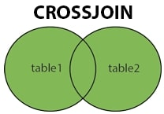

# JDBC/SQL Intermediate

## Cross Join

A `CROSS JOIN`, commonly known as a `CARTESIAN JOIN`, is a type of join in SQL that returns the Cartesian product of two tables. This means that it combines each row from the first table with every row from the second table, resulting in a set of all possible combinations of rows.

If no condition is provided, the result set is generated by multiplying each row from the first table with each row from the second table. This can lead to a large number of rows in the result set, especially if both tables have many rows.



**Syntax:**

```sql
SELECT *
FROM table1
CROSS JOIN table2;
```

### Real World Application

`CROSS JOIN` is used when we need to find all possibilities of combining multiple records, where the result set includes every row from each contributing table. This is particularly useful in scenarios such as:

- Generating all possible combinations of products and customers for a marketing campaign.
- Creating a schedule that pairs every employee with every available project.
- Analyzing the impact of different marketing strategies by combining them with various customer segments.

`CROSS JOIN` can also be used to identify missing relationships or gaps in data by generating all possible combinations and then filtering out the existing relationships.

### Implementation

Let's consider a real world example involving an online store. Below, we have two tables `Customers` and `Products`:

**Customers**

| customerId | f_name  | l_name    |
| ---------- | ------- | --------- |
| 1          | Alice   | May       |
| 2          | Bob     | Parker    |
| 3          | Charlie | Chocolate |

**Products**

| productId | productName | price  |
| --------- | ----------- | ------ |
| 101       | Laptop      | 999.99 |
| 102       | Smartphone  | 499.99 |
| 103       | Headphones  | 79.99  |

Let's generate all possible combinations of customers and products using a `CROSS JOIN`.

```sql
-- Cross join to generate all combinations of customers and products
SELECT Customers.CustomerId, Customers.f_name, Customers.l_name,
       Products.productId, Products.productName, Products.price as ProductPrice
FROM Customers
CROSS JOIN Products;
```

In this example, the `Customers` table represents the store's customers, and the `Products` table represents the available products with their prices. The `CROSS JOIN` generates all possible combinations of customers and products, allowing you to see every customer paired with every product.

**OUTPUT**

| customerId | f_name  | l_name    | productId | productName | ProductPrice |
| ---------- | ------- | --------- | --------- | ----------- | ------------ |
| 1          | Alice   | May       | 101       | Laptop      | 999.99       |
| 1          | Alice   | May       | 102       | Smartphone  | 499.99       |
| 1          | Alice   | May       | 103       | Headphones  | 79.99        |
| 2          | Bob     | Parker    | 101       | Laptop      | 999.99       |
| 2          | Bob     | Parker    | 102       | Smartphone  | 499.99       |
| 2          | Bob     | Parker    | 103       | Headphones  | 79.99        |
| 3          | Charlie | Chocolate | 101       | Laptop      | 999.99       |
| 3          | Charlie | Chocolate | 102       | Smartphone  | 499.99       |
| 3          | Charlie | Chocolate | 103       | Headphones  | 79.99        |

This information can be useful because now we can analyze potential sales opportunities, understand customer preferences, and generate comprehensive reports for marketing strategies.

## Self Join

`SELF JOIN` is a type of join in SQL where a table is joined with itself. This is useful when you want to compare rows within the same table or when you need to find relationships between records in the same table.

When performing a `SELF JOIN`, you typically use table aliases to differentiate between the two instances of the same table. This allows you to reference the same table multiple times in a single query.

This type of join is also known as a Unary relationship.


**Syntax**:

```sql
SELECT a.column1, b.column2
FROM table_name a, table_name b
WHERE a.common_field = b.common_field;
```

### Real World Application

Real world use cases include:

- Finding hierarchical relationships, such as employees and their managers within an organization.
- Comparing records within the same table, such as finding duplicate entries or related items.
- Analyzing relationships in social networks, such as friends or followers.

### Implementation

In the following example, we will have one table since a `SELF JOIN` is a type of join wherein the data is coming from the same table.

**Employees**

| employee_id | employee_name        | manager_id |
| ----------- | -------------------- | ---------- |
| 1           | CEO                  | NULL       |
| 2           | Marketing Manager    | 1          |
| 3           | Sales Manager        | 1          |
| 4           | Marketing Specialist | 2          |
| 5           | Sales Representative | 3          |
| 6           | Marketing Intern     | 2          |

Using the records from this table, we would like to retrieve our employees and readable information for each employee's associated manager in the company.

A `SELF JOIN` query will accomplish this task perfectly:

```sql
SELECT e.employee_name AS employee, m.employee_name AS manager
FROM Employees e
JOIN Employees m
ON e.manager_id = m.employee_id
ORDER BY  e.employee_id;
```

We can also execute the same logic but without the `JOIN` keyword:

```sql
SELECT e.employee_name as employee, m.employee_name as manager
FROM Employees e, Employees m
WHERE e.manager_id = m.employee_id
ORDER BY e.employee_id;
```

**OUTPUT**

| employee             | manager           |
| -------------------- | ----------------- |
| Marketing Manager    | CEO               |
| Sales Manager        | CEO               |
| Marketing Specialist | Marketing Manager |
| Sales Representative | Sales Manager     |
| Marketing Intern     | Marketing Manager |

Both examples utilize a `SELF JOIN` to retrieve related data from the same table. However, the CEO record is not returned from the query due to the `NULL` foreign key reference and the behavior of the `SELF JOIN` or a `WHERE` clause. If we require the CEO record to be returned, we can use a `LEFT JOIN` instead of an `INNER JOIN` or a `WHERE` clause.

```sql
SELECT e.employee_name AS employee, m.employee_name AS manager
FROM Employees e
LEFT JOIN Employees m
ON e.manager_id = m.employee_id
ORDER BY e.employee_id;
```

**OUTPUT**

| employee             | manager           |
| -------------------- | ----------------- |
| CEO                  | NULL              |
| Marketing Manager    | CEO               |
| Sales Manager        | CEO               |
| Marketing Specialist | Marketing Manager |
| Sales Representative | Sales Manager     |
| Marketing Intern     | Marketing Manager |
