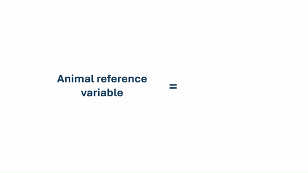
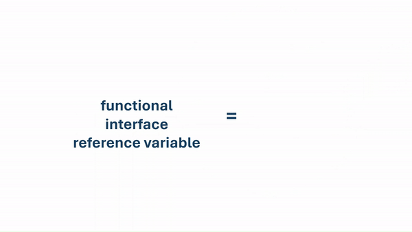
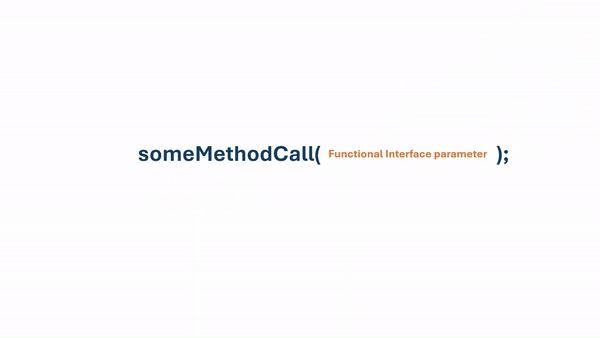

# APIs and Testing - Day 1

Java is mainly an **object-oriented programming language**. This means that everything in Java is associated with **classes and objects**, along with its attributes and methods. However, Java can also be used for **functional programming**.

Functional programming is a different way of thinking about programming. While OOP uses objects and object interactions to design applications, functional programming focuses on using functions to build software. Instead of having objects interacting with each other, functional programming relies on the use of pure functions to transform data.

In functional programming, functions are first-class citizens, meaning they can be passed as arguments, returned from other functions, and assigned to variables. In Java, we can use **lambda expressions** and **method references** as our "first-class citizen" functions, and we can use "functional interfaces" variables and method parameters to hold them.

Using functional programming in Java can be similar to utilizing object casting in OOP. Just as we can cast objects to different types to access specific behaviors, we can use functional programming techniques to manipulate data in a more declarative way.

The below example assumes we have an `Animal` supertype and `Dog` and `Cat` subtypes. We can use object casting to access subtype-specific methods:



With object casting, we can swap subclass objects if we have a supertype reference variable. Meaning, we can assign a `Dog` or `Cat` object to an `Animal` reference variable. However, we can only access the methods defined in the `Animal` class unless we cast the object back to its original type.

We can do something similar if we use **functional interfaces**. A **functional interface** is an interface that contains only **ONE** abstract method. We can use the interface as a supertype reference variable and we can assign it a function (lambda expression or method reference) that matches the abstract method's signature. This allows us to swap different functions while using the same interface reference variable.

In the below example, we have a variable be of the functional interface type, and then we assign it a lambda as its value. We can then call the abstract method on the interface variable, which will execute the lambda function.



The most common use case of functional programming in Java is to have functional interface types as method parameters. This allows us to pass different functions to a method, enabling us to change the behavior of the method without changing its implementation.



### Real World Application

Understanding functional interfaces in Java is important because they are a fundamental concept in modern Java programming, especially with the introduction of lambda expressions and the Stream API in Java 8. Here are some reasons why understanding functional interfaces is important:

- **Lambda Expressions**: Functional interfaces enable the use of lambda expressions, which provide a concise way to express instances of single-method interfaces. Lambda expressions can make code more readable and maintainable by reducing boilerplate code.
- **Stream API**: The Stream API in Java heavily relies on functional interfaces for operations like filtering, mapping, and reducing collections. These methods accept functional interfaces as parameters, allowing developers to pass custom behavior to process data in a functional style.
- **Parallel Processing**: Functional interfaces enable parallel processing of collections using features like parallel streams. Parallel streams internally use functional interfaces to split the workload and execute operation concurrently, improving performance for large datasets.
- **Higher-Order Functions**: Functional interfaces allow the creation of higher-order functions, which are functions that can take other functions as arguments or return them as results. This enables more abstract and flexible programming patterns.
- **Functional Programming Paradigm**: Functional interfaces are a key component of the functional programming paradigm, which promotes writing code in a declarative and composable manner. Understanding functional interfaces helps developers embrace functional programming concepts and write cleaner, more modular code.

In summary, understanding functional interfaces in Java is crucial for leveraging modern Java features, writing more expressive code, and embracing functional programming principles.

### Implementation

Let's look at an example of object casting versus functional programming. Let's say we have three classes: `Animal`, `Dog`, and `Cat`.

```java
abstract class Animal {
    public abstract void makeNoise();
}

abstract class Cat extends Animal {
    @Override
    public void makeNoise() {
        System.out.println("Meow!");
    }
}
abstract class Dog extends Animal {
    @Override
    public void makeNoise() {
        System.out.println("Woof!");
    }
}
```

In `Main.java`, we can use object casting to swap `Animal` implementations wherever there is an `Animal` reference variable. (Note: This is not functional programming, just OOP with object casting aka polymorphism.)

```java
public class Main {
    public static void main(String[] args) {
        Animal myAnimal = new Dog();
        myAnimal.makeNoise(); // Outputs "Woof!"

        myAnimal = new Cat();
        myAnimal.makeNoise(); // Outputs "Meow!"
    }
}
```

Now, let's implement functional programming. First, we will need a functional interface so that we can yse it as a reference/supertype variable. There are already many built-in functional interfaces in the `java.util.function` package, and you'll most likely use those in real-world applications. However, for this example, we will create our own functional interface called `Prettier`:

```java
public interface Prettier {
  /**
   * This method takes in an Object, translates it to a pretty String, and
   * returns that String.
   *
   * @param obj The object to be prettified.
   * @return A pretty String representation of the object.
   */
  public abstract String prettify(Object obj);
}
```

Functional interfaces conventionally have names ending in `-er` or `-able`, such as `Runnable`, `Callable`, `Comparable`, etc. They also typically have only one abstract method, which is the method that will be implemented by the lambda expression or method reference. In this case, we have an interface called `Prettier` with one abstract method called `prettify` and the functionality of the interface is to convert an object to a pretty string. We define a single abstract method that takes in an `Object` and returns a `String`.

Let's implement this functionality using a lambda expression in `Main.java`:

```java
public class Main {
  public static void main(String[] args) {
    // ---- Functional Programming ---- //

    // write functionality
    Prettier prettierImpl = x -> "*~*~ " + x + " ~*~*";

    // use functionality
    Integer myInteger = 5;
    String result = prettierImpl.prettify(myInteger);
    System.out.println(result); // output: "*~*~ 5 ~*~*"

    // swap implementations
    prettierImpl = x -> "+-+- " + x + " -+-+";
    result = prettierImpl.prettify(myInteger);
    System.out.println(result); // output: "+-+- 5 -+-+"
  }
}
```

Let's break down the code:

- The statement: `Prettier prettierImpl = x -> "*~*~ " + x + " ~*~*";` is a lambda expression that implements the `prettify` method of the `Prettier` interface and assigns it to the `prettierImpl` variable. The lambda takes in a single parameter `x` (of type `Object`, inferred from the interface) and returns a formatted string.
- The expression `x -> "*~*~ " + x + " ~*~*"` has unusual syntax because it is a lambda expression. Think of lambdas as functions we can create "on the fly" without needing to create a whole new class that implements the interface. They allow us to write functionality concisely by omitting boilerplate code.
- The `-> ` syntax separates the parameter list (on the left) from the body of the lambda (on the right). In this case, the body is a single expression that concatenates strings.
- Lambdas implicitly return the value of the expression on the right side of the `->` if there are no curly braces `{}`. If there were curly braces, we would need to use an explicit `return` statement.
- We then use the implementation by calling `prettierImpl.prettify(myInteger)` and passing in an `Integer` object. The lambda implementation is executed, and the result is printed.

One significant difference between OOP and functional programming is that we can use much less code to implement some standalone functionality. For example, if we wanted to create a `Prettier` implementation using OOP, we would need to create a new class that implements the `Prettier` interface:

```java
public class FancyPrettier implements Prettier {
  @Override
  public String prettify(Object obj) {
    return "*~*~ " + obj + " ~*~*";
  }
}

public class Main {
  public static void main(String[] args) {
    // ---- Object Oriented Programming ---- //

    // write functionality
    Prettier prettierImpl = new FancyPrettier();

    // use functionality
    Integer myInteger = 5;
    String result = prettierImpl.prettify(myInteger);
    System.out.println(result); // output: "*~*~ 5 ~*~*"
  }
}
```

## Lambdas

Lambda expressions are one of the most prominent features of Java 8 and later versions. They introduce us to some important aspects of functional programming in Java.

Lambdas are a concise way to represent an instance of a functional interface. They enable us to treat functionality as a method argument or store functions in variables, making code shorter and more readable.

The most basic syntax of a lambda expression is:

```java
(parameters) -> expression
```

Let's demonstrate an example that uses lambda. The `ArrayList` class defines a `forEach()` method. The method's signature is below:

```java
public void forEach(Consumer<? super E> action)
```

Notice its parameter is a functional interface called `Consumer` that has one abstract method called `accept()`.

```java
void accept(T t);
```

`accept()` takes in one parameter of type `T` and returns `void`. The `forEach()` method will call the `accept()` method on each element of the list, passing the element as an argument.

A function that implements `accept()` method should take in one parameter, perform some action, and return nothing.

Below is an example of creating a `List`, adding elements to it, and then using the `forEach()` method by passing in a lambda that fulfills the requirements of the `Consumer` interface which is to take in one parameter and return nothing.

```java
List<String> names = new ArrayList<>();
names.add("Alice");
names.add("Bob");
names.add("Charlie");

names.forEach(n -> System.out.println(n));
```

The lambda expression `n -> System.out.println(n)` takes in one parameter `n` (of type `String`, inferred from the list) and prints it to the console. The `forEach()` method will call this lambda for each element in the list, resulting in each name being printed.

#### Lambda Expression Syntax

A lambda expression is composed of three main parts:

| Argument List  | Arrow Token | Body                        |
| -------------- | ----------- | --------------------------- |
| (parameters)   | `->`        | expression or block of code |
| (int x, int y) | `->`        | (x + y)                     |

- **Argument List**: This is a comma-separated list of input parameters for the lambda. The types of the parameters can be explicitly declared or inferred from the context. If there is only one parameter, the parentheses can be omitted. For example, `x -> x * x` is valid for a single parameter.
- **Arrow Token**: The `->` symbol separates the argument list from the body of the lambda expression. It indicates that the parameters on the left are to be used in the body on the right.
- **Body**: This is the code that defines what the lambda does. It can be a single expression or a block of code enclosed in curly braces `{}`. If the body is a single expression, it implicitly returns the result of that expression. If it's a block of code, you need to use an explicit `return` statement if you want to return a value.
  - The `break` and `continue` statements cannot be used inside the body of a lambda expression because they are not part of the lambda's control flow. However, you can use them in a block of code if the lambda is used within a loop or switch statement.
  - IF the body produces a result, every control path must return a value or throw an exception.

Take a look at these examples:

```java
// Example 1: two parameters, single expression
(int x, int y) -> (x + y) // takes in two integers and returns their sum

// Example 2: no parameters, single expression
() -> 42 // takes in no parameters and returns the integer 42

// Example 3: one parameter, block of code
(String s) -> {
  System.out.println(s);
} // takes in a String, prints it, and returns nothing

// Example 4: one parameter, single expression
s -> System.out.println(s) // takes in a String, prints it, and returns nothing

// Example 5: two parameters, block of code
(String s1, String s2) -> {
  System.out.println(s1);
  System.out.println(s2);
} // takes in two Strings, prints them, and returns nothing
```

1. The first example takes in two integers and returns their sum. The types of the parameters are explicitly declared.
2. The second example takes in no parameters and returns the integer `42`. The empty parentheses `()` indicate that there are no parameters.
3. The third example takes in a `String`, prints it to the console, and returns nothing. The body is a block of code enclosed in curly braces `{}`.
4. The fourth example is similar to the third but uses a single expression without curly braces. The parentheses around the parameter are omitted since there is only one parameter.
5. The fifth example takes in two `String` parameters, prints them to the console, and returns nothing. The body is a block of code.

### Real World Application

Lambdas in Java bring several important benefits to the language and its ecosystem. Here are some key reasons why lambdas are important in Java:

- **Conciseness and Readability**: Lambdas allow you to express instances of single-method interfaces (functional interfaces) concisely. This leads to more readable code, especially for small, self-contained functions.
- **Reduced Boilerplate**: Lambdas reduce the amount of boilerplate code needed to create instances of functional interfaces. You don't need to create separate classes or anonymous inner classes for simple operations.
- **Improved API Design**: Lambdas enable the design of APIs to accept behavior as parameters, promoting flexibility and extensibility. This facilitates writing APIs that are more adaptable to different use cases and allows clients to customize behavior easily.
- **Functional Programming Style**: Lambdas enable Java to embrace functional programming principles, such as higher-order functions, immutability, and referential transparency. Referential transparency means that a function, given the same input, will always return the same output without causing side effects. This leads to more predictable and maintainable code.
- **Enhanced Collections Framework**: Lambdas, together with the Stream API introduced in Java 8, provide a powerful and expressive way to work with collections. Operations like filtering, mapping, and reducing can be performed using a functional and declarative style, making it easier to manipulate data and leading to more elegant and efficient code.

In summary, lambdas are important in Java because they enhance code readability, reduce boilerplate, improve API design, promote functional programming principles, and enhance the capabilities of the collections framework. They have become a fundamental feature of modern Java programming and are widely used in various applications and libraries.

### Implementation

Below is an example of a Java program that does the following:

- creates a functional interface
- creates a method that has a parameter of the functional interface type
- calls the method and passes in a lambda expression as an argument

```java
// Functional Interface
interface BinaryCalculator {
  public int binaryOperation(int value1, int value2);
}

// Implementing Functional Interface
public class Main {
  // Method that has a parameter of the functional interface type
  public static void printBinaryResult(int a, int b, BinaryCalculator func) {
    // perform operation, print result
    int result = func.binaryOperation(a, b);
    System.out.println(result);
  }

  // calling the method and passing in lambdas
  public static void main(String[] args) {
    printBinaryResult(3, 4, (a, b) -> a + b); // prints 7
    printBinaryResult(3, 4, (a, b) -> a * b); // prints 12
  }
}
```

## Method References Syntax

In Java, **method references** provide a way to refer to methods without executing them. They are a shorthand notation of a lambda expression to call a method. Method references can be used wherever a functional interface is expected.

This is a new feature introduced in Java 8 that provides a shorthand way of referring to methods without explicitly invoking them.

A method reference is a compact and readable way to refer to a method in cases where a lambda expression would be used to call that method. Instead of writing out a full lambda expression, you can just use the method's name along with a special syntax.

There are four kind of method references:

1. **Reference to a Static Method**: This type of method reference refers to a static method of a class. The syntax is `ClassName::staticMethodName`.

   Example:

   ```java
   // Lambda expression
   Function<String, Integer> stringToInteger = s -> Integer.parseInt(s);

   // Method reference
   Function<String, Integer> stringToIntegerRef = Integer::parseInt;
   ```

2. **Reference to an Instance Method of a Particular Object**: This type of method reference refers to an instance method of a specific object. The syntax is `instance::instanceMethodName`.

   Example:

   ```java
   // Lambda expression
   BiPredicate<String, String> startsWith = (s1, s2) -> s1.startsWith(s2);

   // Method reference
   BiPredicate<String, String> startsWithRef = String::startsWith;
   ```

3. **Reference to an Instance Method of an Arbitrary Object of a Particular Type**: This type of method reference refers to an instance method of an arbitrary object of a specific type. The syntax is `ClassName::instanceMethodName`.

   Example:

   ```java
   // Lambda expression
   Function<String, String> toLowerCase = s -> s.toLowerCase();

   // Method reference
   Function<String, String> toLowerCaseRef = String::toLowerCase;
   ```

4. **Reference to a Constructor**: This type of method reference refers to a constructor of a class. The syntax is `ClassName::new`.

   Example:

   ```java
   // Lambda expression
   Supplier<List<String>> listSupplier = () -> new ArrayList<>();

   // Method reference
   Supplier<List<String>> listSupplierRef = ArrayList::new;
   ```

Below is a code snippet that compares syntax of lambda expressions and the corresponding method reference:

```java
// lambda that returns a character's index in a named String object by calling indexOf()
c -> myString.indexOf(c);

// method reference that does the same thing
myString::indexOf;
```

Notice the more concise syntax of the method reference. Method references always utilize the `::` operator to separate the method name from the class or object it belongs to.
The left side of the `::` operator tells the JVM where to find the method, and the right side is the name of the method itself.

##### Reference to a Static Method

A method reference to a static method in Java is a shorthand way of referring to a static method of a class without invoking it. It is used in the context of functional programming, where you want to pass a method as an argument to a higher-order function or use it in a lambda expression.

The syntax for a method reference to a static method is:

```java
ClassName::staticMethodName
```

For example, let's say we need an implementation for the `BiFunction` functional interface or a method that takes in two parameters and returns a value. We can use a method reference to the static `Math.max()` method to fulfill this requirement:

```java
Math::max
```

#### Reference to an Instance Method of a Particular Object

A **method reference to an instance method of a particular object** in Java is a shorthand way of referring to an instance method of a specific/named object. A named object is an object that has been assigned to a variable. For a reference to an instance method of a particular object, the left side of the operator is the object's reference variable, and the right side is the name of the instance method itself.

```java
objectName::instanceMethodName
```

For example, let's say we need an implementation for the `Supplier` functional interface or a method that takes in no parameters and returns a value. We can refer to the String class's instance method `toUpperCase()` by first creating a String object and then using that object's reference variable on the left side of the operator:

```java
// our named object
String myString = "hello";

// referencing an instance method using our named object
myString::toUpperCase;
```

#### Reference to an Instance Method of an Arbitrary Object of a Particular Type

A **method reference to an instance method of an arbitrary object of a particular type** in Java is a shorthand way of referring to an instance method of any object or unnamed object (not assigned to a variable). A unnamed object is an object that is created during an operation and is not assigned to a reference variable. It is typically used right away without being stored for later use. For example, when we create an object and immediately call a method on it without assigning it to a variable, we are using an unnamed object.
For this type of reference, the left side of the operator is the class name or object type, and the right side is the name of the instance method itself.

```java
ClassName::methodName
```

Notice that this syntax is exactly the same as a reference to a static method. However, behind the scenes is different. The JVM knows that the method is an instance method because of the context in which it is used. The JVM will create an unnamed object of the specified type and call the instance method on that object.

For example, let's say we need an implementation for the `Predicate` functional interface or a method that takes in one parameter and returns a boolean value. We can refer to the String class's instance method `startsWith()` by using the String class name on the left side of the operator:

```java
String::startsWith;
```

#### Reference to a Constructor

A **method reference to a constructor** in Java is a shorthand way of referring to a class constructor without invoking it. It is used in the context of functional programming, where you want to pass a constructor as an argument to a higher-order function or use it in a lambda expression. For this type of reference, the left side of the operator is the class name, and the right side is the keyword `new`.

```java
ClassName::new;
```

For example, let's say we need another implementation for the `Supplier` functional interface or a method that takes in no parameters and returns a value. Since a no-args constructor takes in no parameters and returns a new object, we can use a constructor reference to fulfill this requirement:

```java
String::new;
```

### Real World Application

Method references in Java provide a concise way to refer to methods or constructors without explicitly invoking them or defining a lambda expression. They are important for several reasons:

- **Readability and Conciseness**: Method references allow you to express code more concisely by referring to existing methods or constructors directly. This leads to clearer and more readable code, especially when working with functional interfaces and lambda expressions.
- **Functional Programming Paradigm**: Method references align with the functional programming paradigm by treating methods as first-class citizens. They allow you to pass behavior (methods) as parameters to methods, enabling functional styles of programming in Java.
- **Integration with Existing APIs**: Many existing APIs in Java, such as the Stream API and the Comparator interface, support method references. Using method references allows you to seamlessly integrate with these APIs and leverage their functionality.
- **Reduced Boilerplate Code**: Method references can help reduce boilerplate code by eliminating the need for explicit lambda expressions in certain scenarios. This can lead to more concise and maintainable code.

Overall, method references enhance the expressiveness and maintainability of Java code, making it easier to work with functional programming concepts and integrate with existing APIs.

### Implementation

Below are examples of each type of method reference.

#### Reference to a Static Method

Below is an example of a lambda expression that implements the `Function` functional interface by calling a static method called `triple()`.

```java
import java.util.function.Function;

public class LambdaExample {
  // a static method to reference
  public static int triple(int num) {
    return num * 3;
  }

  public static void main(String[] args) {
    // using a lambda to implement the Function function interface
    Function<Integer, Integer> computation = num -> triple(num);
  }
}
```

We can replace the lambda expression with a method reference to the static method `triple()`:

```java
import java.util.function.Function;

public class MethodExample {
  // a static method to reference
  public static int triple(int num) {
    return num * 3;
  }

  public static void main(String[] args) {
    // reference to a static method
    Function<Integer, Integer> computation = MethodExample::triple;

    // use the implementation, print out the result
    int res = computation.apply(-3);
    System.out.println(res);

    // another example of referencing a static method
    computation = Math::abs;

    // printing out the new result
    res = computation.apply(-3);
    System.out.println(res);
  }
}
```

#### Reference to an Instance Method of a Particular Object

```java
package week_6.day_1.ParticularRef;

import java.util.function.Predicate;

public class Main {
  public static void main(String[] args) {
      // provide an object to use as a reference
      String str = "hello world";

      // reference to a particular object's instance method
      Predicate<String> evaluation = str::startsWith;

      // use the predicate's test() method and print the result
      boolean res = evaluation.test("he");
      System.out.println("Result 1: " + res);

      evaluation = str::equalsIgnoreCase;
      res = evaluation.test("HeLlo WoRlD");
      System.out.println("Result 2: " + res);
  }
}
```

In the above example, we create a `String` object called `str` and then use that object's reference variable on the left side of the operator to refer to the instance method `startsWith()`. We then call the `test()` method on the `Predicate` functional interface, which will execute the `startsWith()` method on the `str` object.

#### Reference to an Instance Method of an Arbitrary Object of a Particular Type

```java
package week_6.day_1.ArbitraryRef;

import java.util.function.BiPredicate;

public class Main {
  public static void main(String[] args) {
    // reference to an arbitrary object of the String type
    BiPredicate<String, String> eval = String::startsWith;

    // use the BiPredicate's test() method and print the results
    boolean res = eval.test("hello world", "he");
    System.out.println("Result 1: " + res);

    // another example
    eval = String::equalsIgnoreCase;
    res = eval.test("goodbye!", "gOoDbYe!");
    System.out.println("Result 2: " + res);
  }
}
```

In the above example, we use the `String` class name on the left side of the operator to refer to the instance method `startsWith()`. The JVM will create an unnamed `String` object and call the `startsWith()` method on that object when we call the `test()` method on the `BiPredicate` functional interface.

#### Reference to a Constructor

```java
package week_6.day_1.ConstructorRef;

import java.util.function.Supplier;

class Dog {
  String name;
  int age;

  @Override
  public String toString() {
    return "Dog[name: " + this.name + " age: " + age + ']';
  }
}

public class Main {
  public static void main(String[] args) {
    // reference to a constructor
    Supplier<Dog> dogGetter = Dog::new;

    // use Supplier's get() method to retrieve and use an object
    Dog d = dogGetter.get();
    d.age = 3;
    d.name = "Charlie";
    System.out.println(d);
  }
}
```

In the above example, we use the `Dog` class name on the left side of the operator and the keyword `new` on the right side to refer to the no-args constructor of the `Dog` class. When we call the `get()` method on the `Supplier` functional interface, the JVM will create a new `Dog` object by calling the constructor.

### Extra Notes

#### Built-in Functional Interfaces

- `Runnable`: Represents a task that can be executed without any input or output. It has a single method `run()` that takes no arguments and returns no value. It is often used for creating threads or executing code asynchronously.
- `Comparable<T>`: Represents an object that can be compared to another object of the same type. It has a single method `compareTo(T o)` that compares the current object with the specified object and returns an integer indicating their relative order.
- `Comparator<T>`: Represents a comparison function that can be used to compare two objects of the same type. It has a single method `compare(T o1, T o2)` that compares the two objects and returns an integer indicating their relative order.
- `Predicate<T>`: Represents a boolean-valued function that takes in one argument of type `T`. It has a single method `test(T t)` that evaluates the predicate on the given argument and returns `true` or `false`.
- `Supplier<T>`: Represents a supplier of results. It has a single method `get()` that takes no arguments and returns a value of type `T`. It is often used for lazy evaluation or generating values on demand.
- `Consumer<T>`: Represents an operation that takes in one argument of type `T` and returns no result. It has a single method `accept(T t)` that performs the operation on the given argument. It is often used for performing side effects or processing data.
- `Function<T, R>`: Represents a function that takes in one argument of type `T` and produces a result of type `R`. It has a single method `apply(T t)` that applies the function to the given argument and returns the result. It is often used for transforming data or performing calculations.

#### Lambdas

- Lambdas utilize "arrow notation" syntax: `->`

#### Method References

- Method references further simplify lambda expressions by eliminating the need to explicitly define the parameters and the body of the lambda when they simply call an existing method.
- Method references utilize the `::` operator to separate the method name from the class or object it belongs to.
