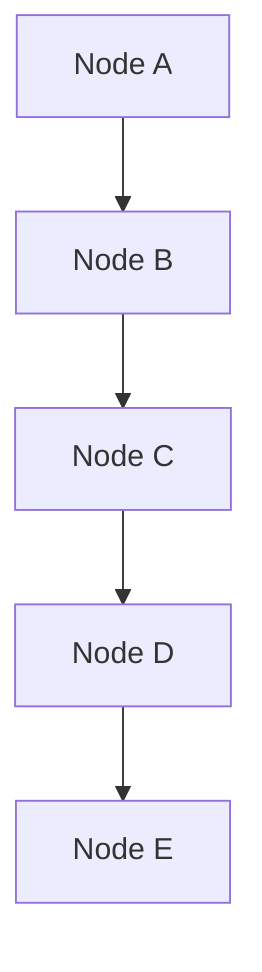

# Java Collections and Algorithms - Day 1

## Video - Data Structures

To start off, there are two main types of memory used in Java applications:

- **Stack Memory**: This is where primitive data types (like `int`, `char`, `float`, etc.) and references to objects are stored. Stack memory is fast and is used for static memory allocation.
- **Heap Memory**: This is where objects are stored. Heap memory is used for dynamic memory allocation and is generally larger than stack memory.

When we create an object in Java, it is allocated in the heap memory, and a reference to that object is stored in the stack memory. This is why we call it a reference type.

| **Stack Memory**                                        | **Heap Memory**                       |
| ------------------------------------------------------- | ------------------------------------- |
| Stores references for primitive and reference variables | Stores larger objects                 |
| Stores the value of primitive variables                 | Memory is allocated in a random order |
| Stores local variables                                  | Stores globally accessible data       |
| Faster access of data                                   | Slower access of data                 |
| Fixed size                                              | Possible to increase size             |
| Data is stored in a LIFO (Last In First Out) order      | Data is stored in a random order      |

How does this relate to data structures?

Data structures is a format for storing and organizing more than one piece of data.

- Arrays are data structures that store multiple values of the same type in a contiguous block of memory.
- Elements can be removed, added, searched for, etc.
- Each data structure has its own way of storing and working with the data it holds.

There are two fundamental ways of storing information in data structures:

- **Linear Data Structures**: These store data in a sequential manner. Examples include arrays, linked lists, stacks, and queues.
- **Non-Linear Data Structures**: These store data in a hierarchical manner. Examples include trees and graphs using nodes and edges.

#### Array-Based Structures

- An array-based structure uses built-in arrays to store data.
- Array-based structures are defined through their use of indexes to reference data within the collection.
- Array-based structures in many languages have a fixed/static size, meaning the number of elements that can be stored is determined when the structure is created and cannot be changed.

| Index | 0   | 1   | 2   | 3   | 4   |
| ----- | --- | --- | --- | --- | --- |
| Data  | A   | B   | C   | D   | E   |

#### Node-Based Structures

- A **node-based structure** stores information in **node** objects which may have one or more references to other node objects.
- Recall that **reference variables** are variables that point to an object's memory location in the heap.
- Node objects usually contain **data** as well as **references** that point to previous and/or next nodes in the structure.



Both array-based and node-based structures have their own advantages and disadvantages. The choice between the two often depends on the specific requirements of the application, such as the need for dynamic sizing, memory efficiency, and access speed.

#### Modifying Array-Based Structures

- **Adding Elements**: To add an element to an array-based structure, you typically need to find the next available index and insert the element there. If the array is full, you may need to create a new larger array and copy the existing elements over.
- **Removing Elements**: To remove an element, you can set the value at the specific index to `null` or a default value. However, this can lead to "holes" in the array, which may require shifting elements to maintain order.
- **Searching for Elements**: Searching can be done using a linear search (checking each element one by one) or a binary search (if the array is sorted).

#### Modifying Node-Based Structures

- **Adding Elements**: To add a node, you typically create a new node and adjust the references of the existing nodes to include the new node in the structure.
- **Removing Elements**: To remove a node, you adjust the references of the surrounding nodes to bypass the node being removed, effectively unlinking it from the structure.
- **Searching for Elements**: Searching involves traversing the nodes starting from a head node and checking each node's data until the desired element is found.

| **Array-Based Structures**                           | **Node-Based Structures**                                         |
| ---------------------------------------------------- | ----------------------------------------------------------------- |
| Default Data Type (built-in)                         | Custom-made, though many are provided by libraries                |
| Supports random access                               | Supports different ways to store data (list, queue, set, map)     |
| Fixed size (non-changing)                            | Dynamic size (can grow and shrink as needed)                      |
| Immediate access to any index                        | Iteration through traversal of nodes                              |
| Iteration uses indexes                               | Custom iteration must be defined (e.g., using loops or recursion) |
| Inserting data may require updating multiple indexes | Easier to insert data in the middle of the structure              |

## Overview of Collections Hierarchy

The Collections Framework in Java provides a set of classes and interfaces that implement commonly used data structures. A collection is a single object that acts as a container for multiple elements. The Collections API is organized in a class hierarchy shown in a simplified form below:


The important interfaces in the Collections API include:

- `Iterable` - The root interface for all collection types. It allows an object to be the target of the "for-each loop" statement or iterated over with an iterator.
- `List` - An ordered collection (also known as a sequence). Lists can contain duplicate elements. Elements can be accessed by their integer index (position in the list).
- `Set` - A collection that cannot contain duplicate elements. It models the mathematical set abstraction
- `Queue` - A collection used to hold multiple elements prior to processing. It typically orders elements in a FIFO (first-in-first-out) manner.
- `Map` - An object that maps keys to values. A map cannot contain duplicate keys, and each key can map to at most one value. It does not extend `Iterable`.

#### `Collection` Interface

- The basic interface of the Java Collections Framework, which is the root interface of all collection types in the API.
- It is placed at the top of the collection hierarchy in Java and provides the basic operations that can be performed on any collection, such as adding, removing, and checking for the presence of elements.
- `List`, `Set`, and `Queue` are three interfaces that extend the `Collection` interface, each providing additional functionality specific to their respective data structures.
- An important note is that the `Map` interface does not extend the `Collection` interface, as it represents a different type of data structure that maps keys to values rather than storing individual elements. Though it is part of the Collections Framework, it operates independently of the `Collection` interface.
- Another important note is that the `Collection` interface itself extends the `Iterable` interface, which allows for iteration over the elements in a collection using an iterator or a for-each loop. The `Iterable` interface has only one method, `iterator()`, which returns an `Iterator` object that can be used to traverse the elements in the collection.

#### `List` Interface

- This interface represents a collection of elements arranged in a specific order, allowing for duplicate elements.
- A list retains the order in which elements are added using indexes.
- This same sequence is used to retrieve elements from the list.
- With lists, a developer can insert elements into the list at any position, remove elements from any position, and search for elements in the list.
- Common implementations of the `List` interface include `ArrayList`, `LinkedList`, and `Vector`.

#### `Set` Interface

- This interface represents a collection of elements that contain unique elements, meaning that duplicate elements are not allowed.
- The `Set` interface does not maintain any order of elements.
- When retrieving elements, they are not guaranteed to be retrieved in the order they were added.
- The `HashSet`, `LinkedHashSet`, and `TreeSet` classes are common implementations of the `Set` interface. `TreeSet` also implements the `SortedSet` interface, which maintains elements in a sorted order.
- A set can be iterated using an iterator, but it cannot be iterated using a list iterator, as sets do not maintain a specific order of elements.

#### `Queue` Interface

- A queue is an ordered collection in which new elements are added at the end of the collection and elements are removed from the front of the collection, similar to a line of people waiting for a service.
- This interface represents a special type of list whose elements are ordered in a FIFO (first-in-first-out) manner.
- `LinkedList`, `PriorityQueue`, `ArrayQueue`, `PriorityBlockingQueue`, and `LinkedBlockingQueue` are common implementations of the `Queue` interface.

#### `Deque` Interface

- A deque (double-ended queue) is a linear collection that supports the insertion and removal of elements from both ends.
- This interface was added to the Java Collections Framework in Java 6.
- The `Deque` interface extends the `Queue` interface and provides additional methods for adding, removing, and examining elements at both ends of the deque.
- Common implementations of the `Deque` interface include `ArrayDeque` and `LinkedList`.

#### `SortedMap` Interface

- This interface represents a map that maintains its entries in a sorted order based on the natural ordering of its keys or by a specified comparator.
- The `SortedMap` interface extends the `Map` interface and provides additional methods for accessing and manipulating the entries in the map based on their sorted order.
- The `TreeMap` class is a common implementation of the `SortedMap` interface.

#### Methods of the `Collection` Interface

The `Collection` interface provides several methods for manipulating collections, including:

- `add(Object o): boolean`: Adds the specified element to the collection.
  - Returns `true` if the collection was modified as a result of the call. Returns `false` if the collection does not allow duplicates and the element was already present.
- `addAll(Collection c): boolean`: Adds all elements from the specified collection to the current collection.
  - Returns `true` if the collection was modified as a result of the call. Returns `false` if no elements were added (e.g., if the specified collection was empty or if all elements were already present in the current collection).
- `clear(): void`: Removes all elements from the collection.
- `contains(Object o): boolean`: Checks if the collection contains the specified element.
  - Returns `true` if the element is present in the collection, otherwise returns `false`.
- `containsAll(Collection c): boolean`: Checks if the collection contains all elements from the specified collection.
  - Returns `true` if all elements from the specified collection are present in the current collection, otherwise returns `false`.
- `isEmpty(): boolean`: Checks if the collection is empty.
  - Returns `true` if the collection contains no elements, otherwise returns `false`.
- `equals(Object o): boolean`: Compares the specified object with the collection for equality.
  - Returns `true` if the specified object is also a collection, both collections have the same size, and all corresponding pairs of elements in the two collections are equal. Otherwise, returns `false`.
- `hashCode(): int`: Returns the hash code value for the collection.
  - The hash code is computed based on the elements in the collection and is used for efficient storage and retrieval in hash-based collections.
- `iterator(): Iterator`: Returns an iterator over the elements in the collection.
  - The iterator allows for traversing the elements in the collection one by one.
- `remove(Object o): boolean`: Removes a single instance of the specified element from the collection, if it is present.
  - Returns `true` if the collection was modified as a result of the call (i.e., if the element was found and removed). Returns `false` if the element was not found in the collection.
- `removeAll(Collection c): boolean`: Removes all elements in the current collection that are also contained in the specified collection.
  - Returns `true` if the collection was modified as a result of the call. Returns `false` if no elements were removed (e.g., if the specified collection was empty or if none of its elements were present in the current collection).
- `retainAll(Collection c): boolean`: Retains only the elements in the current collection that are also contained in the specified collection.
  - Returns `true` if the collection was modified as a result of the call. Returns `false` if no elements were removed (e.g., if the specified collection was empty or if all elements in the current collection were also present in the specified collection).
- `size(): int`: Returns the number of elements in the collection.
- `toArray(): Object[]`: Returns an array containing all elements in the collection.
- `toArray(T[] a): T[]`: Returns an array containing all elements in the collection; the runtime type of the returned array is that of the specified array.
  - If the collection fits in the specified array, it is returned therein. Otherwise, a new array is allocated with the runtime type of the specified array and the size of the collection.

### Real World Application

The Collection Framework in Java plays a crucial role in organizing, manipulating, and storing data efficiently. Here are some reasons why this Java API is useful:

- **Organized Data Structures**: The Collection Framework provides a variety of data structures (like lists, sets, maps, and queues) that allow developers to choose the most appropriate structure for their specific needs. This helps in organizing data in a way that makes it easy to access and manipulate.
- **Reusable and Standardized**: The Collection Framework offers a standardized way to work with collections of objects. This means that developers can use the same methods and interfaces across different types of collections, making code more reusable and easier to understand.
- **Type Safety and Generics**: With the introduction of generics in Java 5, the Collection Framework allows developers to specify the type of elements that a collection can hold. This provides type safety, reducing the risk of runtime errors due to type mismatches.
- **Flexibility and Extensibility**: The Collection Framework is designed to be flexible and extensible. Developers can create their own custom collection classes by implementing the provided interfaces, allowing for tailored solutions to specific problems.
- **Support for Functional Programming**: The Collection Framework integrates well with Java's functional programming features, such as lambda expressions and the Stream API. This allows for more concise and expressive code when performing operations on collections, such as filtering, mapping, and reducing.

### Implementation

Below is an example of using two different collections, an `ArrayList` and a `HashMap`, to demonstrate their functionalities.

```java
import java.util.ArrayList;
import java.util.HashMap;
import java.util.Map;

public class Main {
    public static void main(String[] args) {
      // Example of ArrayList
      ArrayList<String> names = new ArrayList<>();

      // Adding elements to the ArrayList
      names.add("Alice");
      names.add("Bob");
      names.add("Charlie");
      names.add("Diana");

      // Iterating through the ArrayList
      System.out.println("Names in the ArrayList:");
      for (String name : names) {
          System.out.println(name);
      }

      // Example of HashMap
      HashMap<String, Integer> ages = new HashMap<>();

      // Adding key-value pairs to the HashMap
      ages.put("Alice", 30);
      ages.put("Bob", 25);
      ages.put("Charlie", 35);
      ages.put("Diana", 28);

      // Iterating through the HashMap
      System.out.println("\nAges in the HashMap:");
      for (Map.Entry<String, Integer> entry : ages.entrySet()) {
          System.out.println(entry.getKey() + ": " + entry.getValue());
      }
  }
}
```

## Generics

Generics is a feature in Java that allows developers to define classes, interfaces, and methods with a placeholder for the type of data they operate on. This means that you can create a single class or method that can work with different types of data without needing to write multiple versions for each type.

Generics are constructs introduced in Java 5 that enforce compile-time type safety by allowing you to use parameterized types. This means you can define a class, interface, or method with a placeholder for the type of data it operates on, which is specified when the class or method is instantiated or called.

Generics can be declared on a class (generic types), method parameters (generic methods), interfaces, or return types. The most common use of generics is with collections, such as `ArrayList`, `HashMap`, and `HashSet`, where you can specify the type of elements that the collection will hold.

Before Java 5, you had to write something like this and hope developers used the correct types:

```java
List names = new ArrayList();
names.add("Alice"); // OK
names.add(123);     // Also OK, but not intended
```

With generics, you can restrict a class to only accept objects of a specific type, and the compiler will enforce this restriction:

```java
List<String> names = new ArrayList<>(); // Only Strings allowed
names.add("Alice"); // OK
names.add(123);     // Compile-time error
```

#### Generic Classes

To make a class (or interface) generic, use angle brackets (`<>`) when declaring it and use an identifier (commonly a single uppercase letter), such as `T` for "type", `E` for "element", `K` for "key", or `V` for "value". This identifier acts as a placeholder for the actual type that will be specified when the class is instantiated and can be used throughout the class definition.

```java
public class MyGenericClass<T> {
  private T instance;

  // simple generic setter method
  public void setObject(T object) {
    this.instance = object;
  }
}
```

#### Naming Convention for Generics

Technically, type parameters can be named anything you want. However, the convention is to use single uppercase letters to make it clear that they are type parameters and not regular class names. Here are some common conventions:

| Letter  | Meaning                       |
| ------- | ----------------------------- |
| E       | Element (used in collections) |
| K       | Key (used in maps)            |
| N       | Number                        |
| T       | Type (general type)           |
| V       | Value (used in maps)          |
| S, U, V | 2nd, 3rd types                |

### Real World Application

Consider this scenario where we are implementing a radio station on the web. One part of this large project is to create a class called `MetaInfoObject`, which is the superclass for `PLS` and `M3U` classes.

```java
public abstract class MetaInfoObject {
  // ...code omitted for brevity
}
public class PLS extends MetaInfoObject {
  // ...code omitted for brevity
}
public class M3U extends MetaInfoObject {
  // ...code omitted for brevity
}
```

We allow the web "DJ" to change playlists via a selection dialog box. This means that our dialog class, `SelectMultipleStreamDialog`, will have an object that can be of any type that extends `MetaInfoObject`. We can use generics to enforce this at compile time.

```java
public class SelectMultipleStreamDialog<T extends MetaInfoObject> {
  private T selectedStream;

  public T getSelectedStream() {
    return selectedStream;
  }

  // ...code omitted for brevity
}
```

Would it not still work if we just used `MetaInfoObject` as the type for `selectedStream` because of polymorphism? Yes, it would. However, using generics allows us to avoid casting when we retrieve the selected stream. For example:

```java
SelectMultipleStreamDialog<PLS> dialog = new SelectMultipleStreamDialog<>();
PLS plsStream = dialog.getSelectedStream(); // No cast needed
```

vs.

```java
SelectMultipleStreamDialog dialog = new SelectMultipleStreamDialog();
PLS plsStream = (PLS) dialog.getSelectedStream(); // Cast needed
```

We now have a flexible dialog box that can store different types of streams, rather than just one type, and we have type safety at compile time.

### Implementation

Recall that generics are a feature that you can use to define overall functionality for a class, interface, or method while deferring the specification of one or more types until the class or method is instantiated or called.

Generics are commonly used with collections and classes as well as utility classes (a class whose purpose is to provide methods that perform common functions).

In the example below, we will update a class to utilize generics to enforce type safety at compile time.

Company XYZ has a special `Container` that they have developed. A container supports actions for adding an object, viewing what is in the container, and removing an object from the container.

```java
package com.example.model;

public class Container {
  private Object obj;
  public void setObject(Object obj) {
    this.obj = obj;
  }
  public Object getObject() {
    return obj;
  }
  public Object removeObject() {
    this.obj = null;
    return obj;
  }
}
```

Company XYZ has an issue with this class. They want to restrict the type of items that go into the container to be of a single type. For example, they do not want to mix Integer objects with String objects in the same container. They want to enforce this restriction at compile time. How can they do this?

With Generics!

#### Potential Project Usage

How can you make this class use generics to enforce type safety at compile time? Since we want the entire class and its single property to be constrained to a single type, we will make the class itself generic.

```java
public class Container<A> {
  // ...code omitted for brevity
}
```

Choosing the letter is important as there are industry conventions that you should follow. The most common letter used is `T` for "Type" and we will use that in our example.

```java
public class Container<T>  {

}
```

This is great but it does not solve the problem yet. We need to update the property and methods to use the generic type `T` instead of `Object`. Since company XYZ wants to restrict the type of items that go into the container to be of a single type, we will update the property and methods accordingly.

```java
public class Container<T> {
  private T obj;

  public void setObject(T obj) {
    this.obj = obj;
  }
  public T getObject() {
    return obj;
  }
  public T removeObject() {
    this.obj = null;
    return obj;
  }
}
```

Now, the `Container` class is fully generic and enforces type safety at compile time. You can create a `Container` for any type, and it will only accept that type.

## `Set` Interface

The `Set` interface contains only methods inherited from the `Collection` interface and adds the restriction that duplicate elements are not allowed. More formally, sets contain no pair of elements `e1` and `e2` such that `e1.equals(e2)`, and at most one null element.

`Set` also adds a stronger contract on the `equals` and `hashCode` methods, requiring that two sets be equal if they contain the same elements.

#### `HashSet`

A `HashSet` implements the `Set` interface, backed by a hash table (actually a `HashMap` instance).

- Guarantees no ordering of elements.
- Permits the null element.
- Offers constant time performance for basic operations like add, remove, contains, and size, assuming the hash function disperses elements properly among the buckets.

#### `TreeSet`

A `TreeSet` implements the `Set` interface that uses a tree for storage. Its elements are maintained in sorted order, either according to their natural ordering or according to a specified comparator. Internally, it is backed by a Sorted Tree.

- Guarantees that the elements will be in ascending order, sorted according to the natural order of the elements or by a `Comparator` provided at set creation time.
- Does not permit the null element.
- Insertion and removal operations take O(log n) time and are slow because of the sorting.

The methods declared by the `Set` interface are:

- `add(E e): boolean`: Adds the specified element to the set if it is not already present.
  - Returns `true` if the set did not already contain the specified element, otherwise returns `false`.
- `clear(): void`: Removes all elements from the set.
- `contains(Object o): boolean`: Checks if the set contains the specified element.
  - Returns `true` if the set contains the specified element, otherwise returns `false`.
- `isEmpty(): boolean`: Checks if the set is empty.
  - Returns `true` if the set contains no elements, otherwise returns `false`.
- `iterator(): Iterator<E>`: Returns an iterator over the elements in the set.
- `remove(Object o): boolean`: Removes the specified element from the set if it is present.
  - Returns `true` if the set contained the specified element, otherwise returns `false`.
- `size(): int`: Returns the number of elements in the set.

Below is an example of using a `Set` in Java:

```java
import java.util.Set;

public class Main {
  public static void main(String[] args) {
    int count[] = {34, 22, 10, 60, 30, 22};
    Set<Integer> set = new HashSet<Integer>();

    try {
      for (int i = 0; i < 5; i++) {
        set.add(count[i]);
      }

      System.out.println(set);

      TreeSet<Integer> treeSet = new TreeSet<>(set);

      System.out.println("The sorted list is:");
      System.out.println(treeSet);

      System.out.println("The first element of the set is: " + treeSet.first());
      System.out.println("The last element of the set is: " + treeSet.last());
    } catch (Exception e) {
      System.out.println(e);
    }
  }
}
```

### Real World Application

A `Set` is a type of collection that does not allow duplicate elements. This means an element can only exist once in a set. It models the mathematical set abstraction.

#### Characteristic of a Set

- No duplicate elements: A set cannot contain two elements that are considered equal according to the `equals()` method.
- Unordered: The elements in a set are not stored in any particular order. The order of elements may change over time as elements are added or removed.
- Allows null elements: Most implementations of the `Set` interface allow the inclusion of a null element, although this may vary depending on the specific implementation.

#### Why and When to Use a Set

Based on the characteristics of a set, here are some reasons why and when you might want to use a set in your Java applications:

- **Unique Elements**: If you need to store a collection of items where duplicates are not allowed, a set is the ideal choice. For example, if you are maintaining a list of unique user IDs or email addresses, a set will automatically handle duplicate entries for you.
- **Order Independence**: If the order of elements is not important for your application, a set provides a simple and efficient way to store and manage your data without worrying about the order in which elements are added or retrieved.
- **Efficient Lookups**: Sets typically provide efficient methods for checking the presence of an element. If your application requires frequent membership tests (i.e., checking if an item exists in the collection), a set can offer better performance compared to other collection types like lists.

### Implementation

The `Set` interface allows users to perform basic set operations. Let's use two sets of numbers to demonstrate these basic operations: [1, 3, 2, 4, 8, 9, 0] and [1, 3, 7, 5, 4, 0, 7, 5].

Possible operations include:

- **Union**: This operation combines all the elements from both sets, removing duplicates. The result of the union of the two sets would be [0, 1, 2, 3, 4, 5, 7, 8, 9].
- **Intersection**: This operation finds the common elements between both sets. The result of the intersection of the two sets would be [0, 1, 3, 4].
- **Difference**: This operation finds the elements that are in the first set but not in the second set. The result of the difference of the two sets would be [2, 8, 9].

```java
import java.util.*;

public class Main {
  public static void main(String[] args) {
    // Creating an object of Set class
    // Declaring object of Integer type
    Set<Integer> a = new HashSet<Integer>();

    // Adding elements to the set
    a.addAll(Arrays.asList(
      new Integer[] {1, 3, 2, 4, 8, 9, 0}
    ));

    // Creating another object of Set class
    Set<Integer> b = new HashSet<Integer>();

    // Adding elements to the set
    b.addAll(Arrays.asList(
      new Integer[] {1, 3, 7, 5, 4, 0, 7, 5}
    ));

    // To find union
    Set<Integer> union = new HashSet<Integer>(a);
    union.addAll(b);
    System.out.print("Union of the two Set");
    System.out.println(union);

    // To find intersection
    Set<Integer> intersection = new HashSet<Integer>(a);
    intersection.retainAll(b);
    System.out.print("Intersection of the two Set");
    System.out.println(intersection);

    // To find the symmetric difference
    Set<Integer> difference = new HashSet<Integer>(a);
    difference.removeAll(b);
    System.out.print("Difference of the two Set");
    System.out.println(difference);
  }
}
```

## `HashSet` and `TreeSet`

#### `HashSet`

A `HashSet` is a collection that implements the `Set` interface, backed by a hash table (actually a `HashMap` instance). It makes no guarantees as to the iteration order of the set; in particular, it does not guarantee that the order will remain constant over time. This class permits the null element.

- Offers constant time performance for the basic operations (add, remove, contains, and size), assuming the hash function disperses the elements properly among the buckets.

#### `TreeSet`

A `TreeSet` is a collection that implements the `Set` interface that uses a tree for storage. It is part of the Java Collections Framework and implements the `NavigableSet` interface, which extends the `SortedSet` interface. The elements in a `TreeSet` are ordered using their natural ordering or by a specified comparator.

- Guarantees that the elements will be in ascending order, sorted according to the natural order of the elements or by a `Comparator` provided at set creation time.
- Does not permit the null element.
- Insertion and removal operations take O(log n) time.

`HashSet` and `TreeSet` belong to the collections framework. `HashSet` is the implementation of the `Set` interface, whereas `TreeSet` implements `SortedSet`. `TreeSet` is backed by a TreeMap, while `HashSet` is backed by a HashMap.

| Category       | HashSet                                                                 | TreeSet                                                                                                                        |
| -------------- | ----------------------------------------------------------------------- | ------------------------------------------------------------------------------------------------------------------------------ |
| Implementation | Hash table (backed by a HashMap)                                        | Red-Black tree (backed by a TreeMap)                                                                                           |
| Null Object    | Permits one null object                                                 | Does not permit null objects                                                                                                   |
| Methods        | HashSet uses the `equals()` method to compare two objects for equality. | TreeSet uses the `compareTo()` method (from the `Comparable` interface) or a `Comparator` to compare two objects for ordering. |
| Heterogeneous  | Permits heterogeneous objects if they are mutually comparable.          | Does not permit heterogeneous objects.                                                                                         |
| Order          | Does not guarantee any specific order of elements.                      | Maintains elements in a sorted order (ascending by default).                                                                   |

### Real World Application

#### HashSets

Hash Tables store data in key-value pairs. A hash function is used to compute an index (also called a hash code) into an array of buckets or slots, from which the desired value can be found. They only store data that has a key associated with it. Inserting and searching operations are very fast with hash tables.

Some real-world applications of hash tables include:

- **Databases**: Hash tables are used in database indexing to quickly locate a data record given its search key.
- **Caching**: Hash tables are used in caching mechanisms to store frequently accessed data for quick retrieval.
- Every time we type something to be searched on Google, it generates the desired output based on the principle of hashing.
- **Message Digest**: A function of cryptography that takes an input and returns a fixed-size string of bytes. The output is typically a "digest" that is unique to each unique input. Hash functions are used in various security applications and protocols, including digital signatures and message authentication codes.
- In our computers, we have various files stored in it; each file has two crucial pieces of information, namely the filename and file path. Hash tables are used to store this information, allowing for quick access to files based on their names.
- **Social Network Feeds**: Hash tables are used to store and retrieve user data, posts, and comments efficiently.
- **Password Hashing**: Hash tables are used to store hashed passwords securely, allowing for quick verification during login attempts.
- Fast data lookup, such as symbols for compilers and interpreters, database indexing, caches, and unique data representation in many applications.
- **Load Balancing**: Hash tables are used in load balancing algorithms to distribute requests evenly across multiple servers.

#### TreeSets

A tree is a data structure that consists of nodes connected by edges. Each node contains a value and references to its child nodes. The topmost node is called the root, and nodes with no children are called leaves. Trees are used to represent hierarchical relationships and allow for efficient searching, insertion, and deletion of elements.

Some real-world applications of tree data structures include:

- **XML/HTML Parsing**: Trees are used to represent the hierarchical structure of XML and HTML documents, allowing for efficient parsing and manipulation of the document's elements.
- Decision-based algorithms, such as decision trees used in machine learning for classification and regression tasks.
- Databases also use tree structures, such as B-trees and B+ trees, to index data for efficient searching and retrieval.
- Domain Name Servers (DNS) use tree structures to map domain names to IP addresses, allowing for efficient resolution of domain names. A tree structure is used to represent the hierarchical nature of domain names, with each level of the tree representing a different level of the domain name hierarchy.
- **File Systems**: File systems use tree structures to organize files and directories in a hierarchical manner, allowing for efficient navigation and access to files.
- **Binary Search Trees (BST)**: BSTs are used in various applications, such as maintaining sorted data, implementing priority queues, and facilitating efficient searching and sorting operations.
- On websites like Quora, comments are child nodes of the post, and replies to comments are child nodes of the comments. This hierarchical structure can be represented using a tree data structure.
- Code compression algorithms, such as Huffman coding, use tree structures to represent the frequency of characters in a given text, allowing for efficient encoding and decoding of the text.
- **Document Object Model (DOM)**: The DOM represents the structure of an HTML or XML document as a tree, allowing for easy manipulation and traversal of the document's elements.
- Storing genealogy or family tree data, where each person is a node and relationships are represented as edges between nodes.
- **JVM**: The Java Virtual Machine (JVM) uses tree structures to represent the hierarchy of classes and objects in a Java program, allowing for efficient memory management and garbage collection.

## Queue Interface

To visualize a queue, think of a hot dog stand. Customers arrive and get in line. The first customer in line is the first one to be served. New customers arriving at the stand go to the back of the line. Customers leave the line when they are served.

Queues in Java work in a similar way. A queue is a collection used to hold multiple elements prior to processing. It is typically used to order elements in a FIFO (first-in-first-out) manner. After we declare a queue, we can add elements to the end (tail) of the queue and remove elements from the front (head) of the queue.

Some queue specific methods are:

- `offer(E e): boolean`: Inserts the specified element into the queue if it is possible to do so immediately without violating capacity restrictions.
  - Returns `true` if the element was added to the queue, otherwise returns `false`.
- `poll(): E`: Retrieves and removes the head of the queue, or returns `null` if the queue is empty.
- `peek(): E`: Retrieves, but does not remove, the head of the queue, or returns `null` if the queue is empty.

One exception to the FIFO rule is the `PriorityQueue` class, which orders its elements according to their natural ordering or by a specified comparator. In a priority queue, elements with higher priority are served before elements with lower priority, regardless of their order in the queue.

In a `PriorityQueue`, when new elements are inserted, they are ordered based on their natural ordering or by a specified comparator. This means that elements with higher priority will be placed at the front of the queue, while elements with lower priority will be placed at the back. When elements are removed from the queue, they are removed in order of their priority, with the highest priority elements being removed first.

#### Subinterfaces of Queue

Generally, the `Queue` interface is inherited by three main subinterfaces:

- `Deque`: A double-ended queue that allows insertion and removal of elements from both ends.
- `BlockingQueue`: A queue that supports operations that wait for the queue to become non-empty when retrieving an element and wait for space to become available in the queue when storing an element.
- `TransferQueue`: A blocking queue in which producers may wait for consumers to receive elements.

Together, these three subinterfaces are implemented by various classes in the Java Collections Framework, such as `ArrayDeque`, `LinkedList`, `PriorityQueue`, `ArrayBlockingQueue`, `LinkedBlockingQueue`, and `SynchronousQueue`.

##### Blocking Queues

A `BlockingQueue` is a type of queue that supports operations that wait for the queue to become non-empty when retrieving an element and wait for space to become available in the queue when storing an element. This means that if a thread tries to retrieve an element from an empty `BlockingQueue`, it will block (wait) until an element becomes available. Similarly, if a thread tries to add an element to a full `BlockingQueue`, it will block until space becomes available.

Standard implementations of the `BlockingQueue` interface include:

- `ArrayBlockingQueue`: A bounded blocking queue backed by an array.
- `LinkedBlockingQueue`: An optionally bounded blocking queue backed by linked nodes.
- `SynchronousQueue`: A blocking queue in which each insert operation must wait for a corresponding remove operation by another thread, and vice versa.

##### Transfer Queues

A `TransferQueue` is a specialized type of `BlockingQueue` that allows producers to wait for consumers to receive elements. In a `TransferQueue`, when a producer adds an element to the queue, it can choose to wait until a consumer retrieves that element before proceeding. This is useful in scenarios where the producer wants to ensure that the consumer has processed the element before moving on.

Standard implementations of the `TransferQueue` interface include:

- `LinkedTransferQueue`: An unbounded `TransferQueue` based on linked nodes.

##### Deques

A `Deque` (double-ended queue) is a linear collection that supports the insertion and removal of elements from both ends. This means that you can add or remove elements from the front (head) or back (tail) of the deque. Much like a traditional queue, the `Deque` interface provides methods to add, retrieve, and peek at elements from both ends of the deque. Deques can be used to implement a stack (LIFO) or a queue (FIFO) data structure.

Standard implementations of the `Deque` interface include:

- `ArrayDeque`: A resizable-array implementation of the `Deque` interface.
- `LinkedList`: A doubly-linked list implementation of the `Deque` interface.

#### Commonly Used Implementing Classes

- `LinkedList`: Implements both the `List` and `Deque` interfaces, allowing it to be used as a list, stack, or queue.
- `ArrayDeque`: A resizable-array implementation of the `Deque` interface, providing a fast and efficient way to implement a double-ended queue.
- `PriorityQueue`: Implements the `Queue` interface and provides a priority-based ordering of elements.
- `ArrayBlockingQueue`: A bounded blocking queue backed by an array.

#### Thread Safety

Adding elements to queues is particularly useful in multi-threaded environments, where one thread produces data and another thread consumes it. A queue can be shared among threads and used to block progress until space is available or data is present, helping us overcome some common multi-threading issues.

For example, writing to a single disk from multiple threads creates resource contention (multiple threads are trying to access the same resource at the same time) and can lead to slow performance or data corruption. Creating a single writer thread with a `BlockingQueue` can alleviate this issue by allowing multiple threads to add data to the queue while the single writer thread processes the data in the order it was added.

Luckily, Java offers `Concurrent` implementations of the `Queue` interface that are thread-safe, such as `ConcurrentLinkedQueue`, `ConcurrentLinkedDeque`, and `ArrayBlockingQueue`, which are thread-safe without requiring additional synchronization.

### Real World Application

Queues are used when things do not have to be processed immediately but have to be processed in the order they were added to the queue. This property of the queue is called FIFO (First In First Out) and is what makes it useful in the following scenarios:

- When a resource is shared among multiple consumers, such as a printer or CPU, a queue can be used to manage access to the resource in an orderly fashion.
- When data is transferred asynchronously (data is sent and received at different times) between two processes or threads, a queue can be used to buffer the data and ensure that it is processed in the correct order.
- In operating systems:
  - Semaphores use queues to manage access to shared resources.
  - First-Come-First-Served (FCFS) scheduling uses queues to manage the order in which processes are executed.
  - Spooling uses queues to manage print jobs.
  - Buffering for devices like keyboards and mice uses queues to manage input events.
- In networks:
  - Packet switching uses queues to manage the order in which packets are transmitted.
  - Routers use queues to manage the order in which packets are forwarded.
  - Mail servers use queues to manage the order in which emails are sent and received.
- Some other applications of the Queue data structure include:
  - Waiting lists for a single shared resource, like a printer or CPU.
  - Buffers on MP3 players and other media devices.
  - Call center phone systems use queues to manage incoming calls and route them to available agents.
  - Adding a song at the end of a playlist.
  - Handling requests on a single shared resource, like a web server or database.
  - In breadth-first search algorithms, where nodes are explored level by level.

### Implementation

#### Creating Queue Objects

Since `Queue` is an interface, we cannot instantiate it directly. Instead, we can use one of its implementing classes, such as `LinkedList`, `PriorityQueue`, or `ArrayDeque`. The following is an example of creating a `Queue` object using the `PriorityQueue` class:

```java
// Obj is the type of objects to be stored in the queue
Queue<Obj> queue = new PriorityQueue<>();
```

```java
import java.util.LinkedList;
import java.util.Queue;

public class Main {
  public static void main(String[] args) {
    Queue<Integer> q = new LinkedList<>();

    // Adds elements {0, 1, 2, 3, 4} to queue
    for (int i = 0; i < 5; i++) q.add(i);

    // Display contents of the queue.
    System.out.println("Elements of queue: " + q);

    // To remove the head of queue.
    int removedHead = q.remove();
    System.out.println("Removed element: " + removedHead);

    // To peek at the head of queue (without removing it).
    int head = q.peek();
    System.out.println("Head of queue: " + head);

    // Res of the methods of the Collection interface,
    // like size and contains can be used with this queue.
    int size = q.size();
    System.out.println("Size of queue: " + size);

    boolean isEmpty = q.isEmpty();
    System.out.println("Is queue empty? " + isEmpty);
  }
}
```

#### Creating Deque Objects

Since `Deque` is an interface, we cannot instantiate it directly. Instead, we can use one of its implementing classes, such as `ArrayDeque` or `LinkedList`. The following is an example of creating a `Deque` object using the `LinkedList` class:

```java
import java.util.*;

public class Main {
  public static void main(String[] args) {
    Deque<String> deque = new LinkedList<>();

    // We can add elements to the queue in various ways

    // Add to the end of the deque
    deque.add("Element 1 (Tail)");

    // Add to the front of the deque
    deque.addFirst("Element 2 (Head)");

    // Add to the end of the deque
    deque.addLast("Element 3 (Tail)");

    // Add to the front of the deque
    deque.push("Element 4 (Head)");

    // Add to the end of the deque
    deque.offer("Element 5 (Tail)");

    // Add to the front of the deque
    deque.offerFirst("Element 6 (Head)");

    System.out.println("Deque after additions: " + deque);

    // We can remove elements from the deque in various ways

    // Remove from the front of the deque
    String removedElement = deque.removeFirst();
    System.out.println("Removed from front: " + removedElement);

    // Remove from the end of the deque
    removedElement = deque.removeLast();
    System.out.println("Removed from end: " + removedElement);

    System.out.println("Deque after removals: " + deque);
  }
}
```

## Map Interface

The `Map` interface in Java does not extend the `Collection` interface; however, it is considered to be part of the Java Collections Framework. A map is an object that maps keys to values. A map cannot contain duplicate keys; each key can map to at most one value. It is used to identify a value by a key, and each entry in a map is a key-value pair.

Because it does not implement `Iterable` as well, it does not support the enhanced for loop. However, you can iterate over the keys, values, or key-value pairs of a map using methods provided by the `Map` interface.

- Use the `keySet()` method to get a set of all keys in the map and iterate over them.
- Use the `values()` method to get a collection of all values in the map and iterate over them.
- Use the `entrySet()` method to get a set of all key-value pairs in the map and iterate over them.

There are two interfaces that extend the `Map` interface:

- `SortedMap`: A map that maintains its entries in ascending order based on the natural ordering of its keys or by a specified comparator.
- `NavigableMap`: A sorted map that provides navigation methods to retrieve entries based on their keys.

The most commonly used classes that implement the `Map` interface are:

- `HashMap`: A hash table-based implementation of the `Map` interface that allows null values and keys. It does not guarantee any specific order of the elements.
  - Store elements in key-value pairs.
  - Provides fast insertion and retrieval operations.
  - Does not maintain any order of elements.
  - Permits one null key and multiple null values.
- `TreeMap`: A red-black tree-based implementation of the `NavigableMap` interface that maintains its entries in ascending order based on the natural ordering of its keys or by a specified comparator
  - Store elements in key-value pairs.
  - Provides log(n) time complexity for insertion and retrieval operations.
  - Maintains elements in sorted order based on keys.
  - Does not permit null keys (throws `NullPointerException`), but allows multiple null values.
- `HashTable`: A synchronized hash table-based implementation of the `Map` interface that does not allow null values or keys. It is considered to be a legacy class and is generally not recommended for new code.
  - Store elements in key-value pairs.
  - Provides synchronized access, making it thread-safe.
  - Does not maintain any order of elements.
  - Does not permit null keys or null values (throws `NullPointerException`).

### Real World Application

Maps are perfect for key-value association mapping, such as directories. Maps are used to perform lookups by keys or when someone wants to retrieve and update elements based on keys. Some common real-world applications of maps include:

- A map of error codes and their corresponding error messages.
- A map of zip codes and their corresponding city names.
- A map of managers and their corresponding employees. Each manager (key) can have multiple employees (values).
- A map of classes and their corresponding students. Each class (key) can have multiple students (values).
- In a banking project, you can map a customer to their various bank accounts.

### Implementation

Since `Map` is an interface, we cannot instantiate it directly. Instead, we can use one of its implementing classes, such as `HashMap`, `TreeMap`, or `Hashtable`. The following is an example of creating a `Map` object using the `HashMap` class:

```java
import java.util.*;

class Main {
  public static void main(String[] args) {
    // Creating an empty HashMap
    Map<String, Integer> hm = new HashMap<>(); // <KeyType, ValueType>

    // Inserting pairs in the above Map using put() method
    hm.put("India", new Integer(100));
    hm.put("China", new Integer(150));
    hm.put("USA", new Integer(50));
    hm.put("UK", new Integer(30));

    // Traversing the Map using a for-each loop
    // Remember that Map does not implement Iterable so
    // we cannot use the enhanced for loop directly on Map
    // We can use keySet(), values(), or entrySet() methods to get
    // a collection view of the keys, values, or key-value pairs
    for (Map.Entry<String, Integer> me : hm.entrySet()) {
      System.out.print(me.getKey() + ": ");
      System.out.println(me.getValue());
    }
  }
}
```
