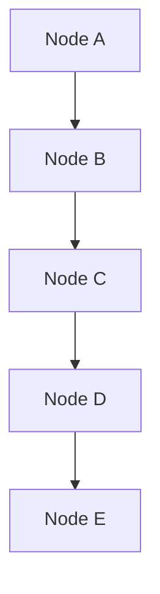

# Java Collections and Algorithms - Day 1

## Video - Data Structures

To start off, there are two main types of memory used in Java applications:

- **Stack Memory**: This is where primitive data types (like `int`, `char`, `float`, etc.) and references to objects are stored. Stack memory is fast and is used for static memory allocation.
- **Heap Memory**: This is where objects are stored. Heap memory is used for dynamic memory allocation and is generally larger than stack memory.

When we create an object in Java, it is allocated in the heap memory, and a reference to that object is stored in the stack memory. This is why we call it a reference type.

| **Stack Memory**                                        | **Heap Memory**                       |
| ------------------------------------------------------- | ------------------------------------- |
| Stores references for primitive and reference variables | Stores larger objects                 |
| Stores the value of primitive variables                 | Memory is allocated in a random order |
| Stores local variables                                  | Stores globally accessible data       |
| Faster access of data                                   | Slower access of data                 |
| Fixed size                                              | Possible to increase size             |
| Data is stored in a LIFO (Last In First Out) order      | Data is stored in a random order      |

How does this relate to data structures?

Data structures is a format for storing and organizing more than one piece of data.

- Arrays are data structures that store multiple values of the same type in a contiguous block of memory.
- Elements can be removed, added, searched for, etc.
- Each data structure has its own way of storing and working with the data it holds.

There are two fundamental ways of storing information in data structures:

- **Linear Data Structures**: These store data in a sequential manner. Examples include arrays, linked lists, stacks, and queues.
- **Non-Linear Data Structures**: These store data in a hierarchical manner. Examples include trees and graphs using nodes and edges.

#### Array-Based Structures

- An array-based structure uses built-in arrays to store data.
- Array-based structures are defined through their use of indexes to reference data within the collection.
- Array-based structures in many languages have a fixed/static size, meaning the number of elements that can be stored is determined when the structure is created and cannot be changed.

| Index | 0   | 1   | 2   | 3   | 4   |
| ----- | --- | --- | --- | --- | --- |
| Data  | A   | B   | C   | D   | E   |

#### Node-Based Structures

- A **node-based structure** stores information in **node** objects which may have one or more references to other node objects.
- Recall that **reference variables** are variables that point to an object's memory location in the heap.
- Node objects usually contain **data** as well as **references** that point to previous and/or next nodes in the structure.

Both array-based and node-based structures have their own advantages and disadvantages. The choice between the two often depends on the specific requirements of the application, such as the need for dynamic sizing, memory efficiency, and access speed.

#### Modifying Array-Based Structures

- **Adding Elements**: To add an element to an array-based structure, you typically need to find the next available index and insert the element there. If the array is full, you may need to create a new larger array and copy the existing elements over.
- **Removing Elements**: To remove an element, you can set the value at the specific index to `null` or a default value. However, this can lead to "holes" in the array, which may require shifting elements to maintain order.
- **Searching for Elements**: Searching can be done using a linear search (checking each element one by one) or a binary search (if the array is sorted).

#### Modifying Node-Based Structures

- **Adding Elements**: To add a node, you typically create a new node and adjust the references of the existing nodes to include the new node in the structure.
- **Removing Elements**: To remove a node, you adjust the references of the surrounding nodes to bypass the node being removed, effectively unlinking it from the structure.
- **Searching for Elements**: Searching involves traversing the nodes starting from a head node and checking each node's data until the desired element is found.

| **Array-Based Structures**                           | **Node-Based Structures**                                         |
| ---------------------------------------------------- | ----------------------------------------------------------------- |
| Default Data Type (built-in)                         | Custom-made, though many are provided by libraries                |
| Supports random access                               | Supports different ways to store data (list, queue, set, map)     |
| Fixed size (non-changing)                            | Dynamic size (can grow and shrink as needed)                      |
| Immediate access to any index                        | Iteration through traversal of nodes                              |
| Iteration uses indexes                               | Custom iteration must be defined (e.g., using loops or recursion) |
| Inserting data may require updating multiple indexes | Easier to insert data in the middle of the structure              |
