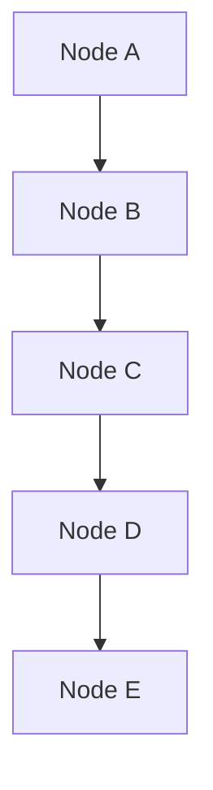

# Java Collections and Algorithms - Day 1

## Video - Data Structures

To start off, there are two main types of memory used in Java applications:

- **Stack Memory**: This is where primitive data types (like `int`, `char`, `float`, etc.) and references to objects are stored. Stack memory is fast and is used for static memory allocation.
- **Heap Memory**: This is where objects are stored. Heap memory is used for dynamic memory allocation and is generally larger than stack memory.

When we create an object in Java, it is allocated in the heap memory, and a reference to that object is stored in the stack memory. This is why we call it a reference type.

| **Stack Memory**                                        | **Heap Memory**                       |
| ------------------------------------------------------- | ------------------------------------- |
| Stores references for primitive and reference variables | Stores larger objects                 |
| Stores the value of primitive variables                 | Memory is allocated in a random order |
| Stores local variables                                  | Stores globally accessible data       |
| Faster access of data                                   | Slower access of data                 |
| Fixed size                                              | Possible to increase size             |
| Data is stored in a LIFO (Last In First Out) order      | Data is stored in a random order      |

How does this relate to data structures?

Data structures is a format for storing and organizing more than one piece of data.

- Arrays are data structures that store multiple values of the same type in a contiguous block of memory.
- Elements can be removed, added, searched for, etc.
- Each data structure has its own way of storing and working with the data it holds.

There are two fundamental ways of storing information in data structures:

- **Linear Data Structures**: These store data in a sequential manner. Examples include arrays, linked lists, stacks, and queues.
- **Non-Linear Data Structures**: These store data in a hierarchical manner. Examples include trees and graphs using nodes and edges.

#### Array-Based Structures

- An array-based structure uses built-in arrays to store data.
- Array-based structures are defined through their use of indexes to reference data within the collection.
- Array-based structures in many languages have a fixed/static size, meaning the number of elements that can be stored is determined when the structure is created and cannot be changed.

| Index | 0   | 1   | 2   | 3   | 4   |
| ----- | --- | --- | --- | --- | --- |
| Data  | A   | B   | C   | D   | E   |

#### Node-Based Structures

- A **node-based structure** stores information in **node** objects which may have one or more references to other node objects.
- Recall that **reference variables** are variables that point to an object's memory location in the heap.
- Node objects usually contain **data** as well as **references** that point to previous and/or next nodes in the structure.



Both array-based and node-based structures have their own advantages and disadvantages. The choice between the two often depends on the specific requirements of the application, such as the need for dynamic sizing, memory efficiency, and access speed.

#### Modifying Array-Based Structures

- **Adding Elements**: To add an element to an array-based structure, you typically need to find the next available index and insert the element there. If the array is full, you may need to create a new larger array and copy the existing elements over.
- **Removing Elements**: To remove an element, you can set the value at the specific index to `null` or a default value. However, this can lead to "holes" in the array, which may require shifting elements to maintain order.
- **Searching for Elements**: Searching can be done using a linear search (checking each element one by one) or a binary search (if the array is sorted).

#### Modifying Node-Based Structures

- **Adding Elements**: To add a node, you typically create a new node and adjust the references of the existing nodes to include the new node in the structure.
- **Removing Elements**: To remove a node, you adjust the references of the surrounding nodes to bypass the node being removed, effectively unlinking it from the structure.
- **Searching for Elements**: Searching involves traversing the nodes starting from a head node and checking each node's data until the desired element is found.

| **Array-Based Structures**                           | **Node-Based Structures**                                         |
| ---------------------------------------------------- | ----------------------------------------------------------------- |
| Default Data Type (built-in)                         | Custom-made, though many are provided by libraries                |
| Supports random access                               | Supports different ways to store data (list, queue, set, map)     |
| Fixed size (non-changing)                            | Dynamic size (can grow and shrink as needed)                      |
| Immediate access to any index                        | Iteration through traversal of nodes                              |
| Iteration uses indexes                               | Custom iteration must be defined (e.g., using loops or recursion) |
| Inserting data may require updating multiple indexes | Easier to insert data in the middle of the structure              |

## Overview of Collections Hierarchy

The Collections Framework in Java provides a set of classes and interfaces that implement commonly used data structures. A collection is a single object that acts as a container for multiple elements. The Collections API is organized in a class hierarchy shown in a simplified form below:


The important interfaces in the Collections API include:

- `Iterable` - The root interface for all collection types. It allows an object to be the target of the "for-each loop" statement or iterated over with an iterator.
- `List` - An ordered collection (also known as a sequence). Lists can contain duplicate elements. Elements can be accessed by their integer index (position in the list).
- `Set` - A collection that cannot contain duplicate elements. It models the mathematical set abstraction
- `Queue` - A collection used to hold multiple elements prior to processing. It typically orders elements in a FIFO (first-in-first-out) manner.
- `Map` - An object that maps keys to values. A map cannot contain duplicate keys, and each key can map to at most one value. It does not extend `Iterable`.

#### `Collection` Interface

- The basic interface of the Java Collections Framework, which is the root interface of all collection types in the API.
- It is placed at the top of the collection hierarchy in Java and provides the basic operations that can be performed on any collection, such as adding, removing, and checking for the presence of elements.
- `List`, `Set`, and `Queue` are three interfaces that extend the `Collection` interface, each providing additional functionality specific to their respective data structures.
- An important note is that the `Map` interface does not extend the `Collection` interface, as it represents a different type of data structure that maps keys to values rather than storing individual elements. Though it is part of the Collections Framework, it operates independently of the `Collection` interface.
- Another important note is that the `Collection` interface itself extends the `Iterable` interface, which allows for iteration over the elements in a collection using an iterator or a for-each loop. The `Iterable` interface has only one method, `iterator()`, which returns an `Iterator` object that can be used to traverse the elements in the collection.

#### `List` Interface

- This interface represents a collection of elements arranged in a specific order, allowing for duplicate elements.
- A list retains the order in which elements are added using indexes.
- This same sequence is used to retrieve elements from the list.
- With lists, a developer can insert elements into the list at any position, remove elements from any position, and search for elements in the list.
- Common implementations of the `List` interface include `ArrayList`, `LinkedList`, and `Vector`.

#### `Set` Interface

- This interface represents a collection of elements that contain unique elements, meaning that duplicate elements are not allowed.
- The `Set` interface does not maintain any order of elements.
- When retrieving elements, they are not guaranteed to be retrieved in the order they were added.
- The `HashSet`, `LinkedHashSet`, and `TreeSet` classes are common implementations of the `Set` interface. `TreeSet` also implements the `SortedSet` interface, which maintains elements in a sorted order.
- A set can be iterated using an iterator, but it cannot be iterated using a list iterator, as sets do not maintain a specific order of elements.

#### `Queue` Interface

- A queue is an ordered collection in which new elements are added at the end of the collection and elements are removed from the front of the collection, similar to a line of people waiting for a service.
- This interface represents a special type of list whose elements are ordered in a FIFO (first-in-first-out) manner.
- `LinkedList`, `PriorityQueue`, `ArrayQueue`, `PriorityBlockingQueue`, and `LinkedBlockingQueue` are common implementations of the `Queue` interface.

#### `Deque` Interface

- A deque (double-ended queue) is a linear collection that supports the insertion and removal of elements from both ends.
- This interface was added to the Java Collections Framework in Java 6.
- The `Deque` interface extends the `Queue` interface and provides additional methods for adding, removing, and examining elements at both ends of the deque.
- Common implementations of the `Deque` interface include `ArrayDeque` and `LinkedList`.

#### `SortedMap` Interface

- This interface represents a map that maintains its entries in a sorted order based on the natural ordering of its keys or by a specified comparator.
- The `SortedMap` interface extends the `Map` interface and provides additional methods for accessing and manipulating the entries in the map based on their sorted order.
- The `TreeMap` class is a common implementation of the `SortedMap` interface.

#### Methods of the `Collection` Interface

The `Collection` interface provides several methods for manipulating collections, including:

- `add(Object o): boolean`: Adds the specified element to the collection.
  - Returns `true` if the collection was modified as a result of the call. Returns `false` if the collection does not allow duplicates and the element was already present.
- `addAll(Collection c): boolean`: Adds all elements from the specified collection to the current collection.
  - Returns `true` if the collection was modified as a result of the call. Returns `false` if no elements were added (e.g., if the specified collection was empty or if all elements were already present in the current collection).
- `clear(): void`: Removes all elements from the collection.
- `contains(Object o): boolean`: Checks if the collection contains the specified element.
  - Returns `true` if the element is present in the collection, otherwise returns `false`.
- `containsAll(Collection c): boolean`: Checks if the collection contains all elements from the specified collection.
  - Returns `true` if all elements from the specified collection are present in the current collection, otherwise returns `false`.
- `isEmpty(): boolean`: Checks if the collection is empty.
  - Returns `true` if the collection contains no elements, otherwise returns `false`.
- `equals(Object o): boolean`: Compares the specified object with the collection for equality.
  - Returns `true` if the specified object is also a collection, both collections have the same size, and all corresponding pairs of elements in the two collections are equal. Otherwise, returns `false`.
- `hashCode(): int`: Returns the hash code value for the collection.
  - The hash code is computed based on the elements in the collection and is used for efficient storage and retrieval in hash-based collections.
- `iterator(): Iterator`: Returns an iterator over the elements in the collection.
  - The iterator allows for traversing the elements in the collection one by one.
- `remove(Object o): boolean`: Removes a single instance of the specified element from the collection, if it is present.
  - Returns `true` if the collection was modified as a result of the call (i.e., if the element was found and removed). Returns `false` if the element was not found in the collection.
- `removeAll(Collection c): boolean`: Removes all elements in the current collection that are also contained in the specified collection.
  - Returns `true` if the collection was modified as a result of the call. Returns `false` if no elements were removed (e.g., if the specified collection was empty or if none of its elements were present in the current collection).
- `retainAll(Collection c): boolean`: Retains only the elements in the current collection that are also contained in the specified collection.
  - Returns `true` if the collection was modified as a result of the call. Returns `false` if no elements were removed (e.g., if the specified collection was empty or if all elements in the current collection were also present in the specified collection).
- `size(): int`: Returns the number of elements in the collection.
- `toArray(): Object[]`: Returns an array containing all elements in the collection.
- `toArray(T[] a): T[]`: Returns an array containing all elements in the collection; the runtime type of the returned array is that of the specified array.
  - If the collection fits in the specified array, it is returned therein. Otherwise, a new array is allocated with the runtime type of the specified array and the size of the collection.

### Real World Application

The Collection Framework in Java plays a crucial role in organizing, manipulating, and storing data efficiently. Here are some reasons why this Java API is useful:

- **Organized Data Structures**: The Collection Framework provides a variety of data structures (like lists, sets, maps, and queues) that allow developers to choose the most appropriate structure for their specific needs. This helps in organizing data in a way that makes it easy to access and manipulate.
- **Reusable and Standardized**: The Collection Framework offers a standardized way to work with collections of objects. This means that developers can use the same methods and interfaces across different types of collections, making code more reusable and easier to understand.
- **Type Safety and Generics**: With the introduction of generics in Java 5, the Collection Framework allows developers to specify the type of elements that a collection can hold. This provides type safety, reducing the risk of runtime errors due to type mismatches.
- **Flexibility and Extensibility**: The Collection Framework is designed to be flexible and extensible. Developers can create their own custom collection classes by implementing the provided interfaces, allowing for tailored solutions to specific problems.
- **Support for Functional Programming**: The Collection Framework integrates well with Java's functional programming features, such as lambda expressions and the Stream API. This allows for more concise and expressive code when performing operations on collections, such as filtering, mapping, and reducing.

### Implementation

Below is an example of using two different collections, an `ArrayList` and a `HashMap`, to demonstrate their functionalities.

```java
import java.util.ArrayList;
import java.util.HashMap;
import java.util.Map;

public class Main {
    public static void main(String[] args) {
      // Example of ArrayList
      ArrayList<String> names = new ArrayList<>();

      // Adding elements to the ArrayList
      names.add("Alice");
      names.add("Bob");
      names.add("Charlie");
      names.add("Diana");

      // Iterating through the ArrayList
      System.out.println("Names in the ArrayList:");
      for (String name : names) {
          System.out.println(name);
      }

      // Example of HashMap
      HashMap<String, Integer> ages = new HashMap<>();

      // Adding key-value pairs to the HashMap
      ages.put("Alice", 30);
      ages.put("Bob", 25);
      ages.put("Charlie", 35);
      ages.put("Diana", 28);

      // Iterating through the HashMap
      System.out.println("\nAges in the HashMap:");
      for (Map.Entry<String, Integer> entry : ages.entrySet()) {
          System.out.println(entry.getKey() + ": " + entry.getValue());
      }
  }
}
```
