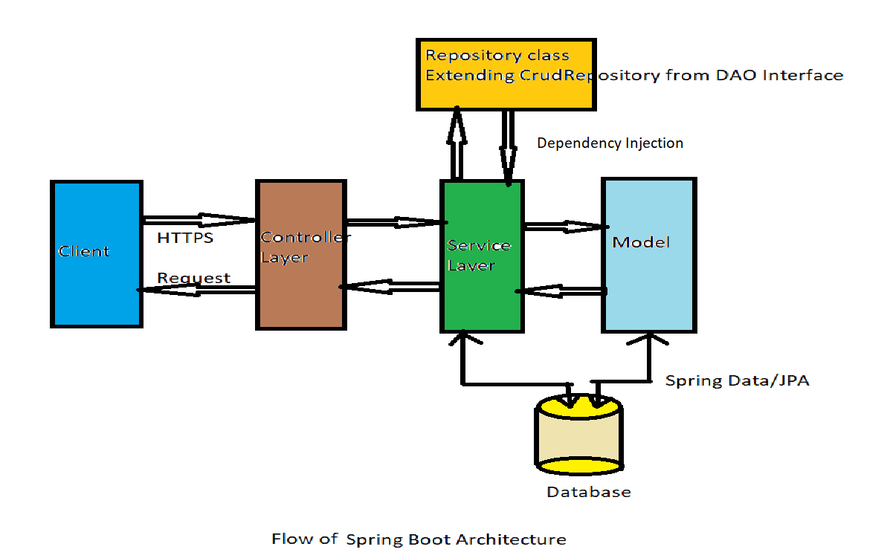

# Spring and Spring Boot Basics - Day 3

## Overview of Spring Boot

Spring Boot is an extension of the Spring framework that simplifies the setup and development of new Spring applications. It makes developing web applications and microservices with the Spring framework faster and easier through three core features:

- Auto-configuration: Automatically configures Spring applications based on the dependencies present in the project.
- An opinionated approach: Provides default configurations and setups to reduce boilerplate code and configuration.
- Additional tools: Includes embedded servers (like Tomcat, Jetty) and production-ready features (like metrics, health checks).

#### Auto-Configuration

One of the key features of Spring Boot is its auto-configuration mechanism, which automatically configures beans and components based on the dependencies present in the classpath. This means that if you include a dependency for a database, Spring Boot will automatically configure a DataSource bean for you. We no longer need to write XML configuration files or Java configuration classes to set up common components because Spring Boot analyzes the environment and classpath to configure beans, reducing the need for manual configuration and improving developer productivity.

#### Opinionated Approach

Spring Boot takes an opinionated approach to configuration, providing sensible defaults and conventions for various aspects of application development. This means that developers can get started quickly without having to make many decisions about configuration. For example, Spring Boot provides default configurations for web applications, data access, and security, allowing developers to focus on writing business logic rather than boilerplate code.

#### Additional Tools

Spring Boot comes with built-in support for embedded servers, such as Tomcat and Jetty, and it also provides a set of starter packs, which are curated sets of dependencies for specific use cases such as web development, data access, and security. Starter packs include all the necessary dependencies and configurations to get started quickly.

Spring Boot also seamlessly integrates with other components of the Spring ecosystem, such as Spring Data, Spring Security, and Spring Cloud, making it easy to build robust and scalable applications. This allows developers to leverage the full power of Spring ecosystem technologies and frameworks to build robust and feature-rich applications.

Its simplicity, ease of use, and focus on convention over configuration have made it a popular choice for building modern Java applications, especially in the context of microservices and cloud-native development.

#### Comparison of Spring and Spring Boot

| Spring                                                                                                   | Spring Boot                                                                                                                                                                                                                                                    |
| -------------------------------------------------------------------------------------------------------- | -------------------------------------------------------------------------------------------------------------------------------------------------------------------------------------------------------------------------------------------------------------- |
| It is a comprehensive and modular framework for building enterprise Java applications.                   | It is an opinionated framework that extends the Spring framework to simplify the setup and development of new Spring applications. It provides opinionated defaults and started packs to reduce boilerplate code and reduce the need for manual configuration. |
| It provides a wide range of features and functionalities for various aspects of application development. | It includes embedded servers and seamless integration with other Spring ecosystem components, making it easy to build robust and scalable applications.                                                                                                        |
| It requires manual configuration and setup for various components and features.                          | It offers auto-configuration, which automatically configures beans and components based on the dependencies present in the classpath, reducing the need for manual configuration.                                                                              |

#### The Spring Boot Flow

1. **Project Setup**: Create a new Spring Boot project using Spring Initializer or your preferred IDE. Choose the necessary dependencies based on your application requirements.
2. **Application Configuration**: Configure your application using the `application.properties` or `application.yml` file. This file allows you to set various properties such as database connection details, server port, logging levels, etc.
3. **Define Beans and Components**: Create your application components, such as controllers, services, and repositories, using Spring annotations like `@RestController`, `@Service`, and `@Repository`. Spring Boot will automatically detect and register these components as beans in the application context.
4. **Run the Application**: Use the `@SpringBootApplication` annotation on your main application class to enable auto-configuration and component scanning. Run the application using the `main` method, which starts the embedded server and initializes the application context.
5. **Access the Application**: Once the application is running, you can access it through the configured server port (default is 8080). You can test your REST endpoints using tools like Postman or curl.
6. **Monitor and Manage**: Spring Boot provides built-in support for monitoring and managing your application through Actuator endpoints. You can access these endpoints to check the health, metrics, and other information about your application.



### Real World Example

Understanding Spring Boot is essential for modern Java developers for several reasons:

- **Rapid Application Development**: Spring Boot simplifies the process of building Spring applications by providing a set of opinionated defaults and auto-configuration. Developers can quickly bootstrap new projects and focus on writing business logic rather than boilerplate code.
- **Microservices Architecture**: Spring Boot is widely used for building microservices, where applications are broken down into smaller, independent services. Its lightweight nature, embedded servers, and seamless integration with Spring Cloud, enable developers to create scalable and resilient microservices architectures.
- **Embedded Servers**: Spring Boot comes with embedded servers like Tomcat and Jetty, eliminating the need for external server setup and configuration. This makes it easier to deploy and run applications in various environments, including cloud platforms.
- **Auto-Configuration**: Spring Boot's auto-configuration feature automatically configures beans and components based on the dependencies present in the classpath. This reduces the need for manual configuration and improves developer productivity.
- **Dependency Management**: Spring Boot simplifies dependency management by providing starter packs, which are curated sets of dependencies for specific use cases. This helps developers avoid version conflicts and ensures compatibility between different libraries.

In summary, understanding Spring Boot is crucial for modern Java developers as it enables rapid application development, supports microservices architecture, simplifies deployment with embedded servers, and enhances productivity through auto-configuration and dependency management.

### Implementation

Below in an example that demonstrates how quickly you can set up a Spring Boot application.

> Create a Maven project and add the `spring-boot-starter` dependency to your `pom.xml` file:

```xml
<dependency>
    <groupId>org.springframework.boot</groupId>
    <artifactId>spring-boot-starter</artifactId>
    <version>2.5.4</version>
</dependency>
```

> Set up the main application class with the `@SpringBootApplication` annotation:

```java
@SpringBootApplication // Combines @Configuration, @EnableAutoConfiguration, and @ComponentScan
// Marks this class as the entry point for the Spring Boot application
public class App {
  public static void main(String[] args) {
    SpringApplication.run(App.class, args);
  }

  @Bean // Indicates that this method produces a bean to be managed by the Spring container
  public CommandLineRunner commandLineRunner(ApplicationContext ctx) {
    // CommandLineRunner is a functional interface that can be used to run code at application startup
    return args -> {
      System.out.println("Let's inspect the beans provided by Spring Boot:");

      String[] beanNames = ctx.getBeanDefinitionNames(); // Retrieve all bean names from the application context
      Arrays.sort(beanNames);
      for (String beanName : beanNames) {
        System.out.println(beanName); // Print each bean name to the console
      }
    };
  }
}
```

We can see the `@SpringBootApplication` annotation, which is a convenience annotation that tags the class as a source of bean definitions for the application context, enabling auto-configuration and component scanning.

The `main` method uses `SpringApplication.run()` to launch the application, which starts the embedded server and initializes the Spring context.

There is also a `CommandLineRunner` method defined as a bean, which runs on application startup and prints out all the beans that Spring Boot has configured.

## Using Spring Initializr

[Spring Initializr](https://start.spring.io/) is a web-based tool provided by the Spring team that allows developers to quickly generate a Spring Boot project with the necessary dependencies and configurations. It sets up an application following best practices and conventions of Spring Boot, enabling you to focus more on your business logic and less on project setup.

### Features of Spring Initializr

- **Dependency Selection**: With Spring Initializr, you do not have to manually search for and add dependencies to your project. You can select the required dependencies from a list of commonly used libraries and frameworks, and Spring Initializr will automatically include them in your project.
- **Easy Project Setup**: Spring Initializr simplifies the process of setting up a new Spring project by generating a basic project structure and configuration files. This saves time and effort, especially for developers who are new to Spring Boot.
- **Customizable Options**: You can customize your Spring Boot project according to your requirements. You can choose the project type (Maven or Gradle), language (Java, Kotlin, or Groovy), Spring Boot version, and other options such as packaging type (JAR or WAR) and Java version.
- **IDE Integration**: Spring Initializr can be integrated with popular IDEs like IntelliJ IDEA, Eclipse, and Visual Studio Code. This allows you to create a new Spring Boot project directly from your IDE without having to visit the Spring Initializr website.
- **Command-Line Interface**: For those who prefer to work from the command line, Spring Initializr also provides a CLI tool that allows you to generate Spring Boot projects using terminal commands. Spring Initializr also provides a REST API that can be accessed using tools like `curl`, HTTPie, or Spring Boot's CLI tool.
- **Community Support**: Spring Initializr is part of the larger Spring ecosystem, which has a vibrant community of developers. This means that you can find plenty of resources, tutorials, and examples to help you get started with Spring Boot.

## Real World Example

[Spring Initializr](https://start.spring.io/) is extensively used in the industry fo`r several reasons:

- **Project Bootstrapping**: Developers use Spring Initializr when starting a new Spring Boot project. It provides a quick and easy way to set up the project structure, dependencies, and configurations, allowing developers to focus on writing business logic rather than spending time on project setup.
- **Learning and Experimentation**: For learners and developers trying out new features or libraries, Spring Initializr is a handy tool. It allows them to quickly generate a project with the desired dependencies and configurations, enabling them to experiment and learn without the hassle of manual setup.
- **Microservices Development**: In microservices architecture, where applications are composed of multiple small services, Spring Initializr is often used to create individual microservices. It helps in quickly generating the necessary boilerplate code and configurations for each microservice, making it easier to develop and deploy them independently.
- **Workshops and Training**: In workshops and training sessions, instructors often use Spring Initializr to demonstrate how to create Spring Boot applications. It provides a consistent and standardized way to set up projects, making it easier for participants to follow along and focus on learning the concepts being taught.
- **Prototyping and Proof of Concepts**: When developers need to create a quick prototype or proof of concept, Spring Initializr is a valuable tool. It allows them to rapidly generate a project with the required dependencies and configurations, enabling them to quickly validate ideas and concepts.

Overall, Spring Initializr serves as a time-saving tool that simplifies the process of setting up Spring Boot projects, making it a popular choice among developers in various scenarios, from project bootstrapping to learning and experimentation.

### Implementation

Spring Initializr is a great tool for setting up a new Spring Boot project quickly. In this guide, we will go through the process of creating a Spring Boot Maven project with Web and Spring Data JPA dependencies using Spring Initializr.

#### Step 1: Open Spring Initializr

Go to the Spring Initializr website at [https://start.spring.io/](https://start.spring.io/).

#### Step 2: Configure Project Settings

In the "Project Metadata" section, configure the following settings:

- **Project**: Select "Maven Project".
- **Language**: Select "Java".
- **Spring Boot**: Choose the desired Spring Boot version (e.g., 2.5.4).
- **Project Metadata**:
  - **Group**: Enter your desired group name (e.g., com.example).
  - **Artifact**: Enter your desired artifact name (e.g., demo) which will be the name of your project and the root package.
  - **Name**: This will be auto-filled based on the artifact name.
  - **Description**: Enter a brief description of your project (e.g., Demo project for Spring Boot).
  - **Package name**: This will be auto-filled based on the group and artifact names.
  - **Packaging**: Select "Jar" to keep it simple and portable.
  - **Java**: Select the desired Java version (e.g., 11 or 17).

#### Step 3: Add Dependencies

In the "Dependencies" section, add the following dependencies:

- **Spring Web**: This dependency is required for building web applications, including RESTful APIs. It includes Spring MVC and an embedded Tomcat server.
- **Spring Data JPA**: This dependency is required for working with relational databases using JPA (Java Persistence API). It provides a simplified way to interact with databases and perform CRUD operations.

You can search for these dependencies in the search bar and click on them to add them to your project.

#### Step 4: Generate the Project

After configuring the project settings and adding the dependencies, click on the "Generate" button. This will download a ZIP file containing your Spring Boot project.

#### Step 5: Extract and Open the Project

Extract the downloaded ZIP file to your desired location. Open the project in your preferred IDE (e.g., IntelliJ IDEA, Eclipse, or VS Code).

Your new Spring Boot Maven project is now set up with Web and Spring Data JPA dependencies. You can start building your application by creating controllers, services, and repositories as needed.

#### Step 6: Running the Project

You can run the Spring Boot application both from the command line and your IDE.

- **From the Command Line**: Navigate to the project directory and run the following command:

  ```bash
  ./mvnw spring-boot:run
  ```

  This command uses the Maven Wrapper to run the Spring Boot application.

- **From the IDE**: Locate the main application class (annotated with `@SpringBootApplication`) and run it as a Java application.

Please note that you need to have the necessary plugins (Spring Boot Tools for VS Code, Spring Tools for Eclipse, or built-in support in IntelliJ IDEA) installed in your IDE to run Spring Boot applications seamlessly.

## Auto Configuration in Spring Boot

Auto-configuration is one of the most powerful features of Spring Boot. It automatically configures your Spring application based on the dependencies present in the classpath. This means that if you include a dependency for a database, Spring Boot will automatically configure a DataSource bean for you. You no longer need to write XML configuration files or Java configuration classes to set up common components.

Some key points about auto-configuration in Spring Boot:

- It aims to drastically simplify the setup and configuration of Spring applications by automatically configuring your Spring application based on the dependencies and libraries present in the classpath.
- Auto-configuration is enabled by default when you use the `@SpringBootApplication` annotation, which is a convenience annotation that combines `@Configuration`, `@EnableAutoConfiguration`, and `@ComponentScan`. It is also enabled when you use the `@EnableAutoConfiguration` annotation.
- It's important to know that auto-configuration is opinionated, meaning that it provides sensible defaults and conventions for various aspects of application development. However, you can always override the default configurations by providing your own configuration classes or properties.
- This features works well with "starter packs", which are curated sets of dependencies for specific use cases such as web development, data access, and security. Starter packs include all the necessary dependencies and configurations to get started quickly.

#### Important Spring Boot Annotations

```java
@SpringBootApplication // Combines @Configuration, @EnableAutoConfiguration, and @ComponentScan
// Marks this class as the entry point for the Spring Boot application
```

- It is a combination of three annotations: `@Configuration`, `@EnableAutoConfiguration`, and `@ComponentScan`.
  - `@Configuration`: Indicates that the class can be used by the Spring IoC container as a source of bean definitions.
  - `@EnableAutoConfiguration`: Tells Spring Boot to start adding beans based on classpath settings, other beans, and various property settings.
  - `@ComponentScan`: Enables component scanning, allowing Spring to find and register beans in the application context.

---

```java
@Configuration // Indicates that the class can be used by the Spring IoC container as a source of bean definitions
// Used to define beans and configuration settings for the application
@EnableAutoConfiguration // Enables Spring Boot's auto-configuration mechanism
// Tells Spring Boot to automatically configure your application based on the dependencies present in the classpath
```

- It enables Spring Boot's auto-configuration mechanism, which automatically configures your application based on the dependencies present in the classpath.
- It automatically creates and registers beans based on both the included jar files in the classpath and the properties defined in the `application.properties` or `application.yml` file.

---

```java
@ComponentScan // Enables component scanning, allowing Spring to find and register beans in the application context
// Scans the specified base packages for components, configurations, and services
```

- When we develop an application, we need to tell Spring where to look for components, configurations, and services. `@ComponentScan` enables Spring to scan for configurations, controllers, services, and other components in the specified base packages.
- The `@ComponentScan` annotation is used with the `@Configuration` annotation to specify the packages to scan for Spring components.
- By default, `@ComponentScan` scans the package of the class that declares this annotation. You can customize the base packages to scan by providing the `basePackages` attribute.

```java
@ComponentScan(basePackages = "com.example.myapp") // Scans the specified package for components
```

---

```java
@Configuration // Indicates that the class can be used by the Spring IoC container as a source of bean definitions
// Used to define beans and configuration settings for the application
```

- The most important annotation in Spring Framework, which indicates that the class can be used by the Spring IoC container as a source of bean definitions.
- It is used to define beans and configuration settings for the application.
- Classes annotated with `@Configuration` can contain methods annotated with `@Bean`, which define beans that will be managed by the Spring container.

```java
@Configuration
public class AppConfig {
    @Bean(name = "anotherName") // Defines a bean named "anotherName"
    public MyBean myBean() {
        return new MyBean();
    }
}
```

### Real World Example

Auto-configuration in Spring Boot has transformed the way developers build Java applications. Here are some key benefits and real-world examples of its importance:

- **Sped Up Development**: Auto-configuration eliminates the need for manual configuration of common components, allowing developers to focus on writing business logic. For example, when building a web application, developers can simply include the `spring-boot-starter-web` dependency, and Spring Boot will automatically configure the necessary components like the embedded Tomcat server, Spring MVC, and Jackson for JSON processing.
- **Focus on Business Logic**: Developers can focus more on writing business logic rather than spending time on boilerplate code and configuration. For instance, when working with databases, developers can include the `spring-boot-starter-data-jpa` dependency, and Spring Boot will automatically configure a DataSource, EntityManagerFactory, and TransactionManager based on the database properties defined in the `application.properties` file.
- **Reduction in Code and Configuration Errors**: As Spring Boot automatically configures many components, the likelihood of configuration errors is reduced. For example, when using Spring Security, developers can include the `spring-boot-starter-security` dependency, and Spring Boot will automatically configure basic security settings, reducing the chances of misconfigurations.
- **Scalable for Large Applications**: Auto-configuration handles a lot of under-the-hood tuning based on the environment and classpath, making it easier to scale applications. For example, when deploying applications to cloud platforms, Spring Boot can automatically configure components like connection pools and caching based on the environment variables and available resources.
- **Simplified Dependency Management**: Spring Boot's starter packs simplify dependency management by providing curated sets of dependencies for specific use cases. For instance, when building a RESTful API, developers can include the `spring-boot-starter-web` dependency, which includes all the necessary libraries for building web applications, reducing the need to manage individual dependencies.
- **Customizable**: Despite its opinionated nature, auto-configuration can be easily customized. Developers can override default configurations by providing their own configuration classes or properties. For example, if a developer wants to customize the default port of the embedded server, they can simply add the following property to the `application.properties` file:

  ```properties
  server.port=9090
  ```

- **Integrated Developer Experience**: Auto-configuration, combined with other Spring Boot features like embedded servers, provide a seamless and integrated developer experience. For example, developers can run their applications directly from their IDEs without needing to set up external servers or configurations.

In summary, auto-configuration is one of the primary reasons why Spring Boot has become the go-to framework for building modern Java applications. It simplifies the development process, reduces boilerplate code, and allows developers to focus on writing business logic, ultimately leading to faster development cycles and more robust applications.

### Implementation

Auto-configuration is a feature of Spring Boot that works out-of-the-box and does not require explicit code to be written to make it work. Instead, it's about understanding how it works and how you can customize it when needed. Below is a step-by-step guide to understanding how to leverage auto-configuration in a Spring Boot application.

#### Step 1: Create a Spring Boot Application

Create new Spring Boot application using Spring Initializr. Configure the project by filling in the necessary details and adding dependencies like `Spring Web` and `Spring Data JPA`. Once done, generate the project and open it in your preferred IDE.

#### Step 2: Understand Auto-Configuration

Auto-configuration is enabled by default when you use the `@SpringBootApplication` annotation. This annotation combines three important annotations: `@Configuration`, `@EnableAutoConfiguration`, and `@ComponentScan`.

```java
@SpringBootApplication
public class Application {
    public static void main(String[] args) {
        // Takes in the class to be run and command-line arguments
        SpringApplication.run(Application.class, args); // Starts the Spring Boot application
    }
}
```

#### Step 3: View Auto-Configuration Report

You can view the auto-configuration report to see what configurations Spring Boot has applied based on the dependencies in your project. To enable this, add the following property to your `application.properties` file:

```properties
debug=true
```

When you run your application, you will see a detailed report in the console output showing which auto-configurations were applied and which were not.

#### Step 4: Customize Auto-Configuration

Auto-configuration configures beans based on the jars present in the classpath and other beans. However, if you define your own configuration, Spring Boot backs off and uses your configuration instead.
For example, Spring Boot auto-configures a `DataSource` bean if it detects a database driver in the classpath. If you define your own `DataSource` bean, Spring Boot will not create its own.

```java
@Bean
@ConfigurationProperties(prefix = "com.example.datasource") // Binds the properties with the specified prefix to this bean
public DataSource customDataSource() {
  return DataSourceBuilder.create().build(); // Creates and returns a custom DataSource bean
}
```

In this example, if you define a `DataSource` bean, Spring Boot will not auto-configure its own `DataSource`. You can also customize properties in the `application.properties` file to change the behavior of auto-configured beans.

```properties
spring.datasource.url=jdbc:mysql://localhost:3306/mydb
spring.datasource.username=root
spring.datasource.password=secret
```

#### Step 5: Exclude Auto-Configuration Classes

Sometimes, you may want to exclude specific auto-configuration classes. This can be done using the `exclude` attribute of the `@SpringBootApplication` or `@EnableAutoConfiguration` annotations.

```java
@SpringBootApplication(exclude = {DataSourceAutoConfiguration.class}) // Excludes the DataSourceAutoConfiguration class
public class Application {...}
```

In this example, the `DataSourceAutoConfiguration` class is excluded, meaning Spring Boot will not attempt to auto-configure a `DataSource` bean, even if it sees database-related dependencies/jars in the classpath.

Remember, Spring Boot's auto-configuration is a powerful feature that makes it easier and quicker to create Spring applications, allowing developers to focus on the unique parts of their applications rather than boilerplate configuration.

## Common Spring Boot Starters

Spring Boot starters are pre-configured dependency descriptors that you can include in your project to quickly set up common functionalities. They provide a convenient way to add a set of related dependencies to your project without having to manually specify each one.

Here are some of the most commonly used Spring Boot starters:

- `spring-boot-starter-web`: This starter is used for building web applications, including RESTful services. It includes dependencies for Spring MVC, Jackson (for JSON processing), and an embedded Tomcat server.
- `spring-boot-starter-data-jpa`: This starter is used for working with relational databases using JPA (Java Persistence API). It includes dependencies for Spring Data JPA, Hibernate, and a connection pool (HikariCP).
- `spring-boot-starter-security`: Offers security features for your application, including authentication and authorization. It includes dependencies for Spring Security.
- `spring-boot-starter-test`: Provides testing support for Spring Boot applications. It includes dependencies for JUnit, Mockito, and Spring Test.

Spring Boot started are highly customizable, allowing developers to override defaults, exclude specific dependencies, and add additional dependencies as needed. This flexibility makes Spring Boot starters a powerful tool for quickly setting up and configuring Spring applications.

### Real World Example

Spring Boot starters are widely used in the industry to accelerate the development of Spring applications. Here's an example scenarios:

Let's consider the development of a social media application. In this application, we would like to include the following functionalities:

- A web interface for user registration, login, and posting updates.
- Database persistence for storing user data and posts.
- Security measures to protect user information and authenticate users.
- Automated testing to ensure the application's reliability.

To achieve this, we can leverage Spring Boot starters:

- We can use the `spring-boot-starter-web` starter to quickly set up the web interface for our application with Spring MV, handle user registration and login endpoints, and server static resources.
- The `spring-boot-starter-data-jpa` starter can be used for easy integration with a relational database, allowing us to persist user data and posts using Spring Data JPA and Hibernate.
- For security, we can include the `spring-boot-starter-security` starter to implement authentication and authorization mechanisms, ensuring that user information is protected.
- Finally, the `spring-boot-starter-test` starter can be used to set up a testing environment, allowing us to write unit tests and integration tests to ensure the reliability of our application.

By using these Spring Boot starters, we can significantly reduce the amount of boilerplate code and configuration required to set up our application. This allows us to focus more on implementing the unique features of our social media application, ultimately speeding up the development process and improving productivity.
